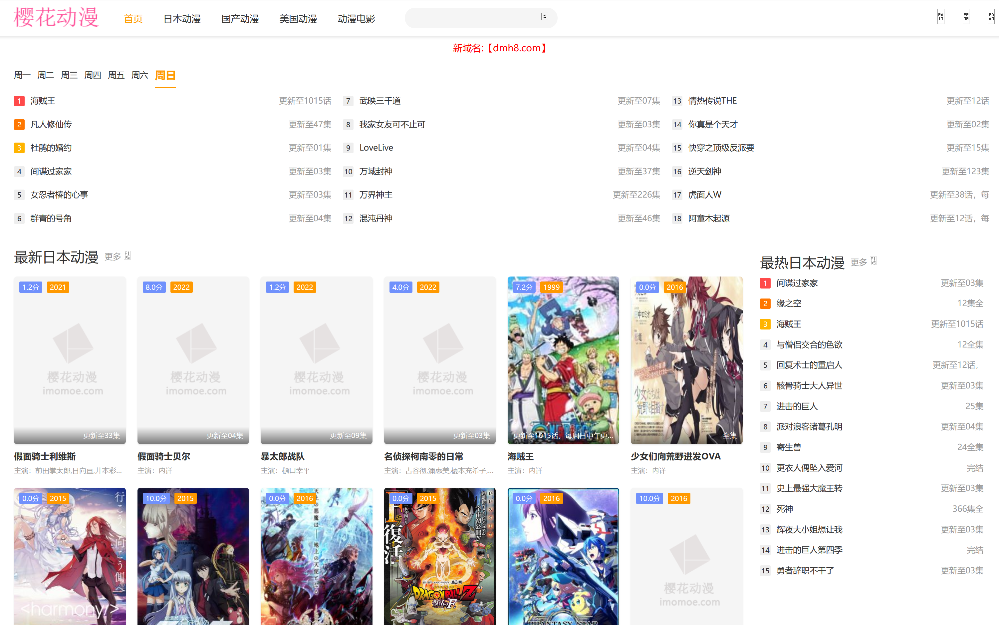
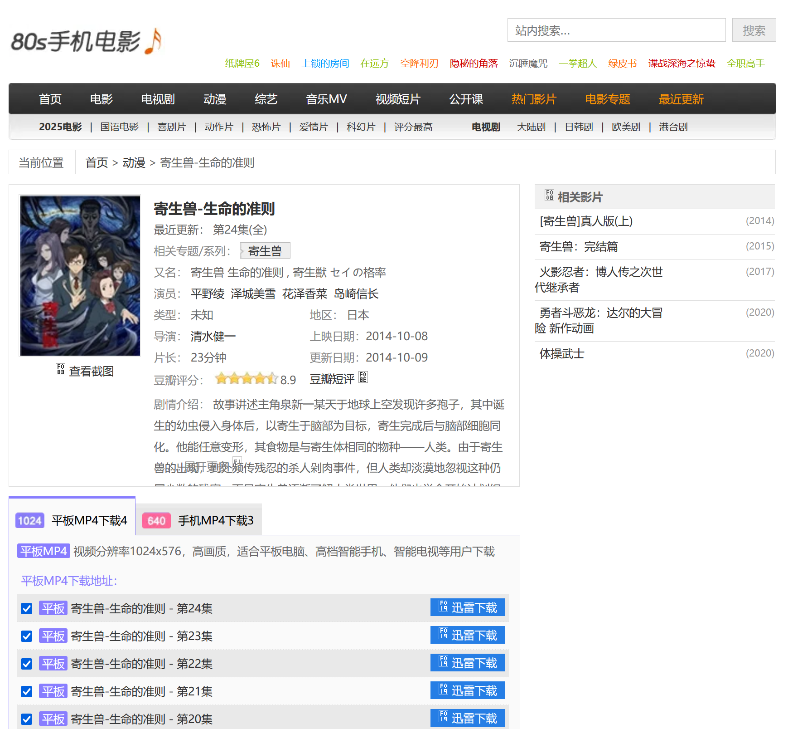
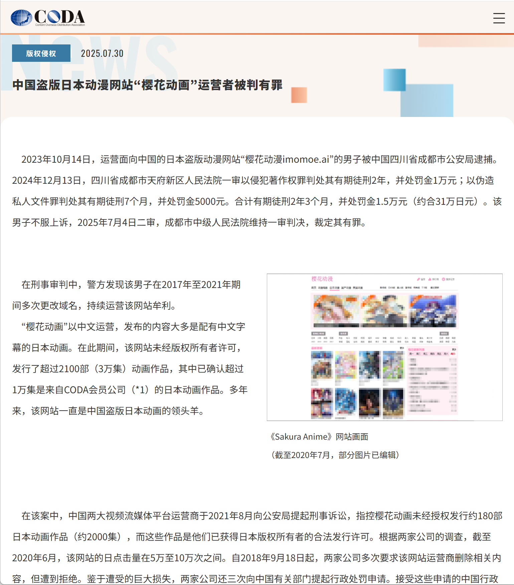
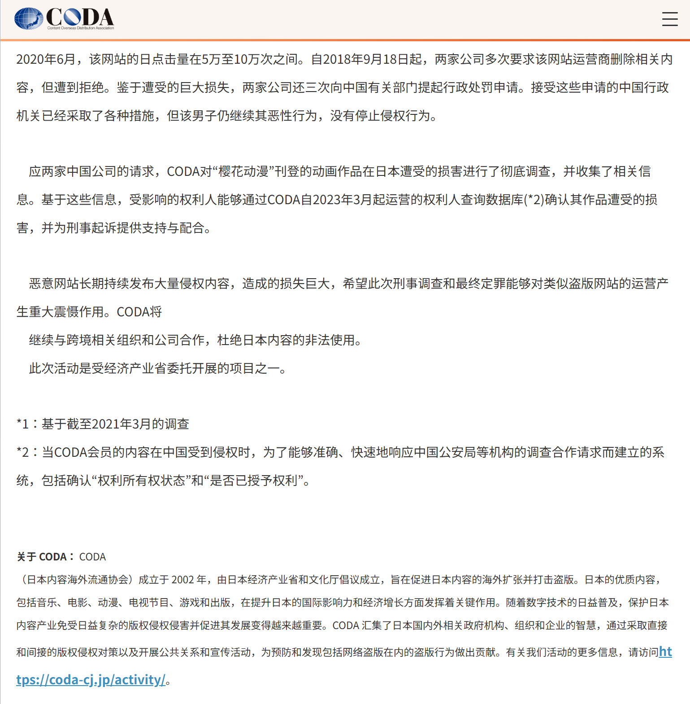

# 你能去救救那个还没被删减的我吗？——悼念「樱花动漫」

## 🌸樱花动漫，你的真名是？

在悼念「樱花动漫」之前，我们先确定一下死者的名字。因为这两天我看到不少同好其实哭错坟了，甚至还有说「樱花动漫」没死的（为了避免网暴，就不截图了）。  
【】图：樱花动漫-仿冒  

### 你访问的可能是假的「樱花动漫」

【】图：CODA新闻1。域名标红  
网站的名字是「域名」。在 CODA 新闻稿中提到的这个 imomoe.ai 域名，其实是樱花动漫的第 7 个域名了。  
【】图：[imomoe.com-ICANN](https://lookup.icann.org/zh/lookup)  
樱花动漫的第一个域名是 imomoe.com，注册时间是 2016-03 月。moe 是日语「萌え」的罗马音，不知道 imo 是什么意思。  

【】图：[imomoe.com-IA集合](https://web.archive.org)  
在「互联网档案馆」上面，  
【】图：imomoe.com-IA-2016-10  
【】注：图片由于技术原因没存下来  
.com 最早的一个存档是 2016-10 月。当时《京吹》正在播放第二季。  

.com 这个域名一直坚持到了 2018 年 10 月，域名开始被 GFW【防火墙】 间歇性阻断。  
之后樱花动漫就开始频繁地更换域名。  

【】图：域名列表  
樱花动漫用过的域名（按时间顺序）  
2016-2022  
imomoe.com（主要）  
imomoe.net  
imomoe.tv  
imomoe.jp  
imomoe.io（稳定）  
imomoe.in（稳定）  
imomoe.ai（主要）  
imomoe.la（稳定）  
imomoe.live  

2022-2023（被逮捕）  
dmh8.com  
dm88.me  
yhdmba.net  

imomoe 系列一直使用到了 2022 年，更换了命名的方式  

{:height="50%" width="50%"}  
【】图：dmh8.com-IA-2022-05  

网站 UI 也发生改变，直到 2023 年站长被逮 dài 捕。  

【】图：[留言板](https://web.archive.org/web/20240614095304/http://www.yhdmba.net/index.php/gbook) 。注：yhdmba.net 2024-06  
樱花动漫有个「留言板」，功能是反馈失效资源、请求新资源。站长的最后一次回复定格在了  2023-11-07 。

### 樱花动漫其实不够「樱花」

樱花动漫其实不够「樱花」  
【】图：[樱花动漫-头图](https://archive.ph/tf5wQ)  
一是 logo 里面没有樱花图案  
【】图：域名列表  
二是 原初域名里面也没有樱花（罗马音、拼音）。一共 12 个域名，只有最后一个才包含了「樱花」的拼音。  

反而是那些仿冒的网站，「樱花味」更浓一些。  
哪怕是盗版网站，只要站长有追求，也不会冒用别人的名字。所以假的樱花动漫资源质量都很差。  

## 🌸樱花动漫，我的朋友

### 我是怎么知道「樱花动漫」的？

2014 年，我在读高中。那时虽然已经有了智能机，  
【】图：[酷派8085N-百度百科](https://baike.baidu.com/item/%E9%85%B7%E6%B4%BE8085N/19537667)  
但流量很贵，中国移动最便宜的套餐是 30元 500M。  
【】图：[移动套餐](https://zqb.cyol.com/html/2014-05/15/nw.D110000zgqnb_20140515_5-05.htm)  
想看动画需要用电脑下载，再传到手机里。分辨率只有 576P 甚至 360P。住校生一星期才能回一次家，在学校还得躲着老师查寝，最后我也没看几部动画。  

{:height="50%" width="50%"}  
【】图：[80s电影网](https://www.80sgod.com/dm/13457)  

2016 年，我复读了，换了一所学校。我发现教室的多媒体电脑可以上网！  
【】图：电子白板。注：BV1gH4y127Ty-00：05  
在上大学之前，我都不知道世界上还有 B 站。所以我是这样看动画的：  
【】视频：搜索框，缘之空 在线观看  

点开一个网站，全是广告；再点一个网站，资源失效；再点一个，画面糊得像打了码。  
终于，我找到了「樱花动漫」  
【】图、注：樱花动漫 2017-07 月  
用过的人都知道，樱花动漫在 2016、2017 年是独一档的体验：无删减、没有贴片（piān）广告、画质不输正版网站、更新快、资源全。  
凭借着这些优势以及线上线下的熟人推荐，「樱花动漫」迅速成长为中国最大的盗版动画网站，可能没有之一。  
我也在 2016 年入宅了：动画成为我的主要爱好，开始追新番了。  

### 后来，樱花不好用了

【】图：无法访问此网站Chrome  
2018-10 月，樱花动漫的第一个域名，开始被 GFW【防火墙】 间歇性地屏蔽（当时我记了笔记）。幸好，我已经掌握了「科学上网」技能，这才没有失联。  
【】图：imomoe.in-2020-01-28。注：樱花动漫 2020-01  
后来，网站换了域名。  
【】图：imomoe.la-2021-07-08。注：樱花动漫 2021-07  
再后来，网站开始有广告，资源的分辨率变低了，我就去其他网站看了。  
【】图：樱花动漫-仿冒。注：仿冒网站  
由于换域名以及大量仿冒网站的出现，我和樱花动漫彻底断了联系。  
再相遇，就是这次的新闻了。  

日本内容产品海外流通促进机构（CODA）于 2025-07-30【7月30日】 发布新闻《 [「樱花动漫」运营者被判有罪](https://coda-cj.jp/news/2472/) 》  
【标题不念，直接下一段】  

{:height="50%" width="50%"}  
【】图：[CODA新闻1](https://coda-cj.jp/news/2472/)  

樱花动漫运营者（站长）被判刑 2 年 3 个月，并处罚金人民币 1.5 万元。（我在「裁判文书网」上没找到判决书）  
【】注：我在「裁判文书网」上没找到判决书  

## 🌸是谁杀死了樱花动漫？

{:height="50%" width="50%"}  
【】图：[CODA新闻2](https://coda-cj.jp/news/2472/)  

我们再来看一下 CODA 发布的新闻稿  
【】字：就挡在新闻稿前面  
自 2018-09-18 日起，**两家中国流媒体平台**多次要求樱花动漫，删除它们买了版权的动画。被站长拒绝，之后两家公司提起行政处罚申请。  
两家公司还向「日本内容产品海外流通促进机构」CODA 请求协助调查。CODA 确认了网站上有 1 万集动画，属于该机构会员公司的作品。  
【】读月份  
2021-08 月，两家公司向公案机关报案，指控樱花动画未经授权发行约 180 部日本动画  
2023-10-14，樱花动漫站长被捕  
2024-12-13，一审判决  
2025-07-04，二审维持原判  

中国主要有 4 个视频平台会购买日本动画的版权。新闻里面这两家到底是谁？目前已公开的信息还不能确定。  
但是，如果某个四个字名字的网站是其中之一，那我有话要说：  
【】图：[B站-bilibili.tv-2012-03-27-码](https://web.archive.org/web/20120327213723/http://www.bilibili.tv/)  
我没有要求你解决房间里的大象，我不是恶魔。但**你最起码标出来哪些动画没有被删改**吧？  
你是一个 ACG 内容起家的视频网站吧？2014 年的时候你也因为版权，被多家公司起诉吧？  
你才 16 岁吧？你的版权观念怎么了？  
【】注：这段为了凑定型文，可能不太准确  
【】文字：  
    2012 年（3 岁），什么动画都能看；  
    2015 年（6 岁），买了的动画才能看；  
    2021 年（12 岁），过审的动画才能看。  
最后，就没有动画可以看了。  
作为 MikuFans，我可能得打败你，真的。  
[B站遭多家视频网站齐起诉，对它到底是不是事儿？](https://36kr.com/p/1641974677505)  

### 🔴CODA 是什么机构？

【】字：  
    日本内容产品海外流通促进机构  
    Content Overseas Distribution Association  
    CODA  

【】图：[CODA-组织概况](https://coda-cj.jp/organization/soshiki/)  
CODA 成立于 2002 年，旨在促进【电影、动画、电视节目、音乐、游戏和出版物等】日本文化产品的海外发行，以及打击盗版。  
【】图：[CODA-会员](https://ja.wikipedia.org/wiki/%E3%82%B3%E3%83%B3%E3%83%86%E3%83%B3%E3%83%84%E6%B5%B7%E5%A4%96%E6%B5%81%E9%80%9A%E4%BF%83%E9%80%B2%E6%A9%9F%E6%A7%8B)  
截止 2025 年，有 36 家企业会员。日本主要的版权方都是会员：  
【】图：[CODA北京代表处-国家版权局](https://www.ncac.gov.cn/xxfb/bqshfw/rzjg/202410/t20241018_870081.html)  
CODA 于 2021 年设置了北京代表处，并且在中国国家版权局获得认证。  

### 🔴CODA 已经多次出手了

【】图：[3年22名运营人被捕](https://cn.nikkei.com/politicsaeconomy/politicsasociety/56167-2024-07-17-15-01-55.html)  
2024-07 月 CODA 宣布，约 3 年时间内有 22 名中国网站运营者因涉嫌侵犯著作权法被逮捕。  
这里介绍其中有代表性的 3 个网站。  

**DiliDili 嘀哩嘀哩**  
【】图：[D站-CODA](https://coda-cj.jp/news/721/)  
【】字：  
    DiliDili 嘀哩嘀哩  
    D 站站长于 2020-07 月被捕。被判三年三个月，罚金人民币 100 万元。  
【】图：D站-侵权作品数量  
【】注：《 [侵犯他人著作权，D站经营者获刑](https://mp.weixin.qq.com/s/DlmsMpbaXaHaAl9UJeRSQg) 》  
庭审中，有一个点值得注意。公诉人认为：「**日本动画被侵权作品的数量以集作为单位**」，而不是以「部」为单位。  

**B9GOOD**  
【】图：[B9GOOD-CODA](https://coda-cj.jp/news/1904/)  
你可能不知道这个网站，很正常。因为这个网站是面向日本同好的，动画是不带字幕的，并且屏蔽了中国 IP 的访问。  
B9GOOD 被 CODA 认定为「日本最大的盗版动漫网站」。  
【】字：B9GOOD 站长于 2023-02 月被捕。被判三年，缓刑三年六个月，罚金人民币 180 万元  

【】注：[10年时间，这个日本组织干掉了中国9成盗版动画](https://zhuanlan.zhihu.com/p/626998831)  
B9GOOD 站长被捕，是具有标志性意义的：**即使你运营的网站对中国人几乎没有影响**，也一样会被抓。  

**ZzzFun**  
【】图：[ZzzFun-CODA](https://coda-cj.jp/news/2297/)  
【】字：ZzzFun 站长于 2025-02 月被捕。目前还没有判决消息。调查显示，2022-2025 年网站收入 33 万人民币。  

【】图：[imanhua.com-CODA](https://coda-cj.jp/news/669/)。字：爱漫画 imanhua.com
【】字：2015-04-15  三名运营者被捕  
【】图：[上海实体店-CODA](https://coda-cj.jp/news/649/)  
不只是动画网站，还有多个漫画网站、实体店铺被 CODA 拿下。篇幅有限，不再详述。  

【】图：无法访问此网站Chrome  
总之，当你下次再遇到网站无法访问时，**「服务器抽风」也算是对站长的美好祝福**。  

**CODA 还会投诉 B 站的视频**  
2025-06 月，B 站 up 主 [Li_TiO2李太白](https://space.bilibili.com/413033267) 发 [动态](https://t.bilibili.com/1077906593699332102) 显示：  

> 您的视频被退回且锁定  
> 您的稿件《「推送报备」BABYMETAL RETURNS - THE OTHER ONE WOWOW Prime 2023.03.25》（BV1uaEbzfEfz）未能通过审核且被锁定（锁定稿件无法被编辑）。原因：我司收到权利人（日本内容产品海外流通促进机构(CODA)）就《BABYMETAL RETURNS - THE OTHER ONE - 1》关于您稿件的侵权申诉并根据其要求及著作权法等相关法律规定对该稿件进行下线处理。如您认为您的稿件不侵权，可通过【创作中心-内容管理-稿件管理】途径提出恢复申请并提交不侵权声明及相关证明材料。您可以编辑稿件重新投稿，或者对审核结果进行申诉。

视频播放量只有 283。这都能被锁稿？  

## 🟡为什么要花钱看删改版？

【】字：**看盗版不是为了「盗」，只是想看原版而已**。  
在中国，这就是盗版存在的意义。  
【】图：《航海王》《火影忍者》单行本  
这是我高中时买的，正版《海贼王》单行本 70 卷，正版《火影忍者》单行本 60 卷。  
高中时我没有收入，哪来的钱？我家没有「零花钱」这个概念。高中时我一星期的饭钱是 100 元，我每周能从里面抠出来 20 甚至 50 元，然后去校门口的书店买几本。我要把书藏进书包里，**像走私犯过海关那样带进家门**。  
这一百多本漫画，我花了大概一年时间才买齐。  
我买的不是漫画书，**我买的是高中住校生每星期只能回家半天的抗抑郁药！**  
我买的不是漫画书，我买的是幸福。  

买正版单行本的同时，我也在盗版网站，比如前面提到的「爱漫画」，追《海贼王》的最新连载。  

### 为什么不看正版？

这个问题真是越看越生气。  
【】图：柯南第一卷打码。 [正版漫画为何要打马赛克？- 百度贴吧](https://tieba.baidu.com/p/4320966030)  
十四年了，我到现在都记得当年同学告诉我「诶你知道吗？现在《柯南》新出版的单行本打码了，以前是没码的」。那可能是我人生第一次怀旧，我恨自己为什么没赶上好时候。  

【】图：BD  
【】字：看看弹幕浓度  
我能从饭钱里抠出来一半买正版，我是舍不得花钱吗？  

【】视频：[馒头掰开](BV1a7411171r)  
一个馒头一块钱，劈一半卖五毛，合理  
【】图：劈《 [蒙娜丽莎](https://zh.wikipedia.org/zh-cn/%E8%92%99%E5%A8%9C%E4%B8%BD%E8%8E%8E) 》  
把《蒙娜丽莎》劈开，门票半价，合理吗？  

【】字：为什么不看正版？  
**删改版是正版吗？！！！**  

## 🔵原版动画在哪里？
【】B：Fuck The World - Richard Cheese。注：感谢 @PMM_LORD  

### 肯定不在境内正版平台

【】字：  
    2021-04 月  
    「先审后播」来了。  
    他妈的现在连删改版都没有了！  
【】图：[B站动画区官号](https://space.bilibili.com/32708462)  
B 站是不想买吗？「房间里的大象」它不说话。  

【】图：[先审后播2014](https://zqb.cyol.com/html/2014-11/06/nw.D110000zgqnb_20141106_7-12.htm)  
没错，「先审后播」制度在 2014 年就已经砍到了境外电影、电视剧的头上。  
【】图：先审后播2018-B站。BV1bPqcYSEUQ-01:37:33  
B 站动画区主编也说 2018 年就已经下发了文件，只是没有落实。  

但是  
【】字：  
    2018 年《DARLING in the FRANXX》【国家队】下架  
    2021 年《无职转生》下架  
太巧了，两次都有你。你 * * * 起码是个导火索吧！  

### BT 下载

什么？你说还有 BT ？  

#### 本就不健康的 BT 环境

**迅雷、网盘是主流**  
说起 BT 下载，主流人群想到的工具是迅雷、网盘这些违背 BT 分享精神的软件服务。  

**难以获取公网 IPv4**  
获取公网 IPv4 的成本越来越高（电信），甚至连加钱的选项都没有（联通、移动）。  

【】图：蜜柑计划  
2023-04 月，一位 up 主在直播中讲了一下如何下载动画。很快啊，相关的几个网站就被防火墙屏蔽了。又是巧合。  
这位 up 主没有做视频，只是在直播里播放了别人的视频。我倾向于他没有主观恶意，他是没想到自己的影响力已经到了这个地步了。  

#### 到了 2024 年更是雪上加霜

**家庭宽带限制上传**  
2024-01 月，电信和联通开始实行「**跨省流量结算**」（ [移动 7 月开始](https://xueqiu.com/7539058388/297179918) ）。简单说，这制度意味着你家的宽带上传的流量越多，运营商的成本就越高。那运营商能亏钱吗？你上传多了直接给你限速、停宽带。  
然后，那帮搞 PCDN 的 * * 开始用「**BT 流量消耗器**」，把本来就不健康的 BT 环境直接打进 ICU。  
现在只能靠自动封禁软件吊着一口气没死。  

### PT 社区

什么，你说还有 PT ？  

运营商限制上传是按流量「一刀切」，可不管你是 PCDN 还是 PT。  

### 海外流媒体平台

Netflix 不错。我想给它钱，但是不行。  
我还得学习原生 IP、二级代理、WARP 解锁、DNS 解锁这些麻烦的网络代理技术，才能打开网站。我还得整天提心吊胆，生怕一不小心就被遣返封号。**看个动画跟搞网络犯罪一个门槛了**。  

还有巴哈姆特，还能看几年呢？这事得去问大象。  

### 没有网络的年代，怎么看片？

假如有一天，前面说的流媒体平台、BT、PT 都用不了，那也许还能回退到买盘这一步。  
【】视频：买光盘。注：《召唤恶魔阿萨谢尔》（海葵篇）  

## 感谢制作资源的各位同好

不论是盗版网站，还是 BT、PT、光盘。他们在产业链里属于是靠终端的零售商、市场。  
更值得我们感谢的是那些提供片源、制作字幕的同好。  

### 感谢为爱发电的字幕组、压制组、汉化组

没有你们的付出，我看不了动画。  

什么叫「为爱发电」？  
2021-04 月，「脸肿汉化组」的 6 位成员被捕。一个月后，由于是「**无偿汉化**」，被释放。  

【】注：有的组有争议，先搁置  
【】字：  
    2015-11   4 位《海贼王》的图源被捕  
    2015-11   熊猫汉化组，停更  
    2019-10   鼠绘汉化组，鼠绘君被捕，判刑三年，缓刑三年，罚金人民币 8 万元  
    2021-01   人人影视字幕组，15 名成员被捕。创始人被判刑三年半，罚金人民币 100 万元  
    2021-04   脸肿汉化组，6 位成员被捕  
    2022-03   SUBPIG 猪猪日剧字幕组，结束运营  
    2022-05   桜都字幕组，停更里番  

    还有很多我不认识的组，被捕、解散  

《 [桜都字幕组宣布停更里番，LSP们的快乐源泉还有多少？](https://www.3dmgame.com/original/3743577.html) 》  

### 感谢放流的普罗米修斯

没有你们提供的片源，字幕组只能停产。  
日本动画一季度 12 集，一套 BD 总价得一两千人民币。放流的大佬自掏腰包买光盘，再冒着法律风险上传，这才有了 BDRip。  
近几年流媒体盛行，拿 Web 源可能相对不那么危险。早些年的盗火者是直接 TV 转录的。人在日本，那是真抓你啊。  

### 感谢 BT、PT 站点的开发、运营、捐赠者

## 🟢以后还能看原版动画吗？

【】字：乐观的人买硬盘，悲观的人学日语  
这句话的原作者可能是 [这位](https://ngabbs.com/read.php?&tid=36043942&pid=685535258&to=1)（因为 nga 的「冲水」规则，不能确定）。  

【】字：**「大不了回到过去」**  
每次出现这类新闻，都能看到有人这么说。  
【】图：晓美焰。《魔法少女小圆》S1E10-07:34  
请问你是「晓美焰」吗？你最好是，我希望你是。  
【】视频：小圆。注：《魔法少女小圆》S1E10-16:05  
【】晓美焰，头旁边放樱花动漫 Logo  
【】字幕：你能去救救那个还能看原版动漫的我吗？  

## 后记

一开始标题中我用的是「阉割」，出处是这里：  

> 欲练神功，必先自宫。当你丧失了表达自己真实观点的欲望，只把写作视为割韭菜挣钱的手段，这生活就简单多了。为什么要自宫？因为睾丸是人的短板。  
> 有一次我跟一位女作家说：写作总觉得自己睾丸捏在别人手里。她说：我虽然没有睾丸，也觉得被人捏了睾丸。  
> [南洋富商](https://mp.weixin.qq.com/s/YVAkc85D91wZDcwp0-Bf1w)

## 更新日志

2026-02-20 补充：迅雷、公网 IP。打腹稿的时候是包含这些内容的，但写着写着太激动了，忘了。  
2025-08-05 做视频用了 18 小时。  
2025-08-04 写文案用了 20 小时。  
2025-08-02 开始写。其实我 31 号看到新闻了，当时没心情写。今天刷到了「瓶子君152」的直播切片，才意识到这件事流量这么高。