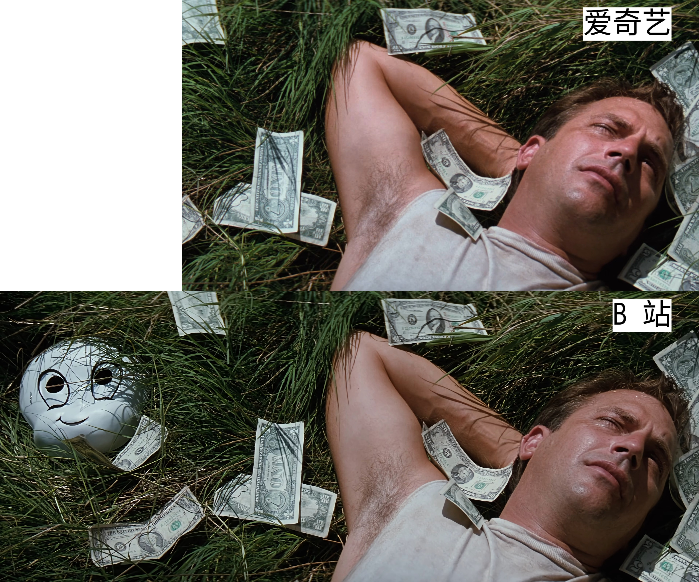

# 流媒体平台审查：同样是删减，阉割刀法亦有不同

一部作品想要在中国上映，免不了要遭受宫刑。具体说，就是由流媒体平台送到有关部门接受审查，简称「送审」；送审通过后才能上映。  
这里有个问题，宫刑的主理人是谁？我推测（没有直接证据）这个活不会是审查部门来干，一年审几百上千部作品，人手应该不够；不一棒子打死，能给修改意见，就算他们做好事了。实际动刀的，大概是流媒体平台的人。  
**下面简单对比一下不同平台宫刑主理人的刀法**：  

## 电影

### 按时长检查是否删减，不靠谱

**爱奇艺自带倍速**  

我看电影不多，这次偶然发现电影《完美的世界》在「爱奇艺」**比原片少了 6 分钟**，是写本文的直接原因。我下载了 [B 站](https://www.bilibili.com/bangumi/play/ep312386) 和 [爱奇艺](https://www.iqiyi.com/v_19rrg3oa5o.html) 2 个版本到本地，对照看完了电影。

画质：B 站画质明显好很多。  
画幅：B 站画幅是 21:9，爱奇艺 16:9；如图，区别很明显。  
{:height="50%" width="50%"}

内容：爱奇艺并没有删减，我只发现了开头「华纳」的 logo 不一样。B 站时长 8298 秒，爱奇艺时长 ，7954 秒，爱奇艺的版本算是**自带了 1.04 倍速播放**，所以片长少了 6 分钟。

**为什么会有这样的区别？**  
B 站、爱奇艺可能与这部电影的删改无关，因为他们不是引进方。  
B 站版本的引进文号：新出像进字（2009）212号  
爱奇艺版本的引进文号：文像进字（2006）415号  
文号的审批年份都早于公司成立时间。所以推测是平台向引进方购买版权，然后上架的，只能播放过审的版本。

不止一部电影在爱奇艺是这个待遇，比如还有《[无耻混蛋](https://www.iqiyi.com/v_19rri0as3c.html)》也是 16:9 画幅、自带倍速、删减。

强调：以上只是个例，结论不具有代表性。

**豆瓣网友整理无删减电影的片单**：  

- [B站完整时长电影](https://www.douban.com/doulist/135672683/)  
- [app可看的无删减优质电影](https://www.douban.com/doulist/135608682/)

但是这两个片单并不好用：

1. 从描述及评论看，两位网友应该只是简单对比了时长，并没有逐帧检查删改。
2. 豆瓣不支持在片单内部搜索

### 即使引进文号相同，片子也可能不同

**《肖申克的救赎》**  
在 [B 站](https://www.bilibili.com/bangumi/play/ep284310) 、[爱奇艺](https://www.iqiyi.com/v_19rra0h3wg.html) 、[优酷](https://v.youku.com/v_show/id_XMjgwNDkwNzE2.html) 、[腾讯](https://v.qq.com/x/cover/1o29ui77e85grdr/h0022ah1yrf.html)  4 个平台，引进文号相同「文像进字（2004）1146号」，但**字幕、时长都不一样**。  
爱奇艺还是自带 1.04 倍速（我对比了前 5 分钟），导致片长少了 6 分钟。

2022 年，公众号「3号厅检票员工」写了一篇《我们只配看这种电影吗？》（[原文](https://mp.weixin.qq.com/s/yM3dEJVC6XwWOuaVLzaTvQ) 已被屏蔽，[存档](https://web.archive.org/web/20220127150437/https://mp.weixin.qq.com/s/yM3dEJVC6XwWOuaVLzaTvQ)，[转载](https://www.douban.com/group/topic/258841645/)），文中整理了 80 部被「删减」的电影，说《肖申克的救赎》「在爱奇艺平台上架后，遭到了约6分钟的删减」。根据上文，可以推测这一篇也只是简单地对比时长而已。

## 日本动画

2021 年开始执行「先审后播」规定的日本动画，似乎全平台都是统一版本。

**爱奇艺刀法粗糙**  
比如《**少女乐队的呐喊**》（ [爱奇艺](https://www.iqiyi.com/v_1zoo3jej0as.html) 、[B 站](https://www.bilibili.com/bangumi/play/ep1193810) ）在 E01 删去的竖中指画面，直接影响了对人物行为的理解。  
搞笑的是，由于审查制度的不透明，B 站替爱奇艺挨了不少骂。

**B 站刀法细腻**  
B 站动画的阉割手法花样繁多。有静止帧、局部放大（裁画面）、P 图（重绘）、字幕翻译和谐，感觉像是员工有个什么「精细阉割」的 KPI，打码、直接删减这些低级手段都不屑于使用。  
结果就是，只看时长，删改版很可能跟原片一样。  
也是因为 B 站这些手段，**我才倾向于使用「删改版」而非「删减版」**。

B 站引进的动画还有一个特点：如果字幕是 B 站自制的，则 B 站是中日双语字幕，其他平台只有中文字幕。  
比如《**金牌得主**》（ [B 站](https://www.bilibili.com/bangumi/play/ep1404755)  、[爱奇艺](https://www.iqiyi.com/v_k5cuew0ghg.html) ）

## 参考资料

《[关于境外影视节目许可证号、登记号、新番先审后播等的调查笔记](https://www.bilibili.com/opus/663067410660589665)》

## 更新日志

2025-09-01 第一版  
2025-08-31 开始写