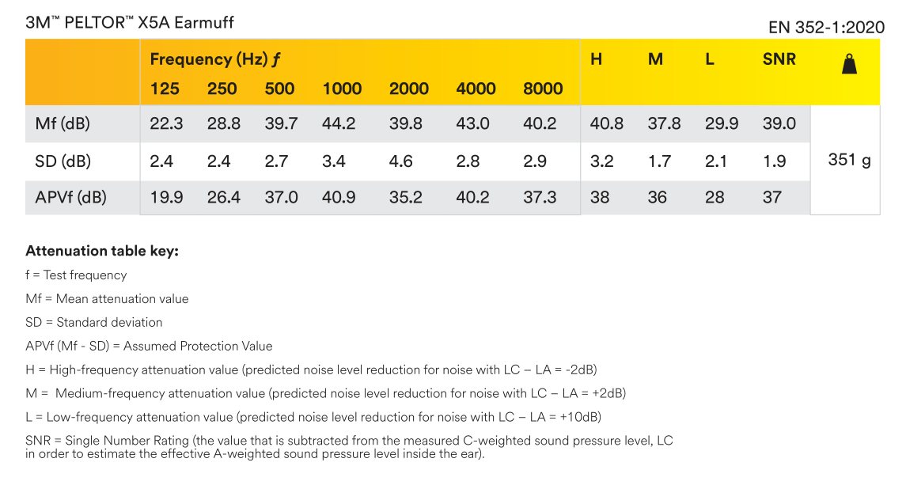

# 隔音耳罩（耳机）使用体验（以 3M X5A 为例）有用吗？值得买吗？

【】字幕：不是广告，不信你看我的粉丝量。

**省流：**  
隔音产品效果如何，只有亲自用了才知道。因为每个人遇到的噪音不同、主观感受也不一样，评测视频不能还原你的环境和主观体验。  

由于最近经常被吵醒，我入手了隔音耳罩。这款 3M X5A 可能是最出名的隔音耳罩，就以它为代表，评价隔音耳罩这个品类。  

  
来自 [3M 中国官网](https://multimedia.3m.com.cn/mws/media/1696474J/xa006458203-3m-peltor-x-series-earmuffs-x5a.jpg?width=1200)  

## 佩戴的不适感

如果耳罩的密闭性差，那隔音效果一定差。但密闭性越好，佩戴的不适感就越强。  
如果耳罩不能长时间佩戴，那隔音效果再好也等于零。所以先说一下戴耳罩的不适感：  

- **夹头**：主要是耳垂附近的脸部肌肉（咀嚼肌）被夹着。松紧可调，戴几天能适应。|【】演示：3M X5A 鼠标画圈
- **闷热**：室温 22℃ 戴都会闷热，耳廓、耳道、脸会出汗，可能有健康风险。
- **侧躺**：需要专门的枕头（ [示例图片](https://item.taobao.com/item.htm?id=801011013657) ）才能侧躺、翻身。用普通枕头时，翻身可能导致耳机脱落。

- **耳压**：戴上之后能感觉到耳道的气压变化。不舒服，不影响入睡。
- **眼镜**：跟眼镜腿的粗细、长度有关，夹着可能会有痛感，也可能影响隔音效果。

只有亲自体验之后，才能知道能不能忍受这些不适感。  
我戴着耳罩睡觉，是不能维持 7 小时的；睡醒的时候，耳罩要么是完全摘下了，要么是摘了一半。  
所以，如果噪音是出现在后半夜，耳罩很可能没用。  

## 隔音效果

### 耳罩隔音效果的纸面参数

  
来自 [3M 英国官网](https://www.3m.co.uk/3M/en_GB/p/d/b00037368/) 的 [Data Sheets](https://multimedia.3m.com/mws/media/2385130O/3m-peltor-x-series-earmuffs-datasheet-english.pdf?&fn=3m-peltor-x-a-b-earmuffs-tds-en-emea-online.pdf)  

表格最下面一行的 APV 的含义是戴上耳罩后，估计可以降低的分贝值。  
可以看到：**面对 500Hz 以下的低频噪音，耳罩的降噪能力较差**，耳罩面对高频能降低 40dB，但面对 250Hz 就只能降 26dB。

【】演示：[京东 3M 自营店 X5A](https://item.jd.com/100016080344.html)  
某平台的销售页也附了一张模糊的检测报告图，纵坐标写的是 Real-Ear Attenuation 意思是人耳听到的噪音衰减值，可以看到也是低频的降噪能力弱。但搞笑的是销售竟然用红字强调「防止低频噪音最为有效」。只能说：销售一定要会查字典，一定要会看图表。  

### 耳罩隔音效果的主观评价

我对噪音算是敏感的：我可以听到楼上狗爪子划地的声音、猫跳到地板的声音。  
下面对常见的噪音，进行完全主观的隔音效果评价；按照戴上耳罩后，噪音对睡眠的影响，给出 3 个 评级：  

- **熟睡**：不影响入睡，也不会在中途醒来。
- **半睡半醒**：也许能睡着，但也会被吵醒。
- **睡不着**：耳罩拼尽全力无法战胜噪音。

**道路噪音**：道路噪音分 3 种：汽车行驶时轮胎产生的噪音：熟睡；汽车发动机的噪音、鸣笛声：睡不着。  
如果你附近是个路口，那耳罩作用有限；因为在路口车辆会频繁地停止、启动，发动机的噪音很大，还有频繁的刹车、鸣笛声。如果旁边不是路口，也很少鸣笛，那耳罩效果应该不错。  
想要云体验隔音效果，可以看这个视频：[BV1Jv4y1A7gF](https://www.bilibili.com/video/BV1Jv4y1A7gF/) 《道路测试》。  

**人声**：儿童、女性的说话声频率较高，评级为「睡不着」；男性人声，评级为「半睡半醒」。寝室环境下，对于吼着玩游戏的，作用有限。  

**鼠标、键盘**：如果是正常使用：熟睡。如果是摔键盘的，以至于桌子都跟着震动，评级：半睡半醒。  
想要云体验隔音效果，可以看这个视频：[BV1m64y1m7Kw](https://www.bilibili.com/video/BV1m64y1m7Kw/)《Sony WH-1000XM4降噪耳机的降噪效果与3M耳罩对比》  

**邻居产生的噪音**：  
楼上、楼下、隔壁邻居造成的天花板、墙体震动声（走路、拖椅子、切菜剁肉、打扫收拾）：半睡半醒。  
下水道的流水声（管道没有做隔音处理）：熟睡。  

**波轮洗衣机**：放水、洗涤声：熟睡；甩干声：睡不着。

**鸟叫**：鸟叫声千奇百怪，笼统地说，尖锐的鸟叫：半睡半醒。

**狗叫**：狗叫也不能一概而论，只能说我遇到过一只土狗的叫声，评级「熟睡」。

**直升机**：降低了很多，但直升机噪音还是太强了，无法战胜。

### 耳罩对比其他隔音、降噪产品

#### 耳塞

比隔音耳塞强很多（我的是安耳悠的泡棉）。我睡觉时用手机外放人声视频助眠，戴耳塞时音量 40%，戴耳罩时音量 70%。

#### 主动降噪耳机

我没有实测，从原理分析一下：  
主动降噪的原理是：耳机的麦克风录音，分析环境噪音，再生成反相的声波抵消噪音。对于**持续且重复的低频噪音**，效果好；对于突发噪音、高频噪音，效果差。也就是说，对于室友说话、邻居活动这些突发的噪音，效果估计不会很好。  

**原理**：  
[BV1hFEWzjEUd](https://www.bilibili.com/video/BV1hFEWzjEUd/) （商单）你以为耳机在降噪，其实它在预判未来 0.001 秒...【差评君】  
[BV1g7411N7Jd](https://www.bilibili.com/video/BV1g7411N7Jd/) （商单）耳机的主动降噪是什么原理？

**云视听**：  
[BV1Eih9zjE2R](https://www.bilibili.com/video/BV1Eih9zjE2R/) （商单）《睡觉戴什么才能真正隔绝噪音？【耳塞、耳罩、降噪耳机、睡眠耳机大评测】》  
[BV1Z8DhYnES5](https://www.bilibili.com/video/BV1Z8DhYnES5/) 谁是最强降噪蓝牙耳机？  

## 最后总结

只有试了才知道。

## 参考资料

[低频噪音主要有哪些？](https://zhuanlan.zhihu.com/p/383892464)  

**看了但没用上**：  
[图一乐儿。3M X5A隔音耳罩测评](https://www.bilibili.com/video/BV1c3411R7Ko/)  

## 更新日志

2025-12-24 第一版  
2025-11-29 开始测试