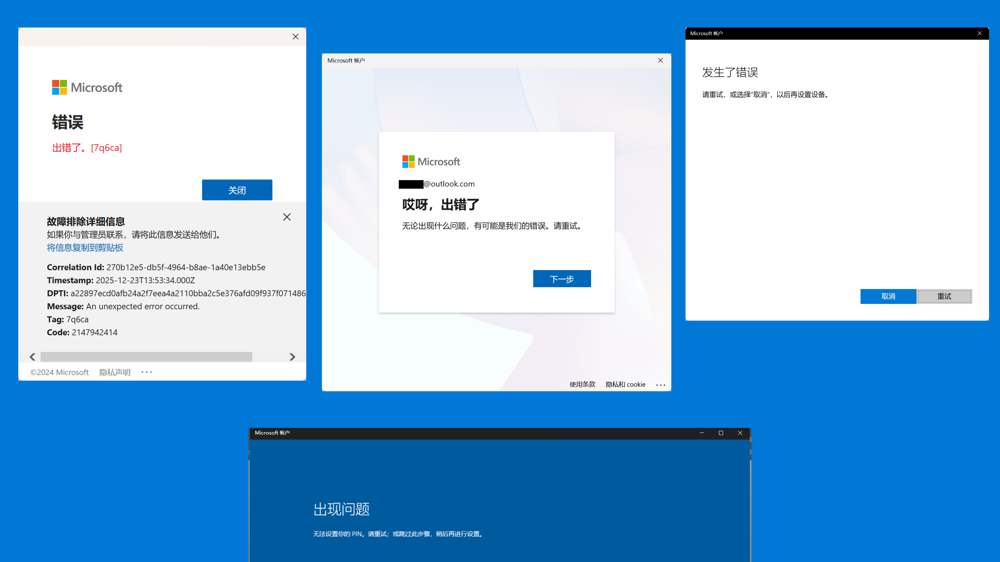
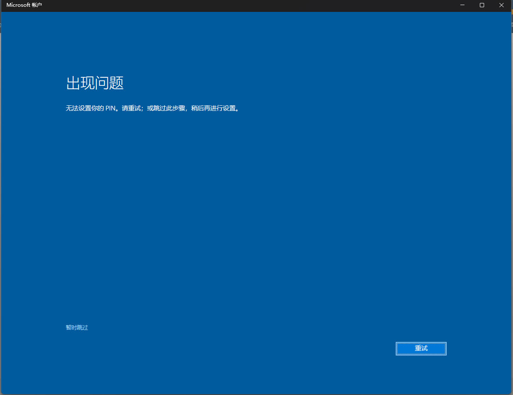
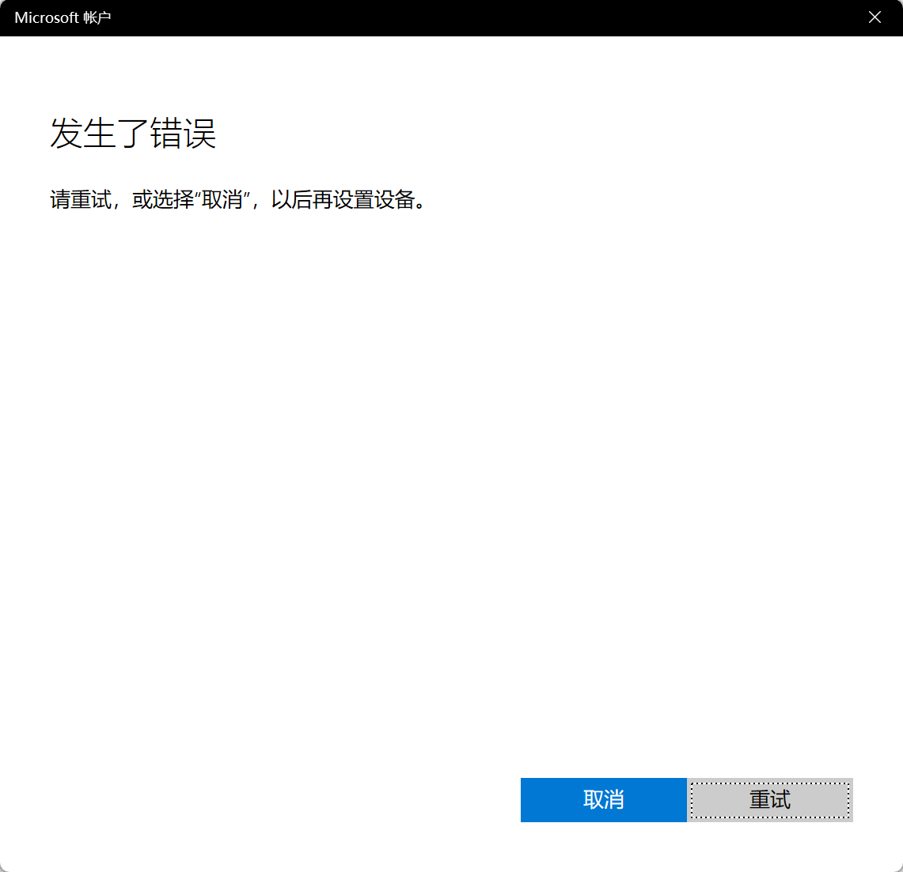
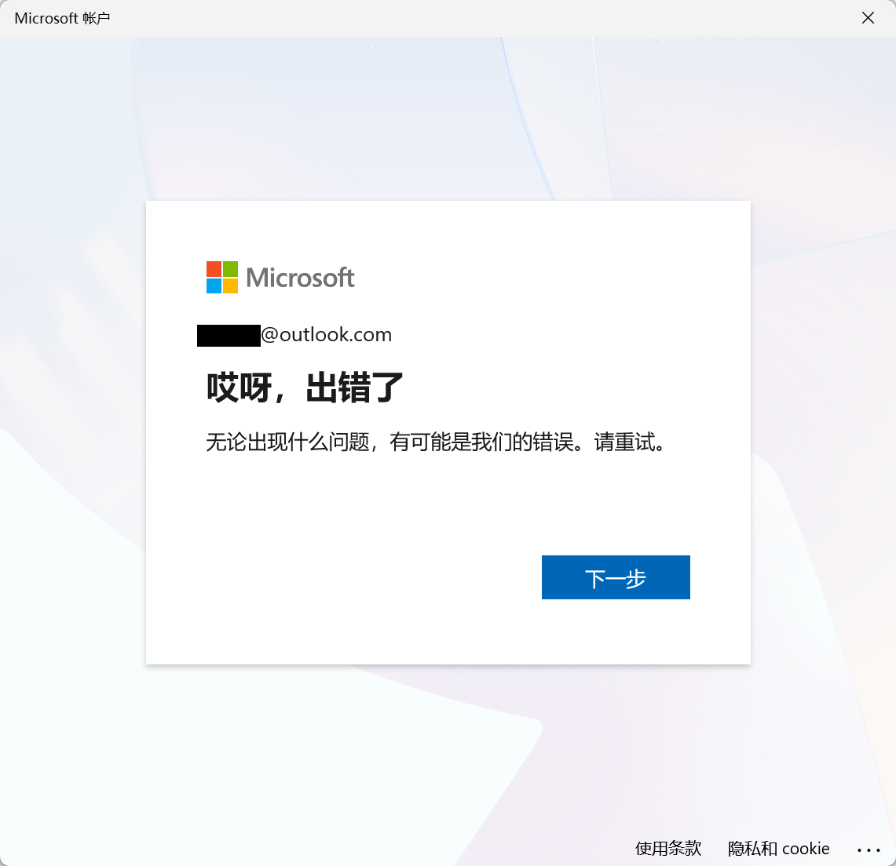
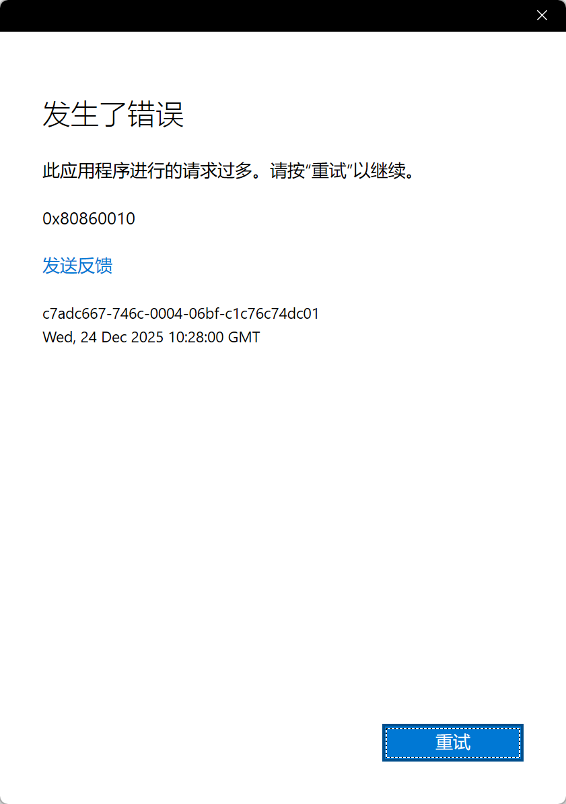
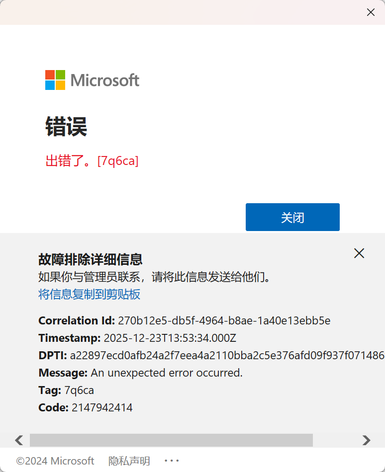
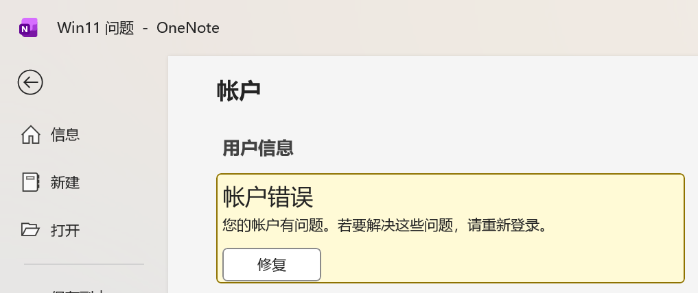
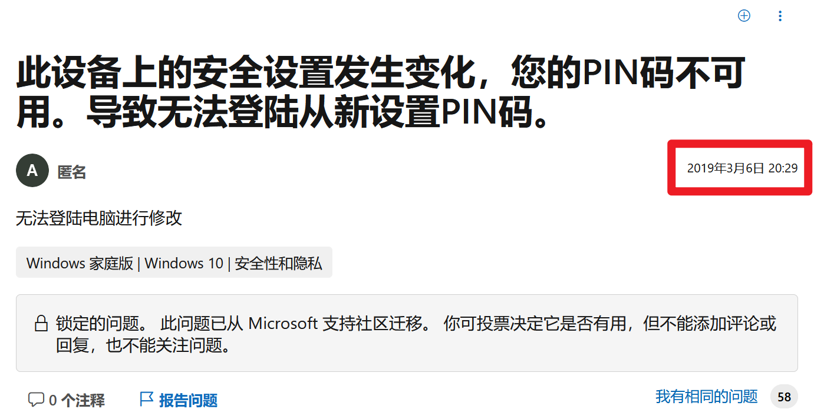
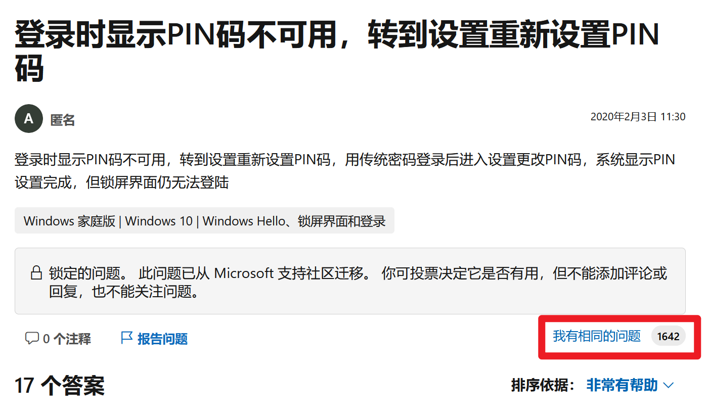

# 微软！我只是想更新 BIOS，结果被迫重装系统？！

【】图：全屏，模仿蓝屏  
使用微软的产品，就像是失败的婚姻：最初很喜欢，后来因背叛而愤怒、痛苦，最后无奈、隐忍。  
【】音频：「凑合过呗！还能离咋地？」。  

## 起因

呃，朋友们好啊，我是新人 up 主「风无前」。刚才有观众问我：「发生甚么事了？」。我说怎么回事。（并非观众）给我发了几张截图。  

我一看，哦，原来是前几天：  

### 升级 BIOS

【】图：主板修复了bug.png  
我看到微星的主板发布了新版本的 BIOS，塔门说：诶……修复了一个 bug：修复在选择「不储存退出」后风扇设定会被改变的问题（ [来源](https://www.msi.cn/Motherboard/MPG-Z690-CARBON-WIFI/support) ）。  
这个「风扇设定被改变」的 bug 我遇到过几次，就是重启之后风扇变成默认策略，噪音很大；手动把设置改回去也浪费时间。在这块 Z690 主板发布 4 年之后，他们终于把这个 bug 修复了。为了获得「**[沉疴顿愈](https://baike.baidu.com/item/%E6%9D%AF%E5%BC%93%E8%9B%87%E5%BD%B1/597411)**」的快感，我决定更新 BIOS。  
**没问题就不要更新 BIOS**。我知道这个道理。我上次升级 BIOS 是 2023-01 月，是为了支持内存 EXPO 超频才升级的。  

### 发现内存超频不稳定、游戏掉帧

升级 BIOS 的过程顺利，我知道升级 BIOS 会导致 Windows 提示「PIN 不可用」，无法进入桌面这个问题，在升级前就把 PIN 删除了。  
【】图：删除PIN  
我防出去了啊，防出去以后，自然是顺利进入桌面，开始正常使用。  
结果，11 天内出现了 3 次内存超频失败，无法开机的问题 （ [报错参考](https://www.bilibili.com/video/BV1UY4y1u7Ka/) ） 。我就只是开个 EXPO，没有手动调参数。  
还有，我长期在玩的《GTA OL》，游戏的 Low 帧变得不稳定，有明显的卡顿。搜索后发现 [有玩家反馈](https://www.bilibili.com/video/BV1xK4tzTEnb/) 降级 BIOS （CPU 微码）后解决了问题。

因为这两条，所以我又决定把 BIOS 降级回去。  

### 降级 BIOS

【】图：微星更新 BIOS  
看着 BIOS 更新的进度条，我才发现我大意了，没有删 PIN。我说停停，但这个界面是禁止键鼠操作的。然后两分多钟以后，就降级好了。  

重启进入 Windows 系统，自然是提示 PIN 不可用。但是，**我并没有像大多数人那样卡在登录界面**。在输入微软帐户密码后，我成功进入了桌面，并且成功删除了 PIN。  
【】图：删除 PIN  
我笑一下，准备开一局。因为这时间，按照传统 bug 的点到为止，这问题已经解决了。我开始重新设置 PIN。

  

结果如图。我发现我笑早了。我感觉微软给我右眼蹭了一下，当时就流眼泪了，捂着眼。我说「阿米诺斯」。  
我也是写这段文案的时候才意识到，微软没有在登录界面卡我脖子，原来是在这儿等着我呢！  

### 死局

我是使用密码管理器管理密码的，我的微软帐户密码是随机生成的 20 位数字、大小写字母、符号的组合。所以 PIN 是一定要设置的，更何况我还花了 90 CNY 买了指纹识别器。  

在尝试过几个操作（详见后文），结果无效后，我想到：切回本地帐户，重新登录，也许能解决。  
**切回本地帐户之后，可以设置 PIN 了。但是，微软帐户登不上了**。  

**在系统设置中无法登录微软帐户**：  
【】视频：微软无法登录-设置.mkv  
  

**在 Office 中也无法登录微软帐户**：  
【】视频：微软无法登录-Office.mkv  
  
  

不登录微软帐户，就不能用 OneDrive 的同步功能。我是 OneNote 的重度用户，用了 8 年，现有图文笔记 9GB。这本地帐户没什么不好，但微软帐户对于我来说，可以更加地海阔天空！  

#### Office 软件不能登录微软帐户

  

这个估计是**与另一个问题耦合**了。长期以来，使用 OneNote 的时候总会提示帐户登录的问题，笔记也经常出现暂时无法同步的问题，但大体上同步功能还是可用的；并且只要在 OneNote 里点一下重新登录，头像旁边的黄色三角感叹号会消失，至少能够正常一会。而最近，在 PIN 出现问题之前，点一下重新登录，也不能够变得正常了；也就是说这个长期问题变得更严重了。在 PIN 出现问题之后，Office 的帐户登录状态就彻底掉了，**OneNote 不能同步，对我来说是无法接受的问题**。

## 解决无法重置 PIN 并且无法进入桌面的方法

**常见的 PIN 的问题是**：卡在登录界面，无法重置 PIN，又不能使用微软帐户登录，以致于无法使用电脑。  
这部分整理一下解决这个典型问题的操作，可以收藏以备不时之需，如果用上了，记得点赞。  
一共 6 种情况，按照操作难度，从简单到复杂排序：  

### 忘记微软帐户密码

如果是因为忘记密码（邮箱、手机号不可用）而没办法重置 PIN，那建议学习密码管理的知识，使用「密码管理器」管理密码。你也可以拒绝接受这次教训，代价是无法登录账号的问题会在你身上重复发生。  

### 电脑连接手机热点 / USB 共享网络 / 改路由器 DNS

[视频](https://www.bilibili.com/video/BV1FZ4y1i7b7/)  
这个情况是解决由于网络问题，连不上微软的服务器，导致无法重置 PIN。具体表现就是点了重置 PIN 之后，一直在加载。  

### 关闭 TPM 再打开

[视频](https://www.bilibili.com/video/BV1934y1K7dg/) 、[视频2（短）](https://www.bilibili.com/video/BV1114y1h7BB/)  
这个情况是由于更新了 BIOS 等操作，导致 TPM 变化。  

### 改注册表 DevicePasswordLessBuildVersion

[视频版](https://www.bilibili.com/video/BV1vu3CzxEHp/) 、[图文版](https://bbs.pcbeta.com/viewthread-2047506-1-1.html)  
这个情况是只能使用 PIN 登录，不能输入微软帐户密码。添加这个注册表项，是为了开启密码登录。  

### 替换 utilman.exe ，改为正常启动

[视频](https://www.bilibili.com/video/BV13p4y1n7yD/)  
这个情况是由于修改了「启动」方式导致的，可能是被软件在不知情中修改了。  

### 缺网卡驱动所以无法上网

[在 PE 系统安装网络驱动](https://www.bilibili.com/video/BV1ucPoe5EZV/)  
这个情况是由于换了主板或网卡，导致网卡缺驱动无法上网，所以无法重置 PIN。  

## 解决我遇到的问题

对于我遇到的删除 PIN 之后不能重新设置的问题，以及微软帐户无法登录的问题，目前没发现有效的解决办法。下面这些我都试过了，都没用。  

### sfc /scannow

[官方指南](https://support.microsoft.com/zh-cn/topic/%E4%BD%BF%E7%94%A8%E7%B3%BB%E7%BB%9F%E6%96%87%E4%BB%B6%E6%A3%80%E6%9F%A5%E5%99%A8%E5%B7%A5%E5%85%B7%E4%BF%AE%E5%A4%8D%E4%B8%A2%E5%A4%B1%E6%88%96%E6%8D%9F%E5%9D%8F%E7%9A%84%E7%B3%BB%E7%BB%9F%E6%96%87%E4%BB%B6-79aa86cb-ca52-166a-92a3-966e85d4094e)  

### 使用 Windows 更新修复问题

[官方指南](https://support.microsoft.com/zh-cn/windows/%E9%80%9A%E8%BF%87%E9%87%8D%E6%96%B0%E5%AE%89%E8%A3%85%E5%BD%93%E5%89%8D%E7%89%88%E6%9C%AC%E7%9A%84-windows-%E4%BF%AE%E5%A4%8D%E9%97%AE%E9%A2%98-497ac6da-7cac-4641-82a5-f50398d879a0)  
【】图：更新修复问题.png  

位置在：设置 - 系统 - 恢复。原理是下载当前版本的系统镜像，并重新安装。不会丢失数据。我的版本是 25H2，从下载到安装全程超过 1 小时。  

### 在安全模式（带网络连接）中设置 PIN

跟普通方式登录的报错是一样的。  

### 网络相关

**SSL / TLS 协议版本**  
运行 `inetcpl.cpl`，高级 - 安全，调整 SSL、TLS 版本。  

**使用代理、加速器后登录**  

如果是微软的服务器有问题，那应该出现成规模的无法登录的问题，而目前没听说有这样的事件。  

### 让 Edge、微软商店同步登录状态

在 Edge 浏览器登录微软帐户：来自 [BV1RN41187kM](https://www.bilibili.com/video/BV1RN41187kM/) 的评论区。我的报错跟 Office 登录一样。  
在微软商店登录：来自 [BV1RXuYztEu2 的评论区](https://www.bilibili.com/video/BV1RXuYztEu2?comment_on=1&comment_root_id=271372907088&share_tag=s_i#reply271372907088) 。首先我的本来就是登录状态，其次我点注销后再重新登录，也登不上。  

### 删除 Ngc、WinBioDatabase

Ngc：`C:\Windows\ServiceProfiles\LocalService\AppData\Local\Microsoft\Ngc`

WinBioDatabase：`C:\Windows\System32\WinBioDatabase`

### 设置组策略

[视频](https://www.bilibili.com/video/BV1RXuYztEu2/)  
计算机配置 - Windows 设置 - 安全设置 - 安全选项。调整以下 3 个：  

- 帐户：阻止 Microsoft 帐户，设为禁用。
- 用户帐户控制：以管理员批准模式运行所有管理员，设为禁用。
- 用户帐户控制：用于内置管理员帐户的管理员批准模式。

### 不是普遍问题

不是只有我一个，但也不是普遍问题。  

**无法设置 PIN**： [例1](https://learn.microsoft.com/zh-cn/answers/questions/4087952/windows-11-pin-pin) 、[例2](https://learn.microsoft.com/zh-cn/answers/questions/4321003/pin) 、[例3](https://learn.microsoft.com/zh-cn/answers/questions/4373257/pin) 。

**无法登录微软帐户**：[例1](https://learn.microsoft.com/en-us/answers/questions/5644991/i-cant-sign-in-and-sync-to-copilot-edge-team-etc-a) 、[例2](https://www.bilibili.com/video/BV18DvWBuELv/) 。

## 结语

更新 BIOS 导致 PIN 失效，这不是 bug，是 feature。但是无法重置 PIN、无法进入桌面，微软要负全责。  

微软！我只是想更新 BIOS，为什么会被迫重装系统？！  
微软！这个问题**已经存在 7 年了**，  

  
[来源](https://learn.microsoft.com/zh-cn/answers/questions/3206811/pin-pin)  

  
[来源](https://learn.microsoft.com/zh-cn/answers/questions/3276337/pin-pin)

  
来自 B 站搜索  

**给几十万人造成困扰**，什么时候能解决？！  

微软（中国团队）！你有本事搞中国大陆特供的「电脑管家」「OfficePLUS」，怎么没本事优化境内的网络连接啊？  

我，劝！微软，耗子尾汁，好好反思，尽快解决这些问题。  

## 参考资料

**看了但没用上**：  

2025-12-31 在 B 站搜索「pin不可用」，按「最多播放」排序，**一共 42 个视频都看了**（播放量最高 48.5 万，最低 56），文中没引用的视频就是重复或没用的。  

[【开机10】解决出现问题，你的PIN不可用](https://www.bilibili.com/video/BV1mS4y127cC/)  
[引流自己的 U 盘](https://www.bilibili.com/video/BV1RP411q7Xq/)  
[系统还原](https://www.bilibili.com/video/BV1qM4y127XB/)  

## 更新日志

2026-01-01 第一版  
2025-12-23 被微软偷袭