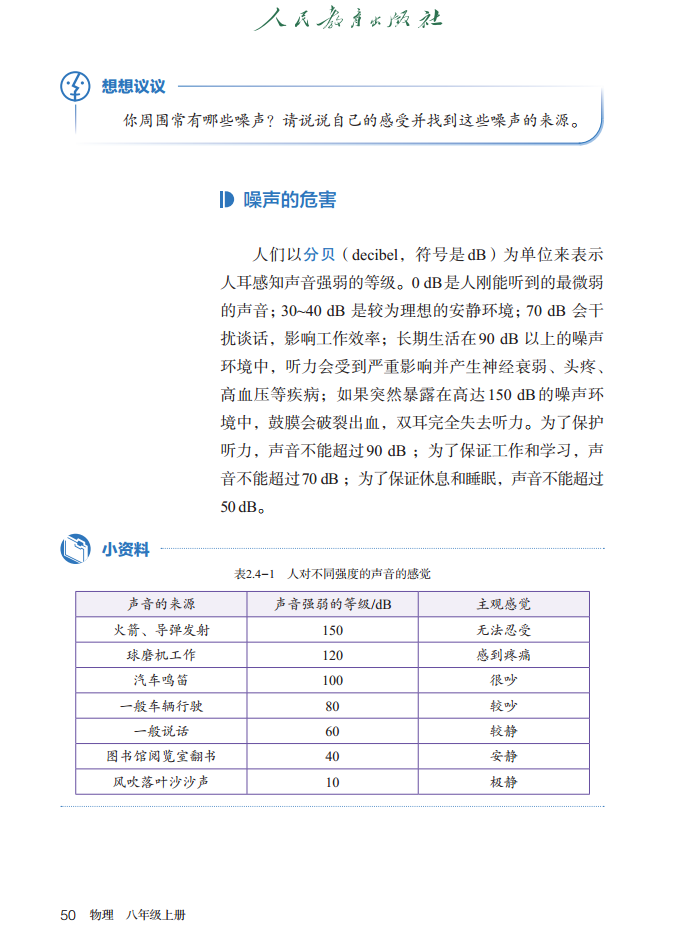
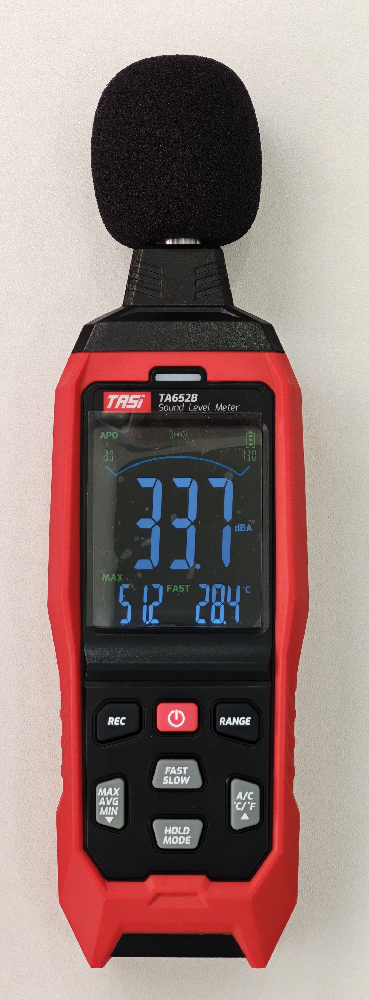
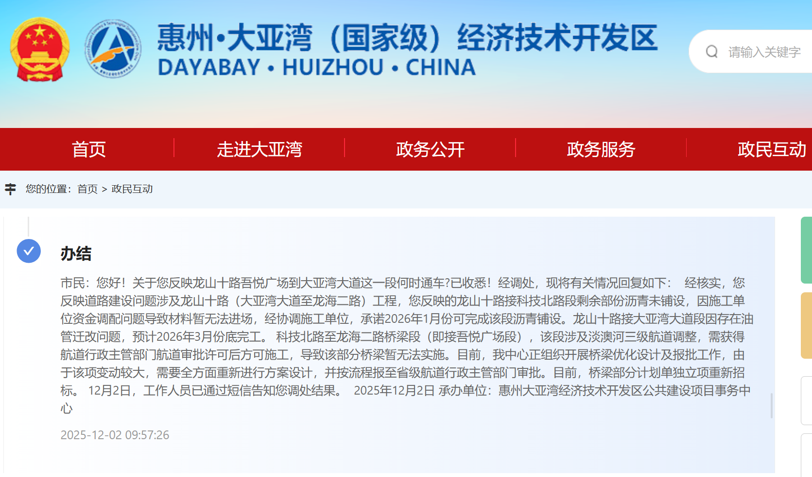
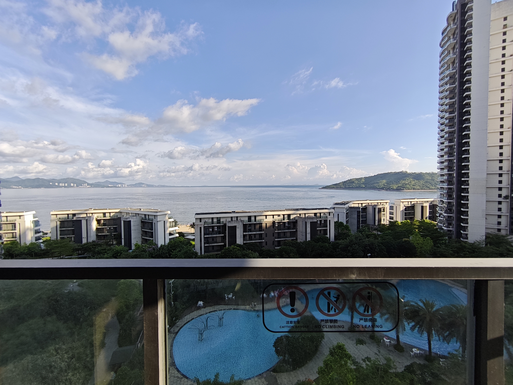
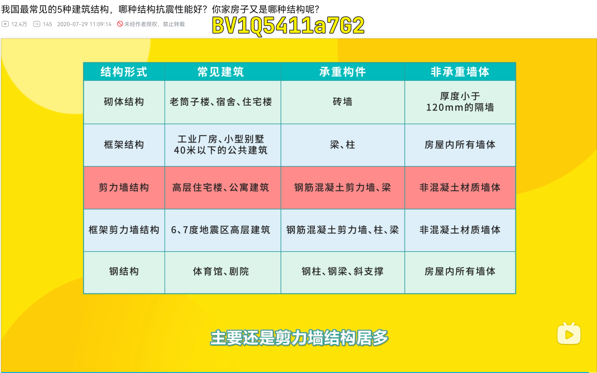

# 锐评惠州大亚湾 35 个小区安静程度

点开这个视频的你，可能就住在惠州大亚湾或者准备来这里旅居、TP（平躺）、过冬、过年。2025-12 月，我花了半个月时间，实地考察了大亚湾 35 个小区，40 套房子，重点调查了小区的安静程度，成果就是本期调查报告。  
本文有一半内容是**通用的：噪音隔声的相关知识、寻找安静房子的方法**，不局限于大亚湾。  

【】这段不在视频里念了  
在「声学」的专业领域内，一般都是用「声」而不是「音」，本文不进行严格区分，会出现混用。  

**一套房子的安静程度由小区附近的环境噪音和房子本身的隔声性能决定**。

## 各小区房子的隔声性能

### 房子的隔声性能由墙、楼板、窗户、门决定

先简单说一下开发商配的窗户（阳台）、入户门。  

**开发商配的窗户**  
据说有的开发商会配双层玻璃；但我在看过的小区里，开发商配的都是**单层玻璃**。噪音超过 50 dB，单层玻璃就挡不住了。  

**开发商配的门**  
入户门的作用是挡住同一层邻居、以及走廊中的噪音。

- 邻居可能经常吵架，可能喜欢（为了通风）开着门看电视等娱乐。
- 走廊：小区的走廊一般比较小，邻居不会长时间停留。但有些公寓一层有十多户，走廊很长，可能遇到喜欢手机外放的人。

下面讲很难改变，但很重要的墙和楼板的隔声性能。  

### 邻居噪音的传播方式

- 通过空气直接传播。比如邻居开着门窗放音乐、吵架、狗叫。
- 通过墙体的震动传播。比如装修、跑步、拖椅子、剁肉。

拖椅子是直接让楼板震动，把噪音传到楼下。而吵架的声音，除了空气直接传播，还有一部分是先在邻居家的空气中震动，再让墙、楼板震动，传到你家。  
主要靠墙体震动传播的这类噪音，会让你家的天花板、地板、前后左右一共六面墙都发生震动。这会导致你对噪音源位置的错误判断，**感觉震动是天花板传来的，实际上噪音可能是楼下邻居造成的**。  

### 房子隔音非常差是什么概念？

你可能没住过隔音非常差的房子，这里有必要讲一下。  
对于大部分情况下，听不到楼上楼下隔壁邻居的说话声、脚步声；但是能听到邻居拖椅子、砸核桃、切菜剁肉捣蒜等，通过震动楼板传播的噪音。这样的房子，**隔音算一般**，甚至可能算好的。  
能听到隔壁或楼上邻居的说话声（不包括吵架），就属于**隔音差**了。  

**隔音非常差意味着**：能听到斜上方、斜下方、楼上的楼上、楼下的楼下甚至更远的邻居的噪音，中间隔了一层都挡不住噪音。  
跑步机的震动，可以往上传 2 层，往下传 2 层；音响的低频，可以往上传 5 层，往下传 5 层。  
甚至能听到：楼上的猫在地板上跑酷的震动，耳朵贴墙能听到钟摆声。

**隔音非常差，意味着邻居的正常活动都会给你造成困扰**：  

- 邻居只是嗓门大，并不是在吵架、吼叫；但你能听到邻居说话。
- 邻居只是体重大，正常走路，并不是在跺脚；但你的天花板在震动。

隔音差的房子不存在安静的角落。楼上在客厅活动，哪怕你在最远的卧室，也一样会被吵醒。

对于这样的房子的噪音问题，我认为《治安管理处罚法》是解决不了的。  

### 我在大亚湾没找到隔音好的房子

把房子的隔声性能单独拿出来讲，是因为：**在我看过的这 35 个小区里，没发现隔音好的，只有「差」和「非常差」**。  
如果有的选，就不要选择隔音差的房子。  
如果没得选，在后文有选房建议。  

## 几个影响范围很大的环境噪音源

大亚湾有几个影响范围很大的噪音源，一个噪音源影响多个小区，这部分进行统一的详细讲解。后面讲小区时就一笔带过了。  

由于「噪声」不是初中物理的考点，所以可能很多人对声音的分贝值没什么概念，这里我们复习一下：

  
2024 年秋季人教版物理八年级上册，第 50 页（ [来源](http://czwlzx.cn/wlzx/072656152090.html) ）

在看房时我使用了噪音计进行测量，型号是「特安斯 TA652B」，测量时用的是 A 加权、快速档（后文都是这个标准，不再重复标注）。  

在有大货车、工程车频繁经过的非常吵的路口（石化大道与科技北路交叉口），噪音也就只有 70~80 dB。但是我大声说话，在 1 米外测得的最大值也能达到 70 dB。显然，这两种声音给人的主观感受是完全不同的。**分贝值的参考作用有限**，它只能用于这样的场景：  

- 场景一：A 小区很吵，B 小区也吵，哪个小区稍微安静一些？分贝仪可以给个答案。
- 场景二：大量看房的时候，用于记录。数字相比「吵、很吵、非常吵」的模糊描述更准确。

哪怕使用专业的声级计，分频率测量声压，再绘制频谱图，也**不能代表你的主观感受**。  

### 直升机噪音

以防你没听过直升机的噪音，先说一下，直升机的噪音非常强，能让几百上千米外的玻璃震动。  

  
来源：[flightradar24.com](https://www.flightradar24.com/)

影响大亚湾的这条直升机航线，是从深圳南头直升机场出发（在南山区），（据说是中海油的）去海上钻井平台。最北端通常在「仁和美地」这个小区，偶尔也会偏北、偏南几百米。基本每天，包括周末都有直升机飞过，数量不固定，频率高的时候大概 10 分钟飞过一架，总共有大概 10 架直升机。
直升机噪音可以影响大概半径 2 km 内的建筑。一架直升机的噪音影响时间约一分钟。航线是双向往返的，有去有回，一架直升机两次噪音。  
【】演示：从航线最北端的「仁和美地」到「海德尚园」直线距离 1.5 km，「海德尚园」也在直升机的影响范围内，玻璃会震动。  

在「仁和美地」附近，直升机通常是上午 8 点之后通过，12-14 点的午休时间会有返航的。晚上是没有直升机飞的。  

据《南方都市报》2025-05 [报道](https://news.qq.com/rain/a/20250519A01LBC00) ，低空飞行噪声监管尚属法律空白，没有具体限值或操作性标准。  

### 学校

大亚湾是人口流入的新城区，小学很多。  

学校的噪音主要来自于：体育活动（体育课、跑操、课间休息、军训）、集体活动（升旗、讲座）、教学活动（读书声、讲课声）、上下课铃声、上学放学。  
如果你工作时间不在家，那小学的噪音基本没有影响。最多就是早晨睡不到 9 点。但初中、高中可就不一定了，996 对部分地区的中学生属于「减负」。

小学附近的住宅底商有不少是午托、晚托、兴趣班。午托、晚托在放学、上学及饭后活动时会有噪音，午托一般都强制午休，整体不算吵。兴趣班要关注乐器类、舞蹈类的，噪音可能很大。

### 大亚湾大道、石化大道、惠深沿海高速

这三条路车流量大，非常吵闹。临近的小区都可以不用考虑。  
【】图：石化区地图  
石化大道怎么得名的？是因为大亚湾有一片石化工厂区。石化大道上有很多大型工程车辆。  

### 龙山十路

龙山十路的规划是「城市主干路」，双向六车道；北通吾悦广场，南通大亚湾大道，开通后车流量不会少。  

**龙山十路什么时候能通车？**  
【】视频：《雍正王朝》十四阿哥，难说  
难说。  
中间的道路已经修完了，现在是两头遇到问题没通。

来源：[大亚湾开发区政民互动](http://www.dayawan.gov.cn/zmhd/index.html) ，工单编号 4525120115530210501

目前的最新消息是 2025-12-02 的。南边到大亚湾大道段因存在油管迁改问题，预计 2026 年 3 月底完工。  
【】图：龙山十路的桥  
北边到吾悦广场这段是要建桥的，需要航道主管部门**审批许可后才能施工**，由于该项变动较大，桥梁需要**重新设计方案**，计划单独立项**重新招标**。  

但是，**同样的话，之前已经说过两次了**：  
【】图：龙山十路消息-2024-11  
2024-11 月一次  
【】图：龙山十路消息-2024-06（感谢公众号「 [大亚湾信息港](https://mp.weixin.qq.com/s/TwSm_FBar4Q8dXhua-eZYQ) 」）  
2024-06 月一次  

如果龙山十路通车了，那估计车流量是不会少的。  
现在虽然没开通，但晚上有不少人在走路健身，半夜还有骑摩托的轰油门。  

### 铁路

惠阳站在这里，这条路是高速铁路，高铁的噪音也是比较大的，并且铁路两侧是没有隔音屏障的。  
目前这条线是「杭深铁路」，未来还会开通「深汕高铁」。  

以上几个影响范围很大的环境噪音源讲完了。  

## 各小区的环境噪音

环境噪音是指：工地、装修、道路、公园、学校、商铺、广场舞、小区内的小孩等噪音源对小区的影响。  
我的需求是 24/7 的安静，所以这部分的评价标准严格；大部分人不需要 24 小时的安静，后文会帮助分析你的需求。  

### 小区噪音的常见噪音源

通常，影响最大的是邻居的噪音，但是因为跟小区关系不大，所以放在后面讲。  

#### 住宅底商

住宅底商就是指住宅楼低层的商户。住宅底商的噪音有可能很严重。  
商铺可能营业到凌晨，甚至通宵；可能用音响放音乐、大喇叭宣传、搞活动。  
饭店：吃饭的人大声说话、唱歌，甚至醉酒打架。还有做饭的油烟会往楼上飘、抽油烟机的噪音。  
碰上 KTV、棋牌室、乐器店那更是永无宁日。  
还有，**商铺是变化的**。现在不吵，不代表你住进去之后也不吵。  

#### 小区里的噪音

常见的有：小区里的游乐园、体育设施（篮球场、羽毛球场、乒乓球台）、游泳池。  
大亚湾是人口流入的新城区，这边的儿童非常多。儿童在小区里玩的噪音也是很吵的，每天晚上三个小时，到寒暑假就变成全天吵。有儿童，自然就有儿童的奶奶、姥姥，她们可能会跳广场舞。  
很多小区是「围合式」的，就是这样楼围一圈，中间是绿化、儿童游乐园。对于南面在小区内部的楼栋，就没有安静的户型了；因为小区里有小孩，小区外面是车流、商铺。对于南面临街的楼栋，可以选择不是南北通透的户型，这样就不会受到小区里的噪音影响。  
如果你注意力惊人，就会发现这条建议跟上一条针对商铺的建议是冲突的。小区里小孩的噪音是已知确定并且会持续下去的，商铺的安静是不确定能维持多久的，对于这样的「围合式」小区，那还是南面朝小区外的楼栋更好；因为明知有噪音，你还住进去，那你只能怨自己。如果是楼栋比较多的小区，那还是有可能找到既没有底商，也远离小区内噪音的楼栋的；但是选择很少。  

### 小区前排的楼挡不住多少噪音

由于要满足采光标准，靠近噪音源的前排的楼并不能挡住多少噪音，两三排楼的隔音效果有限，大型小区中间隔四五排楼隔音效果就不错了。举例：这是大亚湾大道，「仁和美地」这个小区只有两排楼，噪音可以从前排楼之间穿过，传播到后排的楼。  

### 锐评小区

先评一下在网络上最吸引人的海景房：  

**华润小径湾**  
小区建成已经有十年了，不算新房子，看过的几套家具家电都比较旧。  

这是所谓的「一线海景房」。其实真正的一线海景是前排的叠栋别墅。像图中这种低层、靠后的楼栋，海景不怎么样。就算靠着海边，我个人也不喜欢这种有山遮挡的、不够开阔的海景。  
再往后的二线海景，我觉得就不算海景房了。这里的水质、沙滩都不怎么样，不适合游泳。  

空气潮湿，海风也确实有股腥味。这是小径湾一个房子阳台上析出的盐粒。  

【】图：小径湾物价  
这里的物价是景区物价，「海润路」整条街都是海鲜大排档，这附近几乎没有平价餐馆。自己不做饭的话，那生活成本就高了。  

最后终于说到这里的安静程度了。这里白天有游艇等游乐项目，有船的发动机的噪音。晚上这有音乐餐吧放音乐，沙滩上还有用音响鬼哭狼嚎唱歌的。前排的叠拼别墅有一部分是作为轰叭馆出租的。  
再往东看，这里有一道隔离墙，是大亚湾区与惠东县的行政分界线。这边的海滩归惠东县管理。这片海滩晚上是连排的烧烤、饮料摊，同时用音响大声放歌、KTV、娱乐活动。  

【】图：沙滩商业  
【】图：沙滩商业2  
【】图：22 时后沙滩禁放  
还经常有放烟花的。烟花的声音有多大，就不需要我描述了。看见这个告示了吗？骗你的，22 点之后照样放烟花。  

还有，这条路是「石化大道」，临街的也不用考虑了。  
说这里隔音差的网友倒不算多。  

**碧桂园十里银滩**  
【】图：碧桂园十里银滩  
是小径湾的低配版本，海景更差，房子也更差。所以，房租也便宜一些。  

如果能接受这里的物价，也不追求海景，那何必住在这呢？如果就是要住这里，那可以看看更偏僻一些的这些小区。  

---------------------------------------------

说完海景房，接下来的小区按照从北到南，从西到东的顺序讲解。  
本来这部分是要用「平台 B」的小区全景来讲的，很直观，但是这个功能现在下线了，只能用地图了。  

**星河丹堤**  
这附近算是惠阳的老城区，入住率高，商业配套齐全。  
这个社区非常大，别墅、洋房、单元楼加起来 100 多栋。我转了一圈，没有看房。有多位网友反馈房子隔音差。  
楼房与别墅区混合分布，别墅区经常装修。  
有 4 个幼儿园。这是从小学到高中十二年一贯制学校（ [来源](https://mp.weixin.qq.com/s/Kfg1uLftO7xIHTiSiIB5-Q) ），大喇叭很响。  

**翡翠山**  
翡翠山大部分是别墅。主要说这两排楼房。  
这个小区差不多是大亚湾房租最贵的了。反馈房子隔音差的网友基本也是最多的。  
【】图：龙海一路施工 （ [来源](https://www.xiaohongshu.com/explore/681d76420000000023003f53) ）  
「龙海一路」扩建，现在已经施工快一年了，预计工期都排到 2027-03 月了，实际工期那都不敢想。  
这里是幼儿园，这里是第六小学。  
这里是酒店，晚上会有歌唱表演。

**海惠花园**  
商业配套齐全。小区基本住满了。人多就必然不会安静，而且因为是老小区，所以我没有看房。  
「河东一路」因为北边是星河丹堤，路又窄，所以一直都有车过。  
临街的这一排一楼都是商户；这一排的一楼都是烧烤店、饭店。  
这是两个幼儿园。

**惠湾花园**  
这里有夜市，质量一般。  
北边这一排一楼是烧烤店、大排档。东、西一楼也全是商户，南边是小区道路，路对面有商户。  
这小区就是公寓式布局，三部电梯一层十多户。  

**亲水湾**  
南边是龙海二路，车流量大。  
这一圈一楼、二楼都是商户，主要是东边的商户会吵一些。  

**灿邦新天地**  
优点是离商场近，缺点是离商场太近。  
低层受到住宅底商和商场影响，高层又有中兴北路的噪音。  
1 栋楼下是篮球场。4 栋楼下是游乐园。这几栋就在商场楼上。  
12 栋东边是儿童游乐园。  
【】图：吾悦广场东北的工地  
东北边的山上在挖山。  

**三远大爱城 / 三远怡和园**  
小区楼不少，入住率高，人多。  
一楼商铺是满的。北边是龙海二路，这些楼栋都受影响。东边龙山十路开通后，也有噪音。  
有多位网友反馈隔音差；据说小区里面有跳广场舞的。  

**城央印象**  
房租高于平均水平。  
北边商铺是满的，东、西、南的商铺比较少。  
东边是龙山十路。南边这里是新能源大巴车充电站，我去的几次都没什么噪音。  
这几栋还不错，前提是商铺能保持安静；视野开阔。  

**国韵华府**  
这小区还算安静，但是房源少，我找过两家中介都没看成房子。  

**云水佳苑**  
2 梯 4 户，03 04 户型朝南。  
南边有多个小型工地，看起来都是自建房；有个工地在凿山，非常吵。  
除了工地之外，这小区还是安静的，楼下没什么商铺；这片全是空地，视野开阔。  

**中达聚龙庭**  
这小区在平台上没看到有出租的房子。在小红书上见过一套。  
东边有健身房，音乐声有点大，旁边的低楼层受影响。再往东是龙山十路。北边的新能源大巴车充电站，刚才说过了。再往东是第五小学，因为距离远，影响应该不算特别大。  
商铺很少，也没有吵闹的。  

**海德尚园**  
开发商配的单层玻璃隔音很差。会受到直升机影响，玻璃震动。  
有网友反馈房子隔音差。  
西北侧有工地。南边是中兴北路，科技北路、科技东路经常有大车经过。东南是惠深高速，这几栋受影响。西边有游乐场和吾悦广场，也可能会吵。  
小区里有篮球场。  

噪音测量记录：1 栋 55-60 dB。  

**太东公园上城、海德花园**  
说这里隔音差的网友是最多的，可以听到隔壁的咳嗽声，属于非常差的级别。而且这小区建成有几年了，入住率高，很难找到没有邻居的房子。  
1-3 栋，北边是商场，商场门口晚上有跳舞、动感单车，还会有乐队开 Live 及各种商场活动。1 栋楼下有跳广场舞的。西边是龙山十路，开通后这里是路口，是一条路上最吵的部分。这里有一家健身房。  
5-8 栋，北边是中兴北路。  
19-20、28-31 东边是科技北路，这条路看着不宽，但是经常有大车过，发动机噪音很大。  
18-21 栋楼下是泳池，夏天会开放。  
31-32 南面是第七小学，33-36 西南是第五小学。  
22、36 栋楼下有小吃夜市，有噪音，还有烧烤、炒菜的油烟。  
都是围合式小区，一楼商铺是满的。33 栋楼下就有敲鼓的。  
河东三路，也不算安静。  

噪音测量记录：29 栋：开窗 50-60，单层玻璃 40。

**海德公馆**  
房租高于平均水平。  
有网友反馈房子隔音差。  
南边是第五小学，紧挨着还有个幼儿园。  
东边楼下商铺是满的，晚上还有夜市；西边是龙山十路。  

**科创园轻奢公寓（专家公寓）**  
（这名字我也是无力吐嘈了）  
【】图：大安大厦。放大  
首先这是公寓，如果找不到短租可以来这看看。单面楼，房子都是朝南的。东西两侧是一房一厅的户型，中间全都是一居室。13-16 楼是酒店。  
南边紧挨着的楼是新建的，在做室内装修，会挡采光。再往南是工地，是停工状态，不知道什么时候复工。  
北边篮球场，有噪音。北边还有第七小学。  

**泰丰牧马湖**  
房租高于平均水平。  
西南这是从小学到高中十二年一贯制学校，这还有一所中学。南边还在继续盖楼，这里是小学。东边大亚湾大道。  
小区很大，这一片的楼间距也大，视野开阔，湖景房风景还是不错的。如果能接受房租，这部分会比较安静。湖景房还是会受到工地、学校的影响。  
楼下的商业配套有点少。万达广场走路过去有点远，开车又麻烦。  

**泰丰枫林岸**  
共 10 栋。因为是错落着朝南，所以每一栋都朝向两条大道，南边这一片是空地，没有遮挡。  
朝向：1-4 栋是面向东南，5-6 栋是比较正的南，7-10 栋是菱形。  
东北是第五小学，5-8 栋都受影响。  

1 栋东边朝小区，这里是游乐园；南边朝大道，西边是龙山十路。  
5、6 栋的 02、03 户型：没有朝向小学的窗户，南面离两个大道也足够远，只要有双层玻璃就是安静的。  
7-9 栋的 04、05 户型：朝向南偏东，因为有其他小区挡着，所以道路噪音也小。  
9 或 10 栋有小狗叫。  
西边那个凿石头的工地，在这里也能听到噪音。  

**香树丽苑**  
【】图：香树丽苑-墙洞  
墙面质量好像有问题，在我看的几套空房里，墙上都有多处孔洞、脱落，如图。  
北边是第五小学，有朝北窗户的户型，显然没有遮挡噪音的屏障。没有朝北窗户的户型也不安静，因为小学的噪音会从南边小区的楼反射回来。  
西北这里好像是个小工厂，白天会放音乐。  

噪音测量记录：3 栋北边（小学噪音）：开窗 57 关窗（楼道单层玻璃）45，这是小学不太吵的时候。小学开运动会，3-3303 南边阳台：开窗 50，单层玻璃 38。

**香树御园**  
可能是玄学，这小区总有人在装修。房源少。  
北边是第五小学。南边是两条大道；这一片是有人住的场地，会制造噪音（金属撞击声）。  
5 栋基本避开小学，南边也有遮挡，可能还算安静。  

噪音测量记录：3 栋 开窗 50 单层玻璃 40。

**凯悦春天**  
北边这一排楼能听到第五小学的噪音，南边有一个篮球场，这个超市门口有街机。  
游乐园在这个位置。  

**豪利天汇**  
据说是由于违规占用土地，楼盘停止开发了。

**仁和美地**  
南边是两条大道的交汇处，是立交桥。前面这一排都很吵，双层玻璃的隔音效果是不够的。  
9-11 栋受篮球场影响。12 栋受到超市门前的街机影响。游乐园在这个位置。这里是新建的儿童游乐园。  
小区没有 7 栋，这里是幼儿园，是空房，没有使用。  

**峰景湾**  
2005 年建成的老房子。1 栋在西北角，没有 7 栋。
南边是石化大道。3、6 栋的低层相对安静。  
幼儿园在这里。  
1-6 栋：03 04 户型是不通透朝南的。01 与 04 户、02 与 03 户的客厅是握手楼，两个客厅之间只隔了两个窗户，私密性差。  

1-6 栋 2 梯 4 户，7-8 栋 2 梯 6 户，9-10 栋 1 梯 6 户。  
9 层：5-6 栋，15 层：8 栋，17 层：1-4 栋  

噪音测量记录：临街 1 楼 50，17 楼 60。6 栋 204 朝南的阳台：开窗 50，单层玻璃 38。

**星河半岛**  
也是零几年的老房子。  
南边是是石化大道。6 栋、7 栋的低层，因为前面有遮挡，距离也远，就还算安静。

噪音测量记录：4 栋：开窗 54，单层玻璃 40，朝南阳台后的卧室 32。

**雅德名居**  
可能是大亚湾最吵闹的小区了。北边是石化大道，南边是大亚湾大道，东边是惠深沿海高速，这三条大路围成三角把这个小区包围，白天每隔几分钟就有大车的鸣笛声。双层中空玻璃在这个小区是明显不够的，可能需要四玻双夹胶中空玻璃。  
【】图：渡头河跌水  
东边的「渡头河」的流水声也很大。  
【】图：大亚湾奥林匹克体育公园  
体育馆在施工。  

有少见的 40 多平米的一居室户型，适合单人住。  
我看房时待了一个多小时，感觉楼板的隔音可能比其他小区强一些；这个我不做保证，因为也没看到网友对这小区隔音的评价。

噪音测量记录：小区地面只有 60，在 31 层还是 60；主观听感非常吵。1 栋 16 层的阳台：不关窗 60，双层玻璃 45。

**二月天花园**  
西边是「君临雅苑」小区的工地，似乎停工了。东边是「海伦堡都荟花园」看起来烂尾了。再往东是中兴二路，还在修。  
如果工地都不施工，6-8 栋可以考虑。  

**中萃公园**  
1-6 栋南面是渡头河，视野开阔。  
但河边是公园，还有篮球场。下午有人用音响唱歌，晚上有人跳广场舞。  
河对岸「恒鑫大厦」东边是「中兴二路电力管廊工程」工地，现在可能完工了；12 月的时候晚上也施工，而且是巨响的机器。  
西边是「君临雅苑」小区的工地，目前是停工状态。  

**合生时代城**  
人少，安静。但，就是因为太偏僻所以人少，周围商业配套很少。  
【】图：合生时代城商业  
就小区门口这几家店。  
这周围都是空地，土地规划是工业用地。  
西边是配套的小学。  
龙山十路的这一段还是土路，从官方回复看，短期内是不准备修了。

**格美公馆**  
公寓。据管理员说基本住满。  
虽然临街，但是南面没有建筑反射噪音，朝南的房子可以看看。  

**华西星辉公馆**  
北边是大亚湾大道。  
1 栋楼下有跳广场舞的。  

**橙果大厦**  
入住率低。2 栋朝南的户型因为没有楼反射，大亚湾大道的声音并不大。  

**荣盛御景澜湾**  
西边要挖山建楼，非常吵。  
【】图：御景澜湾挖山  
南边大亚湾大道。北边是河岸公园很安静，我看的时候没有噪音。河对岸的虎头山脚下，下午有带着音响唱歌唱戏的，到这里声音应该就不大了。  

**荣盛御湖观邸**  
东边是惠深沿海高速，临近的几栋会受影响；但小区东西方向很长，西边楼栋的噪音不大。东边还有高压输电线。  
南边大片树林，鸟叫声多，下午也叫。  
【】图：御湖观邸  
这是龙尾山水库。  
【】图：御湖观邸2
山上有墓地。  
小区在直升机航线附近。  
北边在修路，现在可能完工了。  
这小区虽然很偏，但物业统计的入住率有 50%，意料之外地高。我去看房时也确实有不少人。  
门口配套不多，有：三津包子、便利店、菜馆。  
西边 2km 的「大悦花园」，因为南边是比亚迪工厂，所以餐馆挺多的。  

-----------------------------------------------------------------------

## 怎么找安静的房子？

问题说完了，接下来还是要解决问题。  
这部分是通用的，不局限于大亚湾。  

### 明确自己的需求

哪怕是噪音敏感的人，对安静的需求也是不同的。  

**安静时段的需求**  
比如我很少出门，我的需求是 24/7 的安静。但大部分人是外出上班的，通常就只要晚上睡觉、以及周末节假日安静就行。对于这样的需求，学校、邻居装修的影响就不是很大。  
小学放学早、不补课，小学的噪音，对于工作时间不在家的人影响比较小，一般就只是早操、运动会有些影响。但对于全天在家的人，就是全天的体育课。小学是比较轻松的，但初中、高中可就不一定了。  
邻居装修一般都被限制在工作日的工作时间。  

**周围配套的需求**  
不管是自己做饭还是外出吃饭，都得有商业配套才方便。追求 24 小时安静很困难，基本就等于远离所有人，结果要么生活不便，要么需要花很多钱。  
有工作的要考虑通勤时间。有孩子的要考虑学区。  
在安静与便利之间如何平衡，这是需要考虑的问题。  

### 小区的环境噪音

**看房时如何评估噪音？**  
还是关注那两方面：一是小区的环境噪音。二是房子周围，也就是邻居产生的噪音。  

评估小区的环境噪音是有通用方法的。可以大致判断噪音的大小、持续时间，综合评估对你的影响。  
要判断小区的环境噪音，就要仔细观察小区周围的环境。下面按照噪音源一个一个来说：  

**工地噪音**  
工地噪音声音大、持续时间几个月起步。好在工地一般都很显眼，容易发现。在看房时要注意小区周围的空地，看看有没有施工围挡，向保安、住户询问**空地的规划**，询问未来会不会有什么**工程**。地图软件上也会标出规划**在建的地铁线路**。  
**市政工程夜间也会施工**，比如地铁、修路。地铁那个施工噪音，人站在附近心脏都跟着共振。  
**不要相信工程牌上写的预计工期**。尤其不要相信市政工程的工期；工期是可以一直续的。  

**道路**  
道路噪音一般是 24 小时都有影响的。  
观察车流量大小、大型车占比、鸣笛频率。  
除了小区旁边的道路，还要去每个房间观察。  
【】图：隔音屏  
因为常见的**道路两边的隔音屏障只对低楼层有用**。**只要是你能看到的路，噪音就都能传过来**。道路噪音的射程有几百米，这里的噪音能传到远处楼房的低楼层。  
【】图：全封闭隔音屏  
这样全封闭的隔音屏，才是对所有楼层都有隔音效果。  
主干道旁边的是不是一定不能住？也不是。如果户型是背向主干道，并且对面没有其他建筑反射噪音，还是比较安静的。  

**公园**  
公园大概率不会是安静的。会有小孩吵闹、有唱歌的、唱戏的、拍视频的、跳广场舞的、商贩吆喝的、演奏乐器的，还有社区活动、商业活动。  

**学校**  
前文讲过了，这里不再重复。  

**商铺**  
观察商铺的类型、营业时间、有没有用音响放歌、大喇叭搞宣传。对于繁华地段的空房，要打听一下未来会是什么商店。  
酒吧、KTV、烧烤店、大排档、棋牌室会营业到凌晨；早餐店、肉铺可能凌晨开始工作。  
餐馆、饭店会有油烟。  

**广场舞**  
广场舞还是容易发现的，因为她们基本每天都跳，所以晚上看房就行了。  

**小区内的噪音**  
小孩在游乐园玩的噪音，基本每个小区都有。其他还有大妈们聊家常、老头打牌下棋。  
狗叫也是要重点关注的。有的人就把狗放在阳台，有一个人经过，狗就会持续叫几分钟。  

### 判断房子隔声性能的方法

如果房子隔声性能好的话，就不需要考虑邻居的噪音了。那么，如何评估房子的隔声性能呢？  

**问邻居、业主**  
这个方法的作用有限，因为很难遇到和你一样噪音敏感的人。如果主流人群都是噪音敏感的，那楼板的国标就不会只有 8 cm 了。  
关于隔音状况，要问年轻人，不要问中年人、老人、小孩，因为：

- 人的听力从 30 岁就开始衰退了
- 可能他们自己就是噪音的制造者

**问网友**  
更好的选择是去问网友。在「小红书」上搜索小区的名字，人多的小区吐嘈的也多。如果搜不到，就发帖问。  
只要是真实的评价隔声性能差，即使只有两三个人的样本，也足够对整个小区下判断了。理由是这三条：  

- 会发帖吐嘈房子隔声性能的，基本都是噪音敏感人群，他们对于隔声性能的要求必然是不低的。
- 20 多岁的健康人群听力差别不会很大。噪音敏感主要是因为心理敏感，而不是听力异于常人。
- 即便是分期建成的小区，建设标准也基本是一致的。

**判断墙体结构**  

  
[来源](https://www.bilibili.com/video/BV1Q5411a7G2/)  

楼房的建筑结构一般是：砖混结构、剪力墙结构。  

**砖混结构 / 砌体结构**：几乎所有墙都是承重墙，不存在薄得像板子一样的墙。墙体用的是实心红砖，隔音比空心砖、轻质砖要好得多。同一层的邻居基本不会互相影响。室内不同房间之间的隔音，就只需要对门做隔音处理就行了。而楼板，在我个人经验中，隔声性能也是不错的，只要不是直接让地板震动，就不会有噪音。  
砖混结构的楼房一般是 20 世纪建成的老房子；楼层在 7 层以下；步梯房，没有原装电梯。  

**剪力墙结构**：超过 7 层的楼房几乎都是这种结构。按照高标准建设，隔声性能可能还不错。但绝大部分都是按最低标准建的。所以，是普遍的隔音差。  

**剪力墙结构：用手敲墙**  
剪力墙结构也有优劣之分，「用手敲墙」这个办法是我自己想到的，仅供参考：

1. 找到非承重墙：客厅隔壁的房间一般都会有一部分是非承重墙。对于隔声性能很差的房子，可以看到非承重墙的厚度明显小于承重墙（可能凹进去一块）。
2. 用手掌根部的骨头拍墙，分析声音和手感的反馈，如果感觉像是拍一块板子，那么墙、楼板的隔声性能估计都是垃圾。拍墙的时候要用力；体力够的话可以一直敲，如果有邻居找过来，那墙壁是否隔音就有答案了。

**找隔音窗户（双层玻璃 / 夹胶玻璃）**  
在出租的房子里面，装了双层玻璃的很少，我见到的比例大概是 10%。在这 10% 里面，大部分也只是封了阳台，卧室还是单层玻璃。如果把追求安静放在第一位，同时预算有限只能做一间房的隔音，那也应该优先卧室。这就说明，这些业主主要是想封阳台，不是做隔音。总之，隔音窗户很少见。  
还要注意隔音窗户的隔声性能也是有优劣之分的，同样是双层中空玻璃，隔声性能是可能存在明显差距的，不能想当然地认为隔音窗户一定能满足你的要求。  
在我看过的这 40 套房子里，没有使用夹胶玻璃的。  

**测试房门、屋门的隔声性能**  
在房门、屋门外使用大音量放人声、音乐，实际听一下。  
大亚湾这边入住率低，一层楼只有一户住人的房子还挺多的。  

### 评估房子周围噪音

**楼层与户型的误区：高层、顶楼边户、南北通透**  
注意：这部分是事实，不是观点。你不认同、不相信只能说明你见识少。  

- **邻居噪音可能来自隔壁、楼上、楼下、斜上、斜下、楼上的楼上、楼下的楼下**。
- **高层的噪音不一定比低层小**。比如道路噪音，站得高看得远，你能看到道路，说明房子和道路之间没有遮挡，路上的噪音就会传过来。低楼层与远处道路之间一般都是有遮挡的，道路噪音更小，代价是采光视野比高层差。
- **顶楼边户一样会遇到噪音**。除了前 2 条说过的噪音，顶楼还要额外面对电梯机房、供水等设备的噪音。楼顶还会有人种菜、晒衣服、还有其他活动，正常人不会长时间待在楼顶，但就怕遇到不正常的。
- **南北通透，噪音也通透**。能被小区内外的噪音同时打扰。
- **同样的噪音，安静的环境下会更刺耳**。比如，晚上的道路噪音不影响你入睡，但早晨的道路噪音能把你吵醒。

**电梯噪音**  
电梯的噪音是有大有小的。质量好的电梯，噪音很小。
但是，如果电梯噪音大，再遇到隔声性能很差的房子，电梯的震动、噪音可以传到电梯旁边房子的主卧。  
部分电梯到站的铃声很大，整栋楼都能听到。还有的电梯会大声放音乐。这些噪音也很烦。  
部分电梯还有分区停靠的功能，就是在空闲时，一部电梯停在一楼，另一部电梯停在中间楼层。对于中间楼层的住户来说，就等于是一个固定的噪音源。  

**设备层、避难层噪音**  
超过 33 层的超高楼，是建有设备层与避难层的。这两层也是噪音源。  

**避开公寓、公寓式住宅**  
这类楼房通常是 3 部电梯，每层 10 多户。走廊很长，人多，噪音源就多。  

### 评估邻居的安静程度

这里的邻居包括同层、楼上、楼下、斜上、斜下，至少三层，有精力的话可以看更多层；只要是共用墙体，隔壁单元的邻居也要看，不要怕麻烦。  

一、**首先看有没有装修**

- 老小区、入住率高的小区可以跳过这一项。
- 透过窗户、门缝看是不是毛坯房、没装修。透过窗户看有多种方法：在同一层转一圈，多找角度看；去楼梯间的窗户看；去楼上往下看；从一楼往上看；去附近小区的楼顶看。

没装修的房子，一般也没人住。在楼市行情低迷的小区，没装修的房子，短期内一般也不会装修了。  

二、**判断有没有住人**

房子有装修，也不一定有人住。  

- 看阳台有没有晾衣服。这个方法还是很准的。有人住几乎就肯定会晾衣服。
- 看门口鞋柜是否有使用痕迹。鞋柜积灰的话，可能没人住。
- 晚上看是否亮灯
- 问物业。就直说你准备租房，看邻居有没有住人。
- 问邻居
- 直接敲门聊聊

三、**判断邻居是什么样的人**

- 看鞋柜里鞋的样式，可以大概判断人的性别、年龄
- 看走廊里有没有儿童用品，例如：婴儿车、自行车、扭扭车、玩具、篮球等。
- 有小孩，大概率就有老人在帮助抚养

以上这些方法，在多数时候，能获取的有效信息并不多，不足以判断邻居是什么样的人。  
如果你沟通能力强，**可以直接跟邻居聊天查户口**；向邻居 A 询问邻居 B 的情况，会更容易得到答案，也可以避免被骗。目的是问出：

- 房子的隔声性能
- 邻居的作息时间。万一**邻居是上夜班的**，那可是有得受。
- 邻居的家庭情况。有没有小孩、老人是否柱拐杖、是不是经常吵架等等。
- 邻居的生活习惯。比如电视音响开大音量、豆浆机、跑步机、每顿饭都在家做等等。
- 邻居的素质。在跟人沟通时，可以在一定程度上评估对方的素质。

还是要再提醒一下，噪敏人群是少数派。同样的噪音，你的邻居可能根本注意不到，所以有可能以上都是白问。  

### 评估自己家的噪音

这些噪音是主要靠自己解决的。  

**卫生间的下水道**  
马桶冲水、洗澡的流水声是足够把人吵醒的。老房子一般都是厚重的铁管，隔音好；近年新建的楼房是塑料管，隔音差。  
要判断下水道，**尤其是与卧室相邻的卫生间的下水道**，是在屋里还是屋外：  
【】图：卫生间墙角的凸起  
注意看卫生间的墙角，像这样有一块是凸出的，里面就是下水道了。  
如果下水道是在屋里，那就要注意是否隔音。如果是用实心砖把下水道封起来，那基本没问题。  
【】图：裸露的下水道  
要**尽量避开裸露的下水道**。给下水道做隔音，最好的方法是用砖封起来，房东不一定愿意。效果差一些的方法是包隔音毡。像图中这样的长度为 2.5 m 的两根管道，需要花几百 CNY，隔音效果还不一定好。  

**与卫生间相邻的房间**  
这个是合租时要注意的，试一下卫生间（室友）冲水时的噪音，会不会把你吵醒。  

**空调**  
自己房子的空调先打开，听一下内机、外机的噪音，尤其是卧室的空调。    
新空调噪音不一定小，老空调噪音不一定大。  
还要注意邻居空调外机的位置，理论上可以让邻居打开空调，你听一听噪音。  

评估房子安静程度的方法，到这里已经讲了三千字，但是，**最有效的办法只能是住了才知道**。  
但是怎么跟房东沟通，说先住一个月（一周不一定够），不满意的话就不租。除了加钱，我想不到什么办法。  

### 找房的信息源：物业、中介、租房平台

大亚湾租房的旺季就是冬季、春节，春节之后几个月是淡季。

看房时先选小区，确定小区后直接问物业有没有出租的房子。物业的收费会比中介少，甚至不收费。不是所有小区的物业都会帮业主租房。  

大亚湾有不少小区的物业是「碧桂园」。碧桂园有自己的中介服务「有瓦」，跟其他的中介有业务冲突。「有瓦」可能会有独家房源。  

某个 B 开头的找房平台，信息不一定正确，楼层、楼栋都可能有错；房子照片也不一定是最新的；但起码是真实房源。某个 A 开头的平台和某个数字平台，不建议使用，有大量钓鱼的虚假房源。  

**中介可能不想带你看房**  
当你在网络租房平台看中一套房，问中介能不能看，中介说「已经租出去」「房东不愿意出租」可能只是借口，实际是他不想带你看。不想带的原因，可能是：小区离中介门店太远、手上没钥匙、嫌弃中介费低（房租低）。中介最喜欢的是密码锁，因为可以直接联系房东获取密码；而钥匙可能放在物业，也可能放在其他中介的门店，借钥匙比密码锁麻烦。  
总之就是**中介都只想带你看他们熟悉的小区**。以我遇到的中介来说，就没有哪个是认真仔细看房子的，他们并不关心房子质量；大部分中介**不尊重也不理解你的需求**，而是按照他的理解用套话说服，有时甚至诱骗你签约。  

**有的房东确实不是诚心租房**  
当然了，也确实有房东不是诚心租房的。房子在平台上挂着，去看房又不给看。  

**对中介、房东说的所有话都要保持怀疑**

- 再强调一遍，是对**所有的话**保持怀疑。中介连物业费都能记错。
- 房子租出去之后，中介费是不退的，押金是在房东手里的。签合同之前，你问，那就是安静，签完合同你就上当了。
- 中介很可能跟你一样是第一次看这套房，不会知道邻居的作息。

### 赌运气

完成以上的操作后，你就做到了「尽人事」，后面就是「听天命」了。  
**赌运气**  
- 赌邻居的素质、作息、生活习惯。
- 赌新来的邻居是好邻居。有个帖子是这样的：直到自己被邻居投诉噪音了，才知道房子的隔音原来很差。
- 赌邻居不会装修
- 赌楼上楼下一直没人住
- 赌小区旁边的空地不会开工
- 赌楼下的商铺不会变吵

## 解决噪音的办法

可能有观众会问：主播主播，你懂得这么多，肯定找到安静的房子了吧！  
【】视频：这件事就不要提了《BanG Dream! It's MyGO!!!!!》S01E08-10：03  
是的，即使学会了这么多，也还是很难找到安静的房子。能做的主要是避开大雷，选个相对不太吵的房子，然后想办法解决噪音。  

**解决噪音有两个方向：解决噪音源、远离噪音源**。  

### 解决噪音源

人产生的噪音，解决人就可以了。动物产生的噪音就不一定，有的动物是保护动物，有的动物是杀不完的。  

**定位噪音源**  
解决噪音源的第一步是定位噪音源。  

场景是：你在家里，被噪音搞得受不了了。  
**判断噪音主要是通过空气传播，还是通过墙体震动传播**。只要打开窗户对比一下噪音大小就可以了，开窗后声音明显变大，那就是主要靠空气传播。  

**对于主要靠空气传播的噪音**，「双耳定位」就基本够用了。选择多个位置进行听声辨位，包括南边的窗户、北边的窗户、东西侧的窗户、走廊的窗户，根据不同位置声音的大小、方向来找到噪音源。如果按照定位，最后能直接看到噪音源，那就定位成功了。  
如果按照定位，看不到噪音源，要注意**声波是会反射和绕射的**。要注意你定位的方向，是不是有墙反射了声音。  

**对于主要靠震动传播的噪音**，这类噪音一般是邻居产生的。  

1. **推测声音是什么活动产生的**，这个会用于综合判断。听起来好像很难，但只要积累经验就可以。比如很多人都有分辨熟人的脚步声的能力。根据噪音的音色、大小、频率，可以分辨出小孩和老人，男和女，拖鞋和高跟鞋，桌椅、切菜、动物爪子、吸尘器、豆浆机。
2. **找方位**。在自己家里前后左右四面墙听一下，看声音大小有没有差异。如果是隔壁、斜上、斜下邻居的噪音，那分户墙的噪音大，对面墙的噪音小。如果是楼上或楼下的噪音，那四面墙的噪音是差不多大的。  
3. **定位楼层**。如果是客厅的噪音最大，就在本层的走廊用耳朵贴墙听，记住声音大小。然后，去楼上、楼下的走廊用耳朵贴墙听，看哪一层声音是变大的，跟着声音顺藤摸瓜就可以找到噪音源。
4. **灯光判断**。如果是离走廊远的房间噪音大，就必须要通过晚上的灯光来判断了。到走廊、一楼或顶楼，看哪一户亮灯了。如果你住的房子，对面还有其他的楼，去那栋楼看是效果最好的。运气好的话，可以直接看到噪音源。
5. **综合研判**。这里就用到了前期看房时的调查成果——楼上楼下哪家有人住、住的是什么人，结合楼层、灯光、声音是什么活动产生的，综合研判噪音源的位置。  

**例 1**：正上方和斜上方的邻居在客厅活动，你在客厅听起来差不多，去走廊听也分辨不出来，但是只有一家亮灯了，那大概率就是亮灯那家产生的噪音。  

### 远离噪音源

还是那句话，远离所有噪音源，大概率造成生活不便。除了远离之外，还可以：  
【】视频：扎聋自己的耳朵《新三国》  
还包括**自建隔声屏障**，也就是阻止噪音传到你耳朵里的手段，比如耳塞、隔音装修。  
离人耳越近的隔音方法，成本越低，舒适度也低；**离人耳越远的隔音方法，成本越高，舒适度也高**。下面按照成本从低到高，简单讲一下。  

**耳塞、隔音耳罩、降噪耳机**  
成本是十块到几千块。  
首推耳塞，如果耳塞不够用可以选隔音耳罩，我之前做过评测《 [隔音耳罩（耳机）使用体验（3M X5A）有用吗？值得买吗？](https://www.bilibili.com/video/BV1TtBDBDErV/) 》。  
【】图：BV1TtBDBDErV  

**隔音房**  
成本在一万上下。  
一般是放卧室里睡觉用；或者工作时使用，比如直播、商场那种单间 KTV。  

**隔音装修**  
全屋装的话，成本就几十上百万了。租房肯定就不考虑这个办法了。  
装完之后影响层高，而且花几十万也不能很好地解决楼板震动的噪音。要解决楼上的楼板震动，是需要到楼上邻居的家里做隔音装修的。  
这时就会有人说了，把楼上楼下都买了就没问题了。  

**楼房买多层**  
我要提醒一下：**对于隔音非常差的楼房，只买楼上楼下是不够的**，得买三层，而且不止是和你同一户型的，你同层的邻居，斜上方斜下方也要买，这至少是 6 套房。这还不一定够，我开头说过，音响的低频是能传到楼上 5 层和楼下 5 层的；按这个算，那肯定够买别墅了。  

**平房，或独栋别墅**  
仅限独栋别墅，联排、叠拼、双拼、合院的别墅受邻居影响还是比较大。  
但是，就算是独栋的，**碰上坏邻居**也还是没用。比如有的长期装修，有的在家开派对。  
还有，平房和别墅都带院子，不管是城市还是农村，大概率会**养狗、鸡鸭鹅**。  

**庄园**  
在我的想象中，庄园应该是不会有邻居的噪音了。如果有观众能带我去看看，那我会在这里鸣谢你。  

------------------------------------------------------------------------

文案到这里已经一万两千字了，限于篇幅，以上关于噪音的知识、建议是简略版的，之后我会再出一期关于噪音的专题视频，欢迎关注。  

最后推荐一部电影《墙外之音》，这片讲了一个年轻人被房贷、噪音、邻居折磨到崩溃的故事，我只是看 [解说](https://www.bilibili.com/video/BV1688FzoE5N/) 都感觉压力冲出了屏幕，以致于根本不想再看原片。  
【】图：《墙外之音》BV1688FzoE5N  

## 参考资料

**看了但没用上**：  
《 [宁静小区建设技术指南](https://meeb.sz.gov.cn/xxgk/qt/tzgg/content/post_12093022.html) 》深圳市生态环境局。是面向开发商、物业的指南，对业主没什么用。  
EPNdB  看起来比 dB 更有参考性，但现在是用于航空器，不知道能不能用在其他邻域。  

## 更新日志

2026-01-30 第一版  
2025-12 实地考察、记录