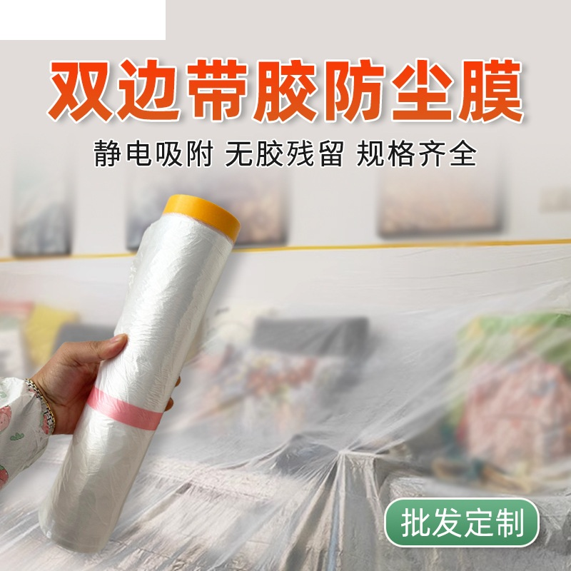
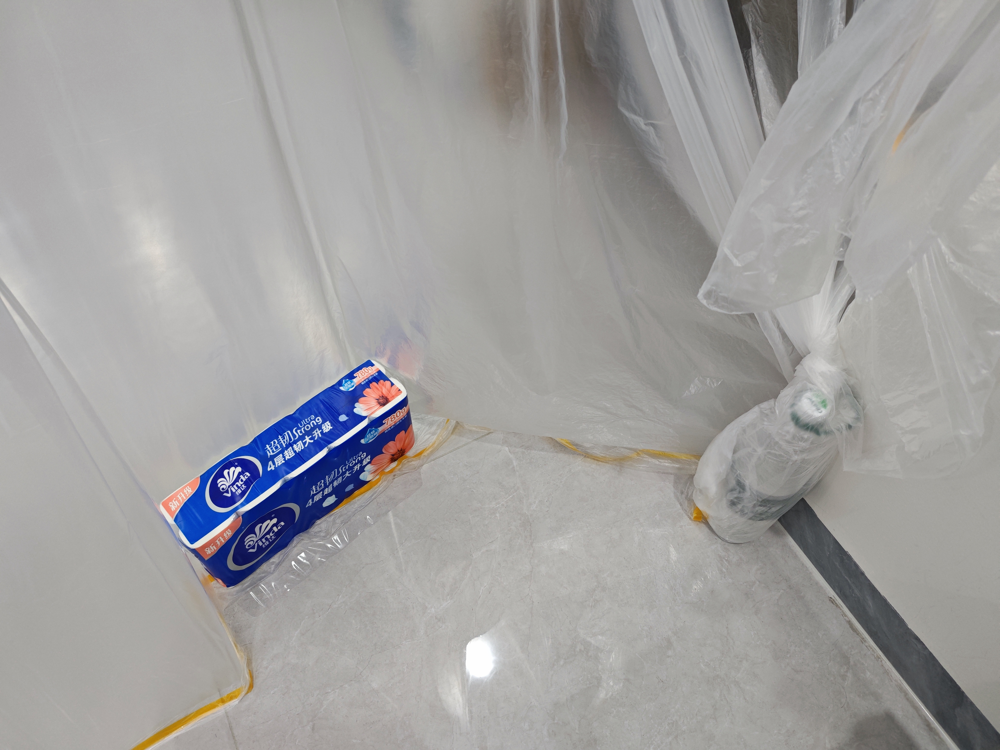

# 10 块钱打造保暖保温电竞房

【】视频：《小林家的龙女仆》S1E11-03：39  
室内取暖有两个方向，一个是制热，一个是保暖。由于热空气密度小于冷空气，会上升，所以**减小需要保暖的空间体积就能同时提高制热和保暖的效率**。  

## 评价几个前辈的版本

### 初版

电竞保温棚的祖师是这个 2023 年的视频：  
[教你23元搭一个保温保暖房，玩电脑再也不冻手](https://www.bilibili.com/video/BV1ow411W7MP/)  
当年我就刷到了，只是当时没有需求。  

初版的主要问题是搭建不方便，想拉这条线，要么在墙上钉钉子，租房的就不敢钉；要么靠粘贴，但是塑料布是比较重的，不容易粘牢。而且这个塑料布好像确实是跟大棚用的一样。  

### 三角钢+气泡膜

[打游戏手终于不冷了](https://www.bilibili.com/video/BV1hy421a7Qw/)  

三角钢：规整、结构稳定。三角钢也可以换成塑料架、木架。  
气泡膜是双层的，比塑料布的保温性能应该还更好。  
缺点：成本要几十上百块。从设计到搭建比较麻烦。

### 不透明的

[比低成本稍微高一点，但是效果好很多的保温保暖电脑小屋子](https://www.bilibili.com/video/BV1Aw411t7BC/)  

这种铝箔膜常用于外卖的保温，保温性能强。  
但是它不透光，照明是个问题。如果围起来的空间小，比较压抑。  
铝箔应该会影响手机信号。  

## 我的方案

  

用的是这种家具的防尘膜。把它顶天立地粘好，就可以把大房间分隔出一个小空间。  
成本低：3 m 高 10 m 长的，带运费只要 10 块钱。  

  

搭建方法简单：粘贴就行了。  
可以随意划出想要的空间，大小、形状、直线曲线都随意。就算是这样有吊顶的不规则平面也不影响。  

**保温效果**  
我得先说下前提：因为我这是在广东，并且我划开之后的取暖空间面积有 16 平米，房高 2.8 m，一般不需要这么大空间，我这个数据只是我这个保温方案的下限。前提说完，那么，在同一个房间，温度计放在 50 cm 的高度，膜内没有供暖设备，电脑功耗 100 瓦，膜内的温度是 24 ℃，膜外的温度是 21 ℃。看起来好像比其他方案差，我再补充一下，同样的空调，同样的房间，在夏天制冷，半小时就凉快了；在冬天制热 2 小时都不暖和。用塑料膜把房间分隔后，1 小时就暖和了。  
想保温更好的话，隔出 8 平米对打游戏来说也是绰绰有余的。也可以只围在电脑桌附近，但是，空间大有大的好处：

- 一是活动方便。不管是游戏还是工作，都建议每隔一小时站立活动几分钟，减少对眼睛、颈椎、手臂各关节、腰椎、屁股、前列腺、肛门的伤害。
- 二是开阔的空间，不会闷，不会缺氧。心理上也舒适。
- 三是能包括整个空调内机，夏天也能继续用，制冷效率也能提高。

**安装方法**  
这个防尘膜本身的胶是不够抵挡气压差的。上下都需要用透明胶带加固。  
把胶撕掉，可能会导致墙皮脱落。如果用热风吹，然后撕胶带，也许可以避免。如果避免不了，我的计划是退租的时候刷一下墙。  

  

出入的地方，我是用一个大瓶子，里面装水作为配重，把膜缠绕一圈。出入时手动移动瓶子。  

空调对着膜吹风，会有一定的噪音。  

这个膜我已经用了 2 个月，没有脱胶、破损。

**成品气泡膜**  
如果你的房间是方方正正的，没有吊顶；或者动手能力强。那我推荐用保温性能更好的气泡膜。上面的这种防尘膜，材质是 PE，最厚的厚度也就跟餐馆的那种一次性手套差不多。  
【】图：气泡膜带门.jpg  
气泡膜也是只要粘贴就行了，门是拉链的。  

## 供暖设备

不管是哪种保暖方案，都还是需要供暖设备的。只靠人和电脑的散热是不够用的。  

### 岭南与海南

我是在能堆雪人，并且没有统一供暖的北方地区长大的；工作后在广东住了 5 年。  
相比炎热，我更讨厌寒冷。岭南与海南才是真正的南方。虚假的南方冬季长达 3 个月，湿冷，而且没有统一供暖；真正的南方冬季只有半个月，还不是连续的，还不需要羽绒服。海南更是没有冬季。  
对于真正的南方，**只要空调能制热，就不用考虑其他供暖设备了**。因为很可能这些供暖设备，只算售价都跟整个冬季（12 月至 1 月）空调的电费差不多，但取暖的效果却差得远；算上电费那更是不值。  

### 电暖类：小太阳、暖风机、电油汀、踢脚线

在我个人经验里，都不算好用。加热区域小、冷热不均、加热速度慢、升温幅度小，耗电高。

**湖南的烤火箱 / 暖脚桶**  
【】图：湖南烤火箱  
【】图：暖脚桶  
在这些电暖类供暖设备的评测下面，总有人推荐湖南的烤火箱。  
我也觉得这个可能比其他那些电暖设备要更好用。但是我不用，因为我的坐姿是双腿叉开，并且双脚是经常移动的，这箱子会有限制。如果我住在湖南的话，可能因为太冷，就会买了。  

### 暖气

**统一供暖**  
有统一供暖的地方，基本也不需要考虑自己买供暖设备了。因为规模效应，取暖效果好，取暖费也不会很贵。

**家庭供暖**  
这个说的是家庭自己烧天燃气供暖。想达到不需要暖手的电竞温度，燃气费和开空调的电费其实差不多，但是升温速度又不如空调。地暖的效果比普通暖气更好，但安装费也高。  

### 空调

**能耗与制热效率**  
理论上，空调的制热效率高于电暖类设备。因为空调是把室外的热量搬到室内，空调消耗一度电，给室内增加的热量是大于一度电的。电暖类设备消耗一度电，给室内增加的热量是小于一度电的。  
实际上，当室外温度接近或低于 0℃ 时，外机需要化霜，这时制热效率会降低。而且，不开电辅热，空调的加热速度很慢。空调冷启动后，会强制使用一段时间的电辅热，不能手动关闭。  

**加热速度**  
空调的加热速度比电暖类设备快。因为是搬运热量，而且风量大。  

### 使用供暖设备的通用技巧

**增加空气流动**  
【】图：空气循环扇  
[冬天如何科学地使用空调取暖 | 冬日空调使用指南](https://www.bilibili.com/video/BV11T6SYXEnW/)  

使用空气循环扇，贴地放，向天花板吹风，让热空气下降。  
【】图：向地面吹风  
空调要调大风速。有的空调支持向地面吹风。  

**空调贴地安装**  
[【微醺评测】实测小米空调上出风Pro](https://www.bilibili.com/video/BV1XmoLYLEw7/)  
这个思路很有意思，制热的均匀性好，不会有头热脚冷的情况。  
夏天，如果空调支持「上出风」，即使贴地安装，也能做到不直吹人体。  

**关于取暖时的空气干燥**  
温度上升，会让相对湿度下降。但取暖时空气干燥的主要原因是气候本身就干燥。广东就算制热到 25 ℃，相对湿度也还有 70%。  
解决办法：首先要避免热干风对着你吹。然后就使用加湿器。  

## 参考资料

[14个最值得买的取暖好物！TESTV的冬季大作战【BB Time第495期】](https://www.bilibili.com/video/BV1SR2DB6EGT/)  
被炉不错，但是贵。

[耗时一月，测冬季爆款取暖神器，割韭菜的竟这么多？](https://www.bilibili.com/video/BV1xc41147Fj/)  

[冬季取暖器选购指南](https://www.bilibili.com/video/BV1LT4y1T7ca/)  
随便看看。

[（李永乐）冬天到了，电暖器和空调谁更省电？](https://www.bilibili.com/video/BV1jT4y1x7bD)  

[（先看评测）空调VS取暖器，冬季取暖 究竟谁更舒适省电？](https://www.bilibili.com/video/BV1iP4y1v7cZ)  
在实验室环境进行了测试。

**看了但没用上**：  

[（京东商单）9 款取暖器横评：小太阳、暖风机、电油汀、踢脚线怎么选？哪款最安全？](https://www.bilibili.com/video/BV1nNBTB2EEY/)  
没什么用的视频，而且是商单，居然评上了「每周必看」。  

[（京东商单）冬季取暖有妙招！全价位全类型取暖器选购指南，小白也能选对不踩雷~](https://www.bilibili.com/video/BV1ociuBgExs/)  
纯念参数。

## 更新日志

2026-02-05 第一版