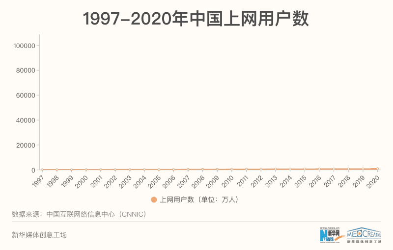

# 谈「傻逼」3：互联网下沉

本文所说的「下沉」，是指从 1994 年中国互联网诞生至今（2026），网民中傻逼的比例越来越高。  

## 中国互联网网民学历变化

如图，网上低学历的人越来越多了。  

**制图说明**：  

- 2000 年的数据，取自 2001 年发布的报告，以此类推。
- CNNIC 每年在年初、年中发布两次报告。由于年初的报告定位是全年的，而年中的报告带有「反映上半年我国互联网发展状况」字样，所以**使用年初的报告**。
- 不同年份学历结构的统计粒度不同。比如：2010 年之前本硕博是分开统计的，之后只有「本科及以上」。2020-04 月的「第45次」报告只有「专科及以上」。

CNNIC 的《 [中国互联网络发展状况统计报告](https://www.cnnic.cn/6/86/88/index4.html) 》  
首次统计网民学历，是在 1998-07 月发布的「第二次」报告。采用问卷调查方式，有效问卷 2494 份，**本科及以上占 58.9%**，其中本科 49.6%、硕士博士 9.3%。  
最后一次统计网民学历，是在 2021-02 月发布的「第47次」报告。本科及以上占 9.3%，**初中及以下占 59.6%**。  
再考虑到「**大学扩招**」，那低学历的比例还要更高。  

**在移动互联网普及之前，高学历网民就已经不是主流了**  

  

2000 年，本科及以上学历占比 41.14%，首次不过半，首次被超过（2001-01 月发布的「第7次」报告）。  
**2003-2006 年，本科及以上学历占比维持在 30% 上下**。  
2006 年，本科及以上占 28.5%，初中及以下占 17.1%（2007-01 月发布的「第19次」报告）。  

**2007 年是拐点**  

  
[来源](https://www.news.cn/datanews/20211015/C999058527900001FE8A144545D09700/c.html)  

2007 年一年增加了 7300 万网民，年增长率 53.3%。在此之前，每年网民的增加量为 2000 万左右。在此之后，基本每年都有 5000 万以上的增量，2008 年增加了 8800 万，2020 年 3-12 月增加了 8540 万。  
2006 年，本科及以上占 28.5%，初中及以下占 17.1%  
2007 年，**本科及以上占 17.5%**、初中及以下占 27.8%  

**移动互联网导致本科以上学历占比进一步下降**  
iPhone 4 于 2010-09 月在中国大陆开售。  
小米手机 1 是 2011-08 月发布的。  

**学生、未成年人对学历占比的影响**  
**学生几乎一直都是占比最高的职业**：2002-2011 年，占比在 30% 上下；2012-2018 年，占比 25%；2020 年占 21%。  
2010 年，40-59 岁占比 16.5%，60 岁及以上占比 1.9%。  
2020 年，40-59 岁占比 33.9%，60 岁及以上占比 11.2%。除了 10 岁以下（2010 后）增长 2%，其他世代的占比都是下降的。  
根据 [知乎周瑞的统计](https://zhuanlan.zhihu.com/p/652405580) ：70后的高等教育率是 1.9%、80后9%、90后22%、00后34%。  
综上：

- 学生、未成年人拉低学历的影响是在减小的，更不用说以前高学历的还更多。
- 是 **70 后及更老的世代拉低了网民的平均学历**。

这里挂一个自以为是的 * * ：《 [中国网民约九成学历不足本科？你被忽悠了吗](https://www.douban.com/note/733286020/) 》  
未成年人在网上又不是不能说话，身上也不带标签，不好说具体比例，但他们也制造垃圾信息。  

## 学历与思维能力

中国的主流教育不培养学生的思维能力。学历高只能（而且不是必然）说明知识多、在特定领域解决问题的能力强。**知识与思维能力的相关性并不强**；比如，现在的 LLM 知识很多、能写代码，但很难说它们有思维能力。  
在读本科生的学历，应该是统计为高中。本科生在互联网上的声音可不小。  

但话又说回来。  
**简中互联网的垃圾信息（谣言）中，流量最大的是这几个主题：生活类、键政类、键政+生活类、八卦吃瓜类**。  
在生活中，一个做题家如果能记得真正有用的知识，起码是不会出现「**不学数理化，生活处处是魔法**」了。真正有用的知识是：物质的化学性质，而不是弱电解质平衡；是人体稳态（医学），而不是遗传计算。生活类谣言的经典，是 2012-04 月 [央视辟谣一氧化二氢](https://zh.moegirl.org.cn/%E4%B8%80%E6%B0%A7%E5%8C%96%E4%BA%8C%E6%B0%A2%E6%81%B6%E4%BD%9C%E5%89%A7) 。放到现在，发帖者大概率会被拘留。  
对于键政类，这里自我审查，不谈。

如果在所谓「低级」的死记硬背、套模板解题的应试教育下，**连大学都考不上**，那思维能力不太可能是优秀的（除非是时代、经济限制不能上学。比如：「中考分流」是 2010 年代开始推行的）。  

## 傻逼共振

2023 年，一位 S1 论坛用户「今井莉莎」提出的 [理论](https://x.com/xiaojingcanxue/status/1655487196030447616)（我找不到原帖）。  
我用这个词，并不是要说「信息茧房」。我看到的共振是：

- **傻逼博主**：傻逼做自媒体，也能获得几十万的关注。百万以上级别的博主，不蠢，就是纯坏。  
- **傻逼粉丝**：支持傻逼博主的，就是傻逼粉丝。

这里的「傻逼」指的是：外行装内行（评测、科技区），编造、使用虚假信息、裁剪事实论证观点（键政、历史），通过暴论引流等。（这些我都有例子，但现在我在做自媒体，不想得罪人。）  
识破这些傻逼博主，只要一点点独立思考能力与专业能力就够了，但傻逼粉丝是没有的。  

> 但不少垃圾号在所谓的窗口期攒了足够多的关注，用户通常也懒，给啥看啥。即便是个抄袭号，也能有恃无恐。经常会出现一个未经确认的消息瞬间被无数号转载，都在抢首发。错了也无所谓，道个歉算是很给面子了。就像我此前写老罗的这篇里说的，谁人不犯错呢。实际上，最根本的原因是它们都知道的，读者根本不在意。  
> 《 [不看任何新闻资讯类app就对了](https://mp.weixin.qq.com/s/fjkPTKsCCRkjBbb43t04YQ) 》

至于提供情绪价值的搞笑、游戏、颜值、短剧、综艺等，主要取决于个人偏好的内容：  

> **我们不能要求别人按照自己的喜好创作，内心却掩饰不住地鄙视那些制造垃圾的人，但自己又深知这不过是一种自以为是**。那东西一大堆人喜欢呢，你说垃圾就垃圾，你自己喜欢的就不垃圾了？无法反驳，是这个道理。  
> 《 [不必让一切都那么合理](https://mp.weixin.qq.com/s/grDDMmSqn-shoXXa60FDJQ) 》

## 傻逼占领舆论阵地，以「主流」压迫少数派

- 2020 年，[肖战粉丝举报 AO3 事件](https://zh.wikipedia.org/wiki/%E8%82%96%E6%88%98%E4%BA%8B%E4%BB%B6)
- 2021 年，《无职转生》下架。以及随之而来的动画「先审后播」。
- [查成分挂墙头扣帽子，避雷正在炸掉整个二次元](https://www.bilibili.com/video/BV1uk6zBbE9m/)

在没有分级制度的中国，只有「禁」和「不禁」两个选项。  
为什么没有分级制度？这里自我审查，不谈。  

## 互联网下沉也并非全是坏处

下沉了，**互联网市场变大了**，才能有这么多互联网公司、自媒体从业者。  
**有用的信息也变多了**。比如「小红书」「知乎」取代了「百度知道」的生态位，有更多的、你身边没人知道的问题，也有了答案。  
**更容易找同类**。网上没什么好争论的，但是线下连可以争论的人都没有。  
**手游的普及**让游戏玩家不需要再夹着尾巴做人了。对于实行过 [14 年游戏机禁令](https://zh.wikipedia.org/zh-hans/%E5%AE%B6%E7%94%A8%E6%B8%B8%E6%88%8F%E6%9C%BA%E5%85%A5%E5%8D%8E) 的国家，这很重要。  

## 早期互联网的垃圾也挺多的

《 [真正有品的 是老克拉 不是老登](https://mp.weixin.qq.com/s/BvlHSkcHjuSWWizmktCI9w) 》魏武挥  

- 天涯论坛的低质量的帖子并不少
- BBS 一样是商业营销重灾区
- 早期的新浪微博到处都是营销内容
- 高关注度的博客是因为低俗内容

## 相关阅读

> 冯小刚最近几年说的话大多都是话糙理不糙，这次也是，没毛病：中国观众一定有相当一部分是垃圾，不然无从解释垃圾电影赚得盆满钵满。  
> 但他始终漏了一点：那些不想当垃圾和看垃圾的少数人，被“他们”淹没了，被“他们”代表了。  
> 没有人替你发声，因为少数人的意见不重要。潮流永远是多数人推动的，而你不在其中。  

《 [文艺低智化，本质是全民屌丝化](https://mp.weixin.qq.com/s/i5d1cYT0ZYawBIWcDRAzPQ) 》肥肥猫  

> 人与人之所以很难沟通，因为每个人看到的世界完全不一样。自身不同，世界给予反馈不同，因此眼里的世界也不同。  
> 然后，大家通过手机，看到差不多的热搜，围观差不多的热点，参与差不多的讨论。凭自身的经验和知识结构各抒己见。说服别人或许有某种内在的成就感，但实际上并不会让自己对真实世界有多一分的认识，更不可能让自己内在有任何的成长，错误的幼稚的观念只会在抱团认同和说服他人之中反复强化。  
> 与他人对话时尽可能摒弃固有的偏见，真正听进去，然后再反复琢磨，这件事真的很难。因为人的自我辩护是下意识的，也就是自己很难意识到。而认识到你我都会下意识地在认知失调时进行自我辩护这件事本身是非常重要的。  
> 今天的环境其实更好，因为移动互联网提供给了任何学历任何收入的人一种前所未有的先进工具。

《 [不必让一切都那么合理](https://mp.weixin.qq.com/s/grDDMmSqn-shoXXa60FDJQ) 》吴主任

> 造谣动动嘴，辟谣跑断腿，还不是因为多数人根本没有对自己看到的东西负责就瞎传播。  
> 如果一个东西看起来很真，但总是有些可疑，就得借助搜索工具，这是需要自己动手去核实的。至少不要让自己成为谣言传播路径里的一个点。另外就是要记住那些品行恶劣的自媒体，不要再给任何机会。  

《 [不看任何新闻资讯类app就对了](https://mp.weixin.qq.com/s/fjkPTKsCCRkjBbb43t04YQ) 》吴主任

在网上，并不能快速、准确判断网友的身份。  

> 问题是，现实中，我们每天都会遇到这些人群，但你不会去跟他们争论。比如说，你会去跟胡同口晒太阳的大爷，去讨论当代日本和二战时的日本，不是一回事吗？你会跟菜市场摆摊的阿姨去讨论中药到底有没有用吗？你会跟酒桌上初次见面的人，为俄乌哪个正义去吵得脸红耳赤吗？你会尝试说服邻居家上初中的小子，古代中国其实一直很落后吗？  
> 同样的，在网络上，这些也是不必要的，因为网线对面的，有超过50%的概率仍然是他们。你没法说服现实中的他们，自然也没法说服网络上的他们，哪怕你再摆事实、讲道理，但是认知差距无法抹平。

《 [扎心了，11 亿网民中 7.3 亿人仅为初中及以下学历](https://mp.weixin.qq.com/s/PfFhOLsQP6xlauY4RODdkw) 》

> 不到一代人的时间里，网民的构成就发生了巨大变化，随即推动着网络空间的舆论场转变：网络不再是知识精英的公共空间，而成了暴民的狂欢乐园。  
> 虽然当下的舆论场肯定不完全是真实的，但网民样本基数的扩大，至少比以往的小圈子更具有代表性。让我们直面无情的现实：那些看起来非理性的喧嚣，恐怕才更接近这片土地上大多数人的所思所想。  
> 现实中所表现出来的“正常”，和网上表现出来的“可怕”是两回事，完全可以并存在同一个人身上。  

《 [现在都是什么人在上网](https://mp.weixin.qq.com/s/tTPt_Cs5jkWf--HIwHySOg) 》维舟

> 互联网在高速发展，好产品好内容不断涌现。用惯了今天的互联网，你穿越回十几年前，就会发现那时的互联网产品，差不多是毕业生习作的感觉。  
> 娱乐需求不重要吗？全国多少行业都在满足大众的娱乐需求，怎么到短视频这里就成原罪，都搁这装什么装呢？
> 如果说“信息茧房”，我父亲的前半生，更像生活在信息茧房里。互联网时代来临多年，他一直以为和自己没关系。直到某一天小视频流行，父亲才打开窗户，发现了精彩世界。  

《 [当代互联网越来越堕落吗](https://mp.weixin.qq.com/s/xBQGCjv9YMr2MaVnKV0mQA) 》陈兴杰

学历（专业能力）在经营企业所需的能力中，可能是排序最靠后的。  

> 社会中的每个人，都以为那些学历高的人、权力大的人就一定聪明很多。比如，有的公司管理者认为，因为公司的员工学历普遍低，所以无法有效授权。这其实是社会中的一个迷思，以为学历高，办事就一定靠谱。  
> 其实，学历和工作能力，只有相关关系。在不同的岗位，相关关系还不一样。在有的工作岗位，甚至是负相关，比如销售、业务岗。销售和业务岗需要超强的沟通能力，还要有丰富的与人打交道的经验。死读书的学生，可能就干不来这些活。如果让他们去管这两种岗位，还可能管死。

《 [遇到蠢货，为什么一定要远离？](https://mp.weixin.qq.com/s/UIuL0boHdgOZVIsaO78GQw) 》晓马

## 更新日志

2026-02-19 第一版  
2026-02-18 开始写