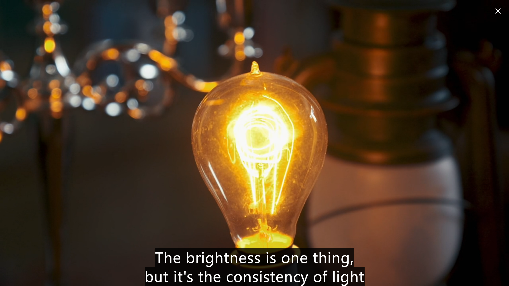

# 高晓松好像编造了一段历史：白金汉宫反对用电

## 高晓松说了什么

2025-09-05 晚上，「海浪电影周」举办「海浪对话」，在河北秦皇岛市阿那亚蜂巢剧场，高晓松与苏童、毕赣，以「[灵光初现：AI是否能与文字共舞？](https://mp.weixin.qq.com/s/o2vYxsyPQp3cxejtS3toXA)」为主题，对谈 AI 时代的创作。  

视频版本：  

- [BV1J6a8zJEgh](https://www.bilibili.com/video/BV1J6a8zJEgh/) 。字幕错别字比较多。
- 微信视频号「明睿智囊」 2026-02-17 发了一段 7 分钟的剪辑《“每个人的心里都有个洞”高晓松在海浪对话中三聊AI》。好像是全网播放量最高的。这个镜头与音质好像是官方源。
- 微信视频号「通讯没有社」2025-09-07 发的，跟 B 站那个是同一版本，字幕都一样。

在 [BV1J6a8zJEgh-01:17:21](https://www.bilibili.com/video/BV1J6a8zJEgh?t=4640.2) ，高晓松说了这些话：  

> 每一次科技大潮来的时候，都会分成基本上这两种：（就是已经高高在上的人——就不要用这个词）被迫离生活远了的人，就特别想要那个真实的生活、体温，等等。  
> 大家知道电来的时候，**最反对用电的是白金汉宫**。  
> 因为它有蜡烛。它有的是蜡烛，白金汉宫点几千支蜡烛。就反对，因为不好看。那**电灯当时出来的时候，它惨白的光**，而且惨白光一照，发现白金汉宫那房顶是黑的，因为被蜡烛熏的。  
> 但是那些蜡烛，你想 100 支蜡烛做那种大的旋转那种东西，在宫廷里跳舞，那多好啊。说我们不要用电，因为我们想要这种温暖的光。这种鲸鱼脑子里的挖出来那个蜡，点出来的那个（光）是最美好。  
> 但是其实大多数人民，是希望离这个世界远一点的。那我们那些被迫离得远的说，我想骑车，大多数人民想开车不是想骑车。因为**公爵肯定喜欢骑马**，因为他那马多好啊。  
> 每次科技来的时候，其实它的普惠价值是超过了它对一部分人的价值。

高晓松讲故事的技巧很强，现场效果很好，我也被他逗笑了。然而，当我想详细了解一下，使用中文、英文搜索后，发现这段历史好像是高晓松原创的。  
哦，好像也不一定是他原创的，向 Gemini 提问「历史上，白金汉宫是否更偏好用蜡烛，而不是用电灯」，就能得到类似的故事。  

我不关注高晓松，我会看到这段视频，是因为 2026-02-21「维舟」在《 [AI有什么用？用起来才知道](https://mp.weixin.qq.com/s/SIrSrxzKqtpjokeVkgRVkQ) 》，以此为论据，论证：

> 高晓松曾在一场对谈中谈到一个有趣的现象：每次科技大潮来临的时候，往往倒是一些生活优渥的精英阶层更加抵触。

## 白金汉宫与电灯泡

《 [7 memorable moments in the history of Buckingham Palace](https://www.historyextra.com/period/20th-century/7-memorable-moments-in-the-history-of-buckingham-palace/) 》  

> In 1883 electricity was installed in the ballroom, the largest room in the palace. Over the following four years electricity was installed throughout the palace, which now uses more than 40,000 lightbulbs.

1883 年，宫殿里最大的房间——宴会厅——安装了电力。在接下来的四年里，电力逐渐普及到整个宫殿，如今宫殿里使用了超过 4 万个灯泡。  

Joseph Swan 发明的灯泡于 1880 年在英国取得专利，1881 年开始商业生产。他发明的灯泡用的是「碳（化）丝」。（ [维基百科](https://en.wikipedia.org/wiki/Joseph_Swan) 、《 [坦率地算了一下，爱迪生是第23个发明电灯的人](https://www.zhihu.com/column/p/31386918) 》）  

维多利亚女王在位时间是 1837-1901 年。（ [维基百科](https://en.wikipedia.org/wiki/Buckingham_Palace#Queen_Victoria_(1837%E2%80%931901)) ）  

2023 年有一部纪录片《Buckingham Palace with Alexander Armstrong》，在 [S1E4](https://www.channel5.com/show/secrets-of-buckingham-palace-with-alexander-armstrong/season-1/episode-4) 13:10（需要英国 IP 才能看）提到了白金汉宫使用电灯的历史：  

> Although the Palace could be home to some rather backwards thinking, its facilities were very much facing the future. Modern lavatories and some gas
lighting had already been installed, but that was just the beginning.  
> In the 1880s, guests to the Palace were treated to a brand-new dazzling invention. There was just one problem, one that would give some of them
a real headache. JJ is shedding some light on the situation.  
> Today, Buckingham Palace is lit up with an estimated 40,000 light bulbs. So, what was it like when the Palace was first illuminated by electric lights? Dr. Matthew Green is going to enlighten me.  

尽管白金汉宫的一些思想可能略显落后，但其设施却非常面向未来。现代化的厕所和一些煤气灯已经安装完毕，而这仅仅是个开始。  
19 世纪 80 年代，白金汉宫的住客们体验了一项全新、耀眼的发明。这项发明也带来了一个会让部分住客头疼的问题。JJ 将为我们揭开这个谜团。  
如今，白金汉宫大约使用了 4 万个灯泡。那么，白金汉宫最初使用电灯照明时是怎样一番景象呢？马修·格林博士将为我们解答。  

> Right through the 19th century, most of the time, it was lit by these rather meagre oil lamps, by gas lights and a whole armada of candles. It would take up to 30 people just to light them all for a single banquet or a ball.  
> **But all this changed in 1883, when new-fangled electric light bulbs were introduced to the palace.** It being Buckingham Palace, it felt fitting that they would use the **recently invented light bulb of Joseph Swan** rather than
the American Thomas Edison. So it was a display of British entrepreneurial prowess which felt fitting.

整个 19 世纪的大部分时间，白金汉宫都依靠简陋的油灯、煤气灯和大量的蜡烛照明。仅仅为了举办一场宴会或舞会，就需要多达 30 个人来点亮所有照明工具。  
但这一切在 1883 年发生了改变，新式电灯泡被引入宫殿。因为是白金汉宫，采用 Joseph Swan 新近发明的灯泡，而非美国人托马斯·爱迪生的发明，是非常合适的。这彰显了英国企业家的卓越成就，堪称恰如其分的选择。  

  
（上图来自纪录片）  
**这个色温叫惨白吗？**  

> And this was the kind of light bulb they would have had back in 1883. Look at that. I mean, it's very in right now. It is, it looks quite boutique-y, just like it could come from an artisan coffee shop. 700 of Swan's very latest light bulbs were installed in the state rooms of Buckingham Palace. So now guests at the royal ball were under the spotlight like never before.

这就是 1883 年人们会用的那种灯泡。看那造型，在今天看来反而极具时尚感，带着一种精品设计的韵味，就像是从一家手磨咖啡馆里拿出来的那样。700 个 Joseph Swan 的最新款灯泡被安装在了白金汉宫的国事厅里。自此，皇室舞会上的宾客们便置身于前所未有的亮光之下。  

> The brightness is one thing, but it's the consistency of light that you don't have with the flickering of everything before it.That's right. And it's an unforgiving light. It's a light that people came to resent in some ways, because it exposed all their flaws. A newspaper report from the time described the effect of the new bulbs as "less than flattering, especially on people's complexions".

亮度是一方面，但更重要的是光线的一致性——那些闪烁的旧光源可做不到。而且这是种毫不留情的光。由于它暴露了皮肤的瑕疵，人们有点讨厌这种光。当时的报纸将电灯泡的效果描述为「不太讨喜，尤其对人的肤色而言」。  

> But guests at the Palace weren't only scared of looking ugly under the harsh electric light, they were worried that the new bulbs were damaging their health. People were fearful of it, as people are of new technologies as well, because many people reported waking up the next day with an absolutely splitting, brain-crushing headache, which was inevitably attributed to this rather alien device. But these complaints were largely ignored. The authorities said it's here to stay, and if anything, we're going to extend it.

但宫殿里的客人们不仅害怕在刺眼的电灯下显得丑陋，更担心电灯泡损害健康。人们对此心怀恐惧，正如对待所有新技术那样。因为许多人反映次日醒来时头痛欲裂，这种痛苦被归咎于这个陌生的装置。但这些抱怨大多被忽视。当局宣称将继续使用电灯，甚至计划进一步推广。  

> So, this is a success? It's a huge success, almost against the odds. And they decide they want to, why not light the rest of the Palace like this? And that sets the tone for other mansions, and eventually, more modest households all over the country will be illumed by this incredible bulb.

这算是成功了？是的，而且是出人意料的巨大成功。于是他们决定：干脆把宫殿剩下的地方全照这么装。这为其他豪宅树立了榜样，最后，全英国千家万户的普通住宅，都被这种不可思议的灯泡点亮了。  

## 爱德华七世国王与汽车

还是纪录片的这一集，在 41:40：  

> An early champion of the motor car, he owned more than ten of them, and used the Palace stables to house this new kind of horsepower.

作为汽车的早期拥趸，他（爱德华七世国王）拥有十余辆汽车，并**把这种新型的马力存放在宫廷马厩里**。  

  
如图，是爱德华七世国王和他的 1902 年款 24 马力戴姆勒汽车。  

1902 年，爱德华七世国王**又买了一辆**戴姆勒汽车后，授予戴姆勒汽车「皇家汽车供应商」许可。（ [维基百科](https://en.wikipedia.org/wiki/Daimler_Company#Royal_patronage) ）  
第一辆量产型 T 型车是 1908 年制造完成的。（ [维基百科](https://en.wikipedia.org/wiki/Ford_Model_T) ）  

--------------------------------------------------------------------------

我不是历史专业的，高晓松也不是。他讲这段历史，来源是什么？是他的原创研究吗？  
我不敢说白金汉宫（的管理者）从来没有反对电灯，但以上这些资料显然不支持高晓松讲的故事。  

**这类「只有中国人才知道的小故事」，不管是什么立场，我真是受够了！**  

## 参考资料

**看了但没用上**：  

## 更新日志

2026-02-22 开始写，第一版