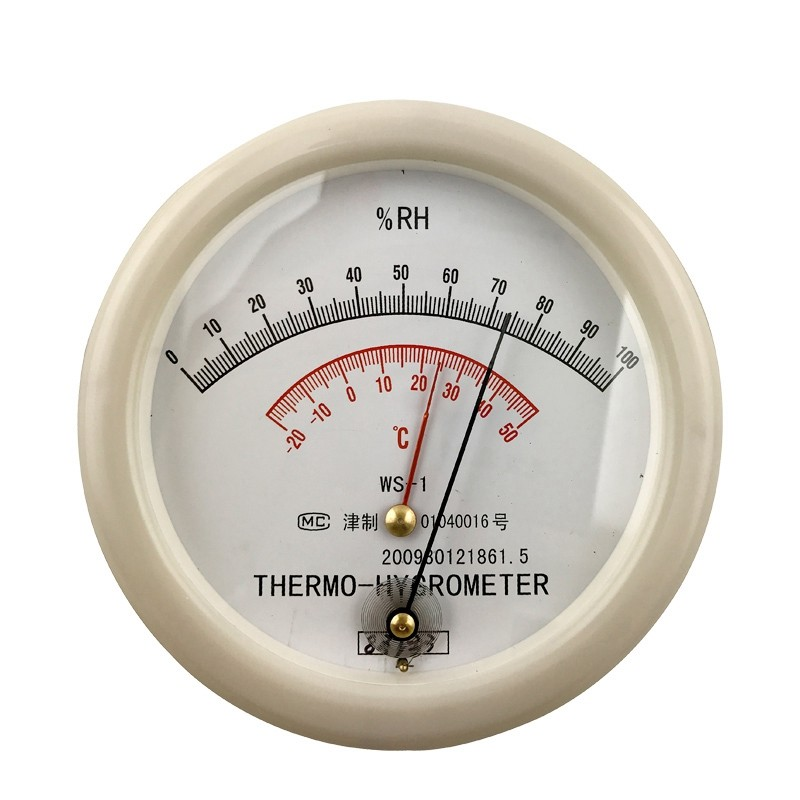
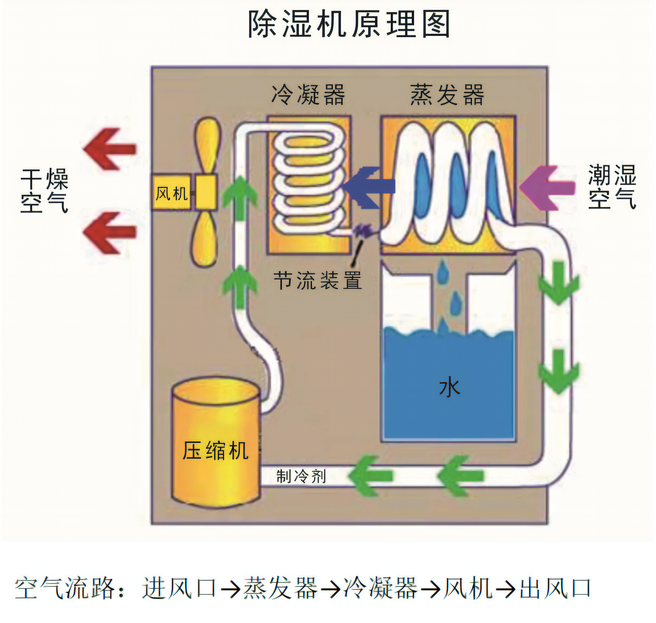

# 家庭除湿最佳实践

## 你要需除湿吗？

在花钱之前，我们先讨论一下这个问题：  
你要需除湿吗？  

### 气候不是决定室内湿度唯一因素

室内湿度与房子的密封性、楼层、通风条件、采光条件，以及空调性能（关键），也有很大的关系。  

这里针对常见的场景进行讨论：  

### 物品不能受潮

电子产品、乐器、书籍、字画、邮票等等，有必要。（摄影镜头直接放恒温湿箱）  
衣服、鞋之中，皮革制品容易发霉。  
墙壁也会发霉。  

如果不是贵重物品的话，等真发霉了再考虑除湿也不晚。  
如是是贵重物品或者不放心的话，先买个**湿度计测量**一下再决定。  

### 人不能受潮

如果患有关节炎、湿疹、哮喘、过敏性鼻炎等疾病，有必要。

觉得潮湿无法忍受，那也有必要。

**细菌、霉菌、螨虫**。你想一下是谁在宣传它们的危害？如果你确实有症状的话，去医院确诊了吗？低湿度确实可以除螨，但是要保持相对湿度在 50% 以下，维持 22 小时；如果是一个小箱子的话还容易做到，但在南方，让整个房间维持这样的湿度是不容易的。

### 气候

**秦岭—淮河以北的北方地区**需要除湿的季节只有夏季，空调基本够用，不需要除湿机。  

[全国1小时相对湿度 - 中国天气网](https://products.weather.com.cn/sk.html?page=SK&type=TY_OBS_RHU_1H)  

（广东、广西、海南、福建）**回南天时间不长**。回南天只在春季出现，而且不是持续性的，每次也就几天时间，总的时长一般不超过 15 天，忍忍也能过去。  

（江浙沪、安徽、湖北、福建）**梅雨持续时间在一个月左右**。这就不是靠忍能过去的，可以考虑使用除湿机。  

### 除湿的收益（高湿度的危害）

「不同季节、不同温度下的最佳空气相对湿度不完全一样，甚至不同的人群对空气湿度的敏感程度也不同，我们可以大致认为**空气相对湿度在 40%～60% 左右比较适宜**。」  
《[除湿器-丁香医生](https://dxy.com/disease/28240/detail)》  

- 高湿度下，衣物、食物、墙壁、家具、电子产品等容易**发霉、损坏**。
- **除虫**：螨虫、蟑螂、衣蛾等。
- **人体健康**：病毒、细菌也喜欢高湿度环境。「环境中微生物的繁殖可能会引发各种疾病，比如霉菌孢子在空气中悬浮可能会引发哮喘、过敏性鼻炎。」「高湿环境容易发生湿疹。低温高湿的阴冷环境中，关节炎、慢性腰腿痛患者的疼痛症状可能加重。」

#### 体感温度

天气预报中的气温是指室外 1.5 米高处百叶箱中空气的温度。而体感温度是指人体感受到的空气温度。  
同样的气温，不同湿度、风速、太阳照射条件下，体感温度差距很大。  
**体感温度受湿度的影响很大**：夏天，低湿度可以让人感觉更凉快；「空气湿度太高则会阻碍人体散热，体感湿热、闷热、身体表面粘腻，严重时会造成体温上升甚至发生中暑。相反，温度较低的季节或地区，比如深秋、冬天，空气湿度过高则会加强空气的导热，主要表现为湿冷、阴冷」。

> 冬天气温低时，空气湿度越大，体感越冷；  
> 夏天气温高时，空气湿度越大，体感越热。  
> 《[北方风寒和南方湿冷 哪种冷更胜一筹？](https://news.weather.com.cn/2018/11/2961991.shtml)》中国天气网

NOAA （美国国家海洋和大气管理局）炎热指数：  

来源： [Heat Index](https://www.noaa.gov/jetstream/synoptic/heat-index)  
简中互联网广泛流传的是这张图的翻译版本「美国NOAA炎热指数（体感温度）」（温标换成了摄氏度）。  

[What is the heat index?](https://www.weather.gov/ama/heatindex)（美国国家气象局）

风寒温度不受湿度影响：  

> Does **humidity** or being near a large water body affect wind chill?  
When NWS tested the new Wind Chill Temperature Index (WCTI), NWS researchers applied the new index to 12 test subjects. The results of the tests showed that relative humidity was an insignificant weather parameter, **affecting the outcome to less than 1 degree**. To simplify the calculation, relative humidity was left out of the formula.   
> [Wind Chill Questions](https://www.weather.gov/safety/cold-faqs)（美国国家气象局）

## 湿度测量

互联网上资料不多，我参考 [如何选购湿度计？](https://www.zhihu.com/question/40026619/answer/209633800) 选择了「毛发湿度计」。  

我个人意见，认为「电子湿度计」精度不够，「干湿球温度计」使用不便。  

**相对湿度**是湿空气的**绝对湿度**与相同**温度**下可能达到的最大绝对湿度之比。想深入了解可以看： [空调除湿原理介绍](https://www.bilibili.com/video/BV1NE411u7u1/)  
《 [绝对湿度和相对湿度](https://zhuanlan.zhihu.com/p/374481977) 》《 [湿空气介绍及焓湿图](https://zhuanlan.zhihu.com/p/445688558) 》  

**如果没有单独说明，下文的湿度都是毛发湿度计的示数。**  

## 除湿方法及原理

### 化学除湿（除湿袋、片、包、盒）

只要你用过除湿机，就知道化学除湿的**除湿效率**有多低。一个袋子放一周能有几百毫升水都是效果好的了，而除湿机 8 小时 3L 水（深圳春季实测），根本不能相提并论。化学除湿剂的库房，也许能达到相同的除湿效率。  
在低温（18℃ 以下）且湿度很大的情况下，除湿袋的干燥剂层会直接变固液混合物，底层结块，并且水无法流入下方集水袋中。最后干燥剂被水包裹，无法继续除湿。  
优点是便宜，如果你和我一样抵制拼多多，可以去 1688 购买，这类商品一般不需要售后。  
TODO:（去广告）

### 物理除湿（升温除湿、降温除湿）

说完化学除湿，剩下的方法都是物理除湿，都是通过控制空气的温度，让水蒸气冷凝来除湿。但从房间温度来看，又分成两种：

- 升温除湿：除湿后房间温度上升。
- 降温除湿：除湿后房间温度下降。

除了夏天之外的绝大部分除湿场景都是升温除湿更好。  

### 半导体除湿机就是玩具，不建议买

原价 300 CNY 以下的除湿机都是玩具。  
可以买二手的压缩机除湿机。  

### 压缩机除湿机

《[除湿机除湿原理介绍](https://www.bilibili.com/video/BV18V411C77R/)》《[回南天除湿器是如何除湿的？](https://www.bilibili.com/video/BV1Rt421H76G/)》《[【球村】压缩机除湿机原理](https://www.bilibili.com/video/BV17j411a7X5/)》  

夏天从冰箱里拿出一瓶水，过一会儿，瓶子上出现一层冷凝水，这就是压缩机除湿机、空调的除湿原理。  
压缩机除湿机把空调的外机、内机整合，都放在室内了。

  
[图片来源](https://zhuanlan.zhihu.com/p/432490202)  

湿空气被吸入除湿机，其中的水气与冷的蒸发器（2-5℃）接触、放热、液化，变成干燥的冷空气；再与热的冷凝器（40-55℃）接触、吸热、升温，吹出除湿机。**最后，吹出来的风是干燥的暖风**。  
一般的除湿机需要环境温度 18℃ 以上才能正常工作，否则蒸发器会结霜。  
根据能量守恒定律，蒸发器的冷量 + 压缩机的功率 = 冷凝器产生的热量，除湿机吹出来的空气温度一定高于吸入空气的温度，属于**升温除湿**。除湿之后室温会升高 1-2℃。  
蒸发器和冷凝器的「蒸发」「冷凝」说的是制冷剂（冷媒）的状态。  

### 空调

《[空调除湿原理介绍](https://www.bilibili.com/video/BV1NE411u7u1)》

空调的冷凝器在室外，向室外散热，因此是**降温除湿**。  
普通空调的除湿模式原理是控制压缩机间歇工作，间歇制冷，室内风扇一直以低速运行（为了尽可能保证室温接近设定温度，如果风扇全速送风，降温非常快）。([来源](https://zhuanlan.zhihu.com/p/364526766))  
**间歇制冷、风扇低速运行，仅仅是减缓了降温的速度，同时还降低了除湿效率**。  

某些**高端空调具有恒温除湿**的功能，原理：

- 出风口电热丝加热；功耗翻倍
- 室内机双热交换器设计（类似除湿机）([来源](https://www.zhihu.com/question/24518430/answer/602622360))

### 转轮除湿机

转轮除湿机不是骗钱的产品，它主要是用在工业领域除湿。  
TODO:（去广告）  
如果关注过除湿机品牌，一定听说过德业，德业也是有转轮除湿机的，并且也宣传「瑞典进口转轮」「可提供冷却除湿方式无法实现的露点在 10℃ 以下……干燥空气」（[DY-ZL1.5～DY-ZL12](http://www.deye.cn/new/2021/04/08/dy-zl1-5%ef%bd%9edy-zl12/)）。不过德业不销售家用的转轮除湿机。  

我也实测了，转轮除湿机能除湿，能出水。  
转轮除湿机也是**升温除湿**。650W 功率运行 2 小时可以升温 3-4 ℃。

转轮除湿机的原理，参见 [转轮除湿技术及其优点 ](http://www.cn-sen.com/news-72-.html) （资料较少，这家讲得最清楚；但我还是一知半解。）
> 转轮式除湿机的除湿原理，系利用涂布在转轮上的硅胶将空气中的水份，以物理方式吸附于具多孔性之合成硅胶上，然后在转轮再生区，将吸附在硅胶孔洞的水气加热汽化，至交流式热交换器入口处，形成高温高湿的空气，接着再经过已被室内冷湿空气降温冷却的热交换器时，由于露点差异而成凝结水排出。

- **优点**
    - 秋冬季，压缩机除湿机冬季需要化霜。对于冬季寒冷的南方地区（四川、贵州、湖南、江西），转轮除湿机的效率高于压缩机除湿机。
    - [三款除湿机冬季除湿效果实测](https://post.smzdm.com/p/a3gvol3r/)

- **缺点**
    - 功耗高。我这款额定功率 650W，三档可调。
    - 噪音比压缩机除湿机大一点。

### 带除湿功能的新风系统

可能是效果最好的，可以同时完成：调温、调湿、空气净化等多项工作。  
但我没钱，测不了。

## 除湿设备选购与使用

### 压缩机除湿机

**选购注意事项**  

- 压缩机性能（品牌）
- 名义除湿量
    - 日除湿量的工况（30℃ 80% RH）下，只用空调也够了，没有参考意义。
- 噪音
    - **最小噪音没有意义。噪音与除湿效率不能兼得**。
- 整机水平和垂直移动是否方便，是否有轮子或提手。
- 水箱
    - 大小，影响倒水频率
    - 是否易于拿取、移动、倒水
    - 上盖，居然有设计师不做上盖！如果没有盖子，稍微晃一下水就洒出来了。
    - 是否易于看到水量情况
    - 优先选择敞口设计的，方便清洗
- 记忆之前的除湿设置
- 如果房间面积超过 20 平米，可能需要再配个空气循环扇。
- 
- 多关注价格，尽量**在淡季购买**，旺季缺货还贵。
- airx气熙、浦力适 的软广挺多的。

我购入了某名牌 1400 元的除湿机。  
23℃ 条件下：1 小时可以从 70% 降低到 60%。但 55% 以下的湿度除湿效率很低，差不多一小时才能除去 1%；连续除湿 8 小时，最低也只能到 52%。  
**噪音**：主要是风扇的噪音；压缩机的声音**响度**比风扇低，但**频率**是「嗡嗡」声，比较烦人，可以听一下空调、冰箱的压缩机声音做参考。

**除湿机相比空调的优点**  

- 升温除湿，室温上升 1-2℃
- 可移动。没装空调的房间也能用。

[「除湿机」和「空调的除湿模式」有什么区别？ - 不知为不知的回答 - 知乎](https://www.zhihu.com/question/24518430/answer/406010831)

### 转轮除湿机

我用过两年，不太推荐。  
因为适用场景有限，大概也就是在冬季寒冷的南方地区（四川、贵州、湖南、江西等）有它的一席之地，其他场景都不是最优解。  

### 空调

如果不想买除湿机，用空调也行。  

- 一边制冷，一边制热（用暖器、高发热的电脑等）。由于热空气会上升，导致空调的温度传感器检测到的温度一直高于设定温度，空调就会持续制冷，同时除湿。
- 如果没有加热器，就先制冷，降低绝对湿度；再制热，降低相对湿度。
- 普通空调的抽湿模式：湿冷，鸡肋

## 不同天气下的最佳实践

### 回南天（广东、广西、海南、福建）

> 一般出现回南天现象需要两个天气条件：**持续 3 天以上的日平均气温低于 14℃，以及气温突然变暖并且湿度加大**。  
> 2012年春天，广东曾经历过近几年来最严重的“回南天”现象。以广州为例，2012 年 2-3 月曾出现 5 次“回南天”过程，分别为 2月6日、13-15日、21-24日，3月4-6日、15-18日。严重的“回南天”使得当年广州大棚蔬菜品质下降减产，价格上涨。  
>  中国天气网《 [回南天究竟有多离谱？南方人的崩溃你不懂](https://www.weather.com.cn/lte/2021/03/3446498.shtml) 》  

> 「回南天」是天气返潮现象，一般出现在广东春季的二三月份，主要是因为冷空气之后，暖湿气流迅速影响，致使气温快速回升，空气湿度加大，一些冰冷的物体表面遇到暖湿气流后，容易产生水珠的现象，也称为「吐湿」，而浓雾则是「回南天」最具特色的表象。  
> 「回南天」的形成原理跟「露」的形成原理是一样的，就是露结在了家里，结在了墙壁、地板和家具上。明显「回南天」的形成至少要有两个条件：**首先要有长时间的低温，日平均气象低于 12℃ 至少要持续 3 天以上**，比方说 2010 年 2 月份出现「回南天」之前就经历了连续 9 天日平均气温低于 12℃；**其次要有天气突变，长时间的低温后要突然地变得暖湿**，发生「回南天」的时候，湿度有时高达 100 %。  
（[深圳气象局](https://www.sz.gov.cn/hdjl/ywzsk/qxj/qxfwl/content/post_7861193.html)）

在回南天发生时，室温在 20-25℃。  

- 普通空调的**抽湿**
    - 湿冷。空调吹的是相对湿度 100% 的冷风。
    - 除湿效率不如除湿机

- 空调**制冷**
    - 降温明显，空气含水能力下降，相对湿度可能不降反升。
    - 不舒服 —— 室内冷，室外湿。

- 空调**制热**
    - 墙壁上的水不会消失

因此推荐使用除湿机。  
如果不想买除湿机，就用上文说的「一边制冷，一边制热」方法。  
不管哪种方法，都不要开窗通风，要保持良好的密封性。  

### 梅雨（江浙沪、安徽、湖北、福建）

> 梅雨是指每年 6 月中旬到 7 月上、中旬，中国长江中下游区域内出现的一段连阴雨天气。  
> [中国气象报社](https://www.cma.gov.cn/2011xzt/2014zt/20140621/2014062101/201406/t20140620_250079.html)  

因为我没经历过梅雨，这部分只能看气候数据云分析。梅雨季节气温在 22-28℃，比回南天高一点。  
如果平均气温在 25℃ 以下，就用除湿机。等到最低气温超过 25℃，空调应该就够用了。  

### 夏季（包括北方）

- 夏季**晴天**除湿的主力是空调，因为空调制冷的同时也会除湿，空调排水管排的水就是室内空气中的水。
- 由于房子状况不同，不一定需要开除湿机。闷热天如果**只用**除湿机，会更热。
- 但**雨天**可能因为室内外温差小（空调制冷时间变短）或湿度太高（来不及除湿），空调的除湿效率低，这时就需要除湿机一起工作。

26℃ 制冷可以让相对湿度降到 60%-70%。除非降低空调设定温度，否则湿度不会更低了。如果**想要更低的湿度**，有 3 种方法：  

- 降低空调设定温度。如果平时设定为 26℃，那就降到 25℃。
- 上文说过的一边制冷，一边制热（在空调房用 4090 真爽啊）
- 一边空调制冷，一边用除湿机。

这 3 种方法都会让空调制冷时间变长，会导致室温降低（房间越小越明显），需要穿外套。

### 秋冬季

北方就不用说了，已经在买加湿器了。  

回南天地区，由于秋冬季气温低，空气的含水量也不多，制热就能降低相对湿度。  

梅雨地区**秋、冬、春季的湿冷**，可以通过制热或除湿机来解决。  

**如果室温已经低到除湿机无法工作了，那还是先取暖吧**，除湿往后面排。  

## 参考资料

[AnimeShot](https://as2.bitinn.net)  

**看了但没用上**：  

《 [中国最潮湿的地方，竟然不是江浙沪？](https://mp.weixin.qq.com/s/31q6GeloIY7lCk5Bj1YMAA) 》DT商业观察（ [备份](https://www.thepaper.cn/newsDetail_forward_13178759) ）  
《 [中国哪里最潮湿？](https://mp.weixin.qq.com/s/xQqdsVZVfJm_Y27a5hxq7A) 》中国国家地理  

## 更新日志

2026-01-24 增加「你要需除湿吗」。更新措辞、改错别字。更新了一千字。  
2024-06-30 增加《除湿器-丁香医生》  
2024-03-30 更新体感温度、夏季除湿、压缩机除湿机原理图、除湿的好处。不再推荐转轮除湿机。  
2024-03-24 将原文拆分，除湿的内容放在这里；基本等于重新写。  
2023-06-29 初次发布，原题《占领 PS5 的虫子与除湿》