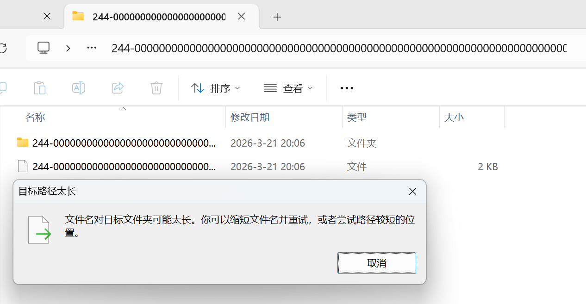
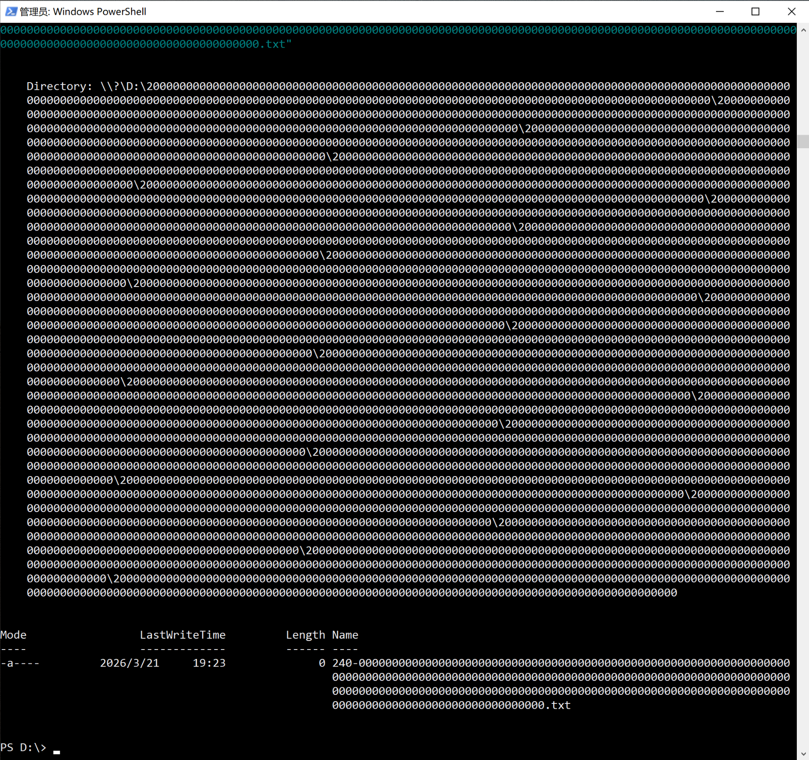
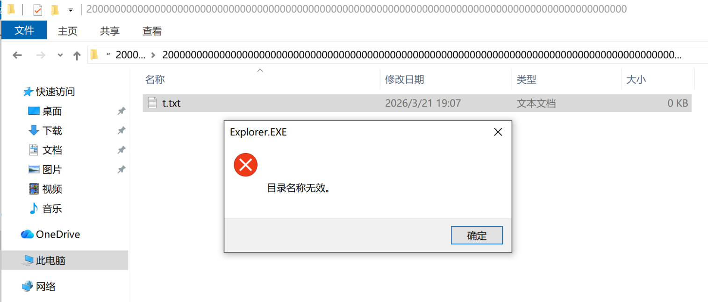

# Windows 系统的文件路径长度限制是多少个字符？244、255、256、260、32767 ？「启用长路径」有用吗？

## 到底是多少个字符？

### 256

微软文档《 **[最大路径长度限制](https://learn.microsoft.com/zh-cn/windows/win32/fileio/maximum-file-path-limitation?tabs=registry)** 》（ [Maximum Path Length Limitation](https://learn.microsoft.com/en-us/windows/win32/fileio/maximum-file-path-limitation?tabs=registry) ）：  
在 Windows API 中，路径的最大长度为 **MAX_PATH，为 260 个字符**。  
系统按以下顺序构建本地路径：驱动器号、冒号、反斜杠、用反斜杠分隔的路径和终止 null 字符。  
例如，驱动器 D 上的最大路径为：  
`D:\某个 256 个字符的路径字符串<NUL>`  
其中 `<NUL>` 表示当前系统代码页的不可见终止 null 字符。（<> 字符在此用于醒目用途，不能作为有效路径字符串的一部分。）  

文档到这里的意思是：路径总长度是 260 个字符，掐头去尾中间**可用的部分是 256 个字符**（英文版也是 256）。  

那么来测试一下。  
**测试用例**：  
```
240-00000000000000000000000000000000000000000000000000000000000000000000000000000000000000000000000000000000000000000000000000000000000000000000000000000000000000000000000000000000000000000000000000000000000000000000000000000000000000000000

251-0000000000000000000000000000000000000000000000000000000000000000000000000000000000000000000000000000000000000000000000000000000000000000000000000000000000000000000000000000000000000000000000000000000000000000000000000000000000000000000000000000000

252-00000000000000000000000000000000000000000000000000000000000000000000000000000000000000000000000000000000000000000000000000000000000000000000000000000000000000000000000000000000000000000000000000000000000000000000000000000000000000000000000000000000
```

[字符串计数工具](https://mothereff.in/byte-counter)  

### 244

在 `D:\` 路径，使用「**文件资源管理器（Explorer.exe）**」创建文件或文件夹，**只能创建 244 个字符的文件、文件夹**。  

  
这张图是在一个 `D:\244字符` 的文件夹里，继续新建文件夹的报错「目标路径太长」。  

然后我发现群晖文档《 [如果 Windows 文件资源管理器提示文件名过长，我该怎么办？](https://kb.synology.cn/zh-cn/DSM/tutorial/smb_file_name_too_long) 》讲得很清楚：  
「**最大可用路径长度为 244 个字符**，因为 Windows 文件资源管理器为 **8.3 文件名格式**预留了 12 个字符。」  

其实微软文档《最大路径长度限制》也提到了：「使用 API 创建目录时，指定的路径不能太长以致于无法附加 **8.3 文件名**（即目录名不能超过 MAX_PATH 减 12）」。只是不太显眼，容易被忽略。  

### 「8.3 文件名」是什么？

在 MS-DOS FAT 文件系统，基础文件名最多 8 个字符，扩展名最多 3 个字符，总共支持 12 个字符（包括点分隔符），所以被称为 8.3 文件名。Windows FAT 和 NTFS 文件系统不限于 8.3 文件名，因为它们有长文件名支持功能，但也支持 8.3 版本的长文件名。  


在 Win10、Win11 系统，**系统盘默认启用 8.3 文件名，非系统盘默认禁用 8.3 文件名**。  
可以用 `fsutil` 查询（需要管理员权限）：  
```
fsutil 8dot3name query D:
卷状态为: 1 (8dot3 名称创建已禁用)
注册表状态为: 2 (按卷设置 - 默认值)

基于上述设置，8dot3 名称创建已在“D:”上禁用
```

在启用了 8.3 文件名的盘中，创建文件名超过 12 个字符的文件，系统会**自动生成相应的 8.3 文件名，即「短文件名」**。

微软文档《 [命名文件、路径和命名空间](https://learn.microsoft.com/windows/win32/fileio/naming-a-file) 》  
微软文档《 [8.3 Filename](https://learn.microsoft.com/en-us/openspecs/windows_protocols/ms-fscc/18e63b13-ba43-4f5f-a5b7-11e871b71f14) 》  
《 [关于Windows文件名和路径名的那些事](https://fresky.github.io/2015/10/13/story-about-windows-file-name/) 》  
联想文档《 [什么是 8.3 格式？](https://www.lenovo.com/tw/zh/glossary/what-is-8-3-format/) 》  

所以，文件资源管理器为了兼容性，进一步限制，就只能创建 **256 - 12 = 244** 个字符的文件、文件夹。  

### 255

在「群晖文档」中提到：「此限制仅适用于 Windows 文件资源管理器和 Windows API。使用 Windows PowerShell 或 命令提示符 中的 **ren 或 rename 命令重命名文件不受影响**。」

测试后确实，使用 ren 可以创建超过 244 个字符的文件、文件夹。  
但是，**文件不能超过 255 个字符，文件夹不能超过 254 个字符**：（ `-LiteralPath` 是必须的）：  

```PowerShell
ren -LiteralPath "1" "252-00000000000000000000000000000000000000000000000000000000000000000000000000000000000000000000000000000000000000000000000000000000000000000000000000000000000000000000000000000000000000000000000000000000000000000000000000000000000000000000000000000000345"
ren : 指定的路径或文件名太长，或者两者都太长。完全限定文件名必须少于 260 个字符，并且目录名必须少于 248 个字符。
所在位置 行:1 字符: 1
+ ren -LiteralPath "1" "252-0000000000000000000000000000000000000000000 ...
+ ~~~~~~~~~~~~~~~~~~~~~~~~~~~~~~~~~~~~~~~~~~~~~~~~~~~~~~~~~~~~~~~~~~~~~
    + CategoryInfo          : WriteError: (D:\1:String) [Rename-Item], PathTooLongException
    + FullyQualifiedErrorId : RenameItemIOError,Microsoft.PowerShell.Commands.RenameItemCommand
```

报错是：「**完全限定文件名必须少于 260 个字符，并且目录名必须少于 248 个字符**」。  
微软文档《 [Git 跨平台兼容性](https://learn.microsoft.com/zh-cn/azure/devops/repos/git/os-compatibility?view=azure-devops) 》：「对于具有 .NET 的目录，完全限定的文件名必须少于 260 个字符，目录名称必须少于 248 个字符」。  

**为什么文件最多 255 个字符？**  
既不是 256 也不是 244，代码实现与文档《最大路径长度限制》是对不上的。  
在另一篇微软文档《 [Filename](https://learn.microsoft.com/en-us/openspecs/windows_protocols/ms-fscc/2917da5c-253c-4c0e-aaf6-9dddc37d2e6e) 》倒是提到了 255 个字符：A filename MUST be at least one character but no more than 255 characters in length.  

为什么文件夹最多 254 个字符？这个数字更是哪都对不上。还有，使用 mkdir 只能创建 244 个字符的文件夹。  

## 「启用长路径」有用吗？

「启用长路径」也就是注册表值 `HKEY_LOCAL_MACHINE\SYSTEM\CurrentControlSet\Control\FileSystem LongPathsEnabled` (Type: REG_DWORD) 设置为 1。  

微软文档《最大路径长度限制》：启用之后，「允许最大总路径长度为 **32767 个字符**的扩展长度路径」，要指定扩展长度路径，要使用 `\\?\` 前缀。例如，`\\?\D:\非常长的路径` 。  

### 为什么是 32767 ？  
（感谢 [V2EX@codehz](https://www.v2ex.com/t/1201537?p=1#r_17461895) ）  
因为「NTFS 将文件名存储在 Unicode 中。较旧的 FAT12、FAT16 和 FAT32 文件系统使用 OEM 字符集。」《 [文件名中使用的字符集](https://learn.microsoft.com/zh-cn/windows/win32/intl/character-sets-used-in-file-names) 》  
Windows NT 内核（Native API）使用 `UNICODE_STRING` 结构体传递 Unicode 字符串。其定义如下：  

```C++
typedef struct _UNICODE_STRING {
  USHORT Length;
  USHORT MaximumLength;
  PWSTR  Buffer;
} UNICODE_STRING, *PUNICODE_STRING;
```

《 [UNICODE_STRING structure (ntdef.h)](https://learn.microsoft.com/en-us/windows/win32/api/ntdef/ns-ntdef-_unicode_string) 》  

Length 和 MaximumLength 变量都是 USHORT 无符号短整型，能表示的最大值是 65535（2^16 - 1），单位是字节。  
NT 内核中，Unicode 字符编码表是 UTF-16。在 UTF-16 中，大多数日常使用的字符（英文字母、中日韩统一表意文字 CJK）都在「基本多语言平面（BMP）」，每个字符固定占用 2 个字节。  
因此，路径的字符数上限为 65535 / 2 = 32767.5，向下取整为 32767 个字符。  

### 单个文件、文件夹的名字上限还是 255

**「长路径」只对部分 Windows 函数生效**。「多数 C++ 标准库函数仍受限于 Win32 路径解析逻辑，需显式使用 Unicode API 及 `\\?\` 前缀才能突破限制」《 [c++如何获取当前系统支持的最大路径长度常量及其实际使用策略](https://www.php.cn/faq/2262712.html) 》  

前面测试的**文件资源管理器，PowerShell 的 New-Item、Rename-Item 等命令仍然不完全支持长路径**。  
New-Item、Rename-Item 具体调用的是什么函数？这个问题超出我能力范围了。  

启用长路径之后，`mkdir`（`New-Item -ItemType Directory -Path`）可以创建 255 个字符的文件夹，**限制只增加了 11 个字符**，在这个文件夹下也能继续创建文件。  

```PowerShell
mkdir "252-00000000000000000000000000000000000000000000000000000000000000000000000000000000000000000000000000000000000000000000000000000000000000000000000000000000000000000000000000000000000000000000000000000000000000000000000000000000000000000000000000000000345"

    目录: D:\
Mode                 LastWriteTime         Length Name
----                 -------------         ------ ----
d-----         2026-3-19     21:49                252-00000000000000000000000000000000000000000000000000000000000000000
                                                  000000000000000000000000000000000000000000000000000000000000000000000
                                                  000000000000000000000000000000000000000000000000000000000000000000000
                                                  000000000000000000000000000000000000000000000345
```

### 长路径语法 `\\?\`

如果按文档，加上 `\\?\` 反而会报错：  

```PowerShell
mkdir "\\?\D:\252-00000000000000000000000000000000000000000000000000000000000000000000000000000000000000000000000000000000000000000000000000000000000000000000000000000000000000000000000000000000000000000000000000000000000000000000000000000000000000000000000000000000345"
mkdir : 路径不能为空字符串或全为空白。
参数名: path2
所在位置 行:1 字符: 1
+ mkdir "\\?\D:\252-000000000000000000000000000000000000000000000000000 ...
+ ~~~~~~~~~~~~~~~~~~~~~~~~~~~~~~~~~~~~~~~~~~~~~~~~~~~~~~~~~~~~~~~~~~~~~
    + CategoryInfo          : InvalidArgument: (\\?\D:\252-0000...000000000000345:String) [New-Item]，ArgumentException
    + FullyQualifiedErrorId : CreateDirectoryArgumentError,Microsoft.PowerShell.Commands.NewItemCommand
```

New-Item 创建文件时，支持 `\\?\` 语法：`New-Item "\\?\D:\123"` 。但创建文件夹时，又不支持了。  
Rename-Item 支持 `\\?\` 语法：`Rename-Item -LiteralPath "\\?\D:\1" "\\?\D:\123"` 能正常运行。  
Remove-Item 支持 `\\?\` 语法，而且对超过 255 个字符的命令没有报错。还好它是支持的，否则创建之后不能删除就麻烦了。  

| PowerShell 5.1 | 启用长路径前         | 启用后 |
| -------------- | -------------------- | ------ |
| 文件资源管理器 | 244                  | 244    |
| mkdir          | 244                  | 255    |
| ni（文件）     | 255                  | 255    |
| ren            | 文件夹 254，文件 255 | 255    |
| del            | 超过 4000         |        |

255 还不到 32767 零头的一半。  

### PowerShell 7

**Win10、Win11 默认的 PowerShell 是 5.1 版本的**。  
`$PSVersionTable` 查看版本。  

我下载了 PowerShell 7.6.0 版本进行测试。  

| PowerShell 7.6.0 | 启用长路径前         | 启用后 |
| -------------- | -------------------- | ------ |
| mkdir          | 255                  | 255    |
| ni（文件）     | 255                  | 255    |
| ren            | 文件、文件夹都是 255 | 255    |
| del            | 超过 4000         |        |

统一是 255 字符了，比 5.1 版本好一些，但单个文件、文件夹的长度限制还在，使用 `\\?\` 语法也不行。  

### 多层文件夹的路径上限

虽然单个文件、文件夹的名字上限是 255 个字符，但多层目录的限制又不一样了。在**未启用长路径**的情况下，就可以**创建超过 4000 个字符的路径**。还能在这个路径下新建 txt，并且用「记事本」读写：  

  

而且，到了这个长度，「文件资源管理器」报错是「目录名称无效」：  

  

「启用长路径」之后这个报错也还在。  

### 创建文件名 32767 个字符的文件

写代码的方法有 2 种：  

- 启用长路径之后，调用 [没有 MAX_PATH 限制的函数](https://learn.microsoft.com/windows/win32/fileio/maximum-file-path-limitation?tabs=registry#functions-without-max_path-restrictions) 比如 [CreateFileW](https://learn.microsoft.com/windows/win32/api/fileapi/nf-fileapi-createfilew) 
- 直接调用 Windows Native API，比如 [NtCreateFile](https://learn.microsoft.com/windows/win32/api/winternl/nf-winternl-ntcreatefile) 函数

不写代码，可以用支持长路径的软件，比如有 Stack Overflow 网友使用 [Far Manager](http://www.farmanager.com/) 测试了《 [What happens internally when a file path exceeds approx. 32767 characters in Windows?](https://stackoverflow.com/questions/15262110/what-happens-internally-when-a-file-path-exceeds-approx-32767-characters-in-win) 》，**最多只创建了 32765 个字符的文件**（包括 `\\?\` 和 `<NUL>` 的完整路径）。为什么还差 2 个字符，不知道。  

## 第三方软件的支持情况

### PikPak

**终于到了我研究这个问题的初心了！**  
我发现 PikPak 的 Windows 客户端下载文件（v2.8.16.5418），**文件名超过 100 个字符的部分会被截断**。网页端没有这个问题。  
于是我去找客服提了 bug，只过了 11 天，官方就在 2.9.0 版本修复了。我要给 PikPak 的客服和研发点赞，认真处理用户反馈。  

修复后的逻辑是这样的：  
**总路径长度支持 500 个字符**：包括 246 个字符的文件名，246 个字符的上层路径（可以有多层文件夹）：  
`\\?\D:\246 个字符的路径\246 个字符的文件名`  
如果超过限制，会弹出「下载失败」的通知。  

## 总结

截至 2026-03 月，使用 Windows 系统，路径长度（文件名）最好控制在 **244 个字符以内**。  
单个文件、文件夹的名字上限是 255 个字符。  
多层文件夹的路径上限超过 4000 个字符。  
「启用长路径」的作用鸡肋。  

**提醒：4 个字符的扩展名是很常见的**：  
.avif .docx .flac .html .jpeg .json .m3u8 .pptx .webp .xlsx  


## 参考资料

[Windows10下路径名称限制](https://blueheart0621.github.io/2022/01/13/Technique/Windows/Windows10%E4%B8%8B%E8%B7%AF%E5%BE%84%E5%90%8D%E7%A7%B0%E9%99%90%E5%88%B6/)  

群晖文档《 [Cloud Station Backup 帮助](https://kb.synology.cn/zh-cn/DSM/help/CloudStationBackup/cloudstationbackup?version=6) 》：  
Cloud Station Backup 默认在以下情况下不会备份文件和文件夹：  
对于 Windows：  
- 文件夹或文件路径长度超过 247 个字符。
- 文件名称长度超过 255 个字符。

**看了但没用上**：  

[30年前的技术债引发win11离奇bug，微软不敢修！](https://www.bilibili.com/video/BV1Rf421v73F/)  
[请教一下， windows 系统变量字符过长有什么好的解决方案！](https://v2ex.com/t/1056570)  

## 更新日志

2026-04-08 更新：为什么是 32767、创建文件名 32767 个字符的文件  
2026-03-21 第一版  
2026-03-19 开始写