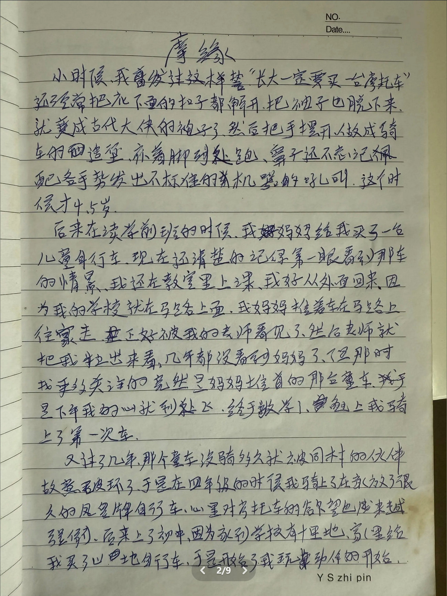
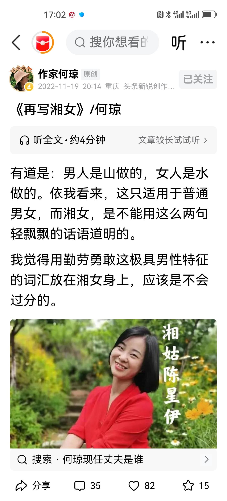
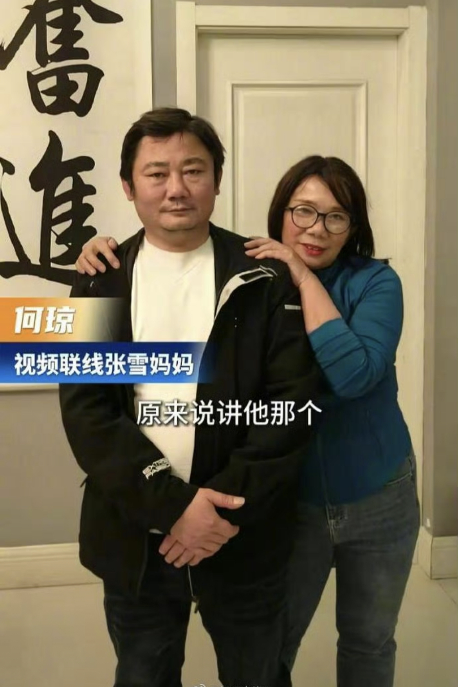
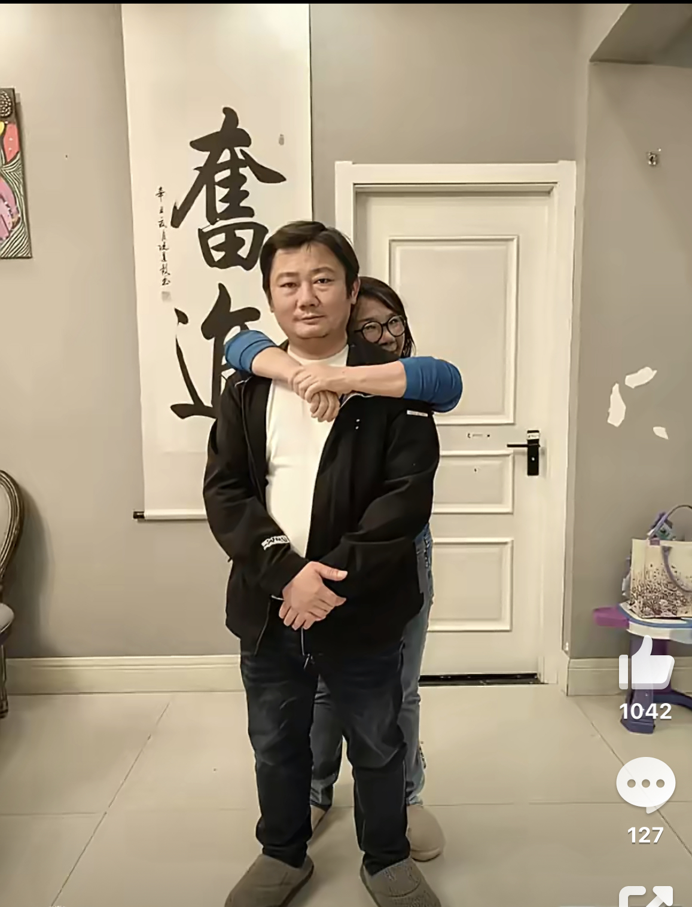
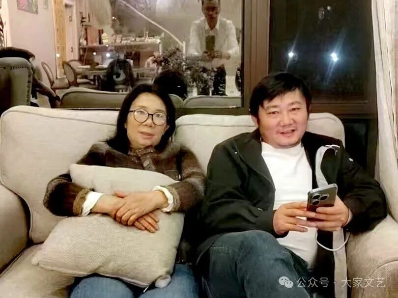
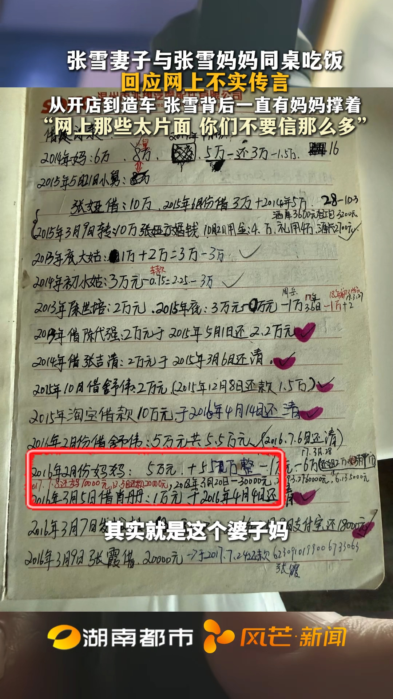
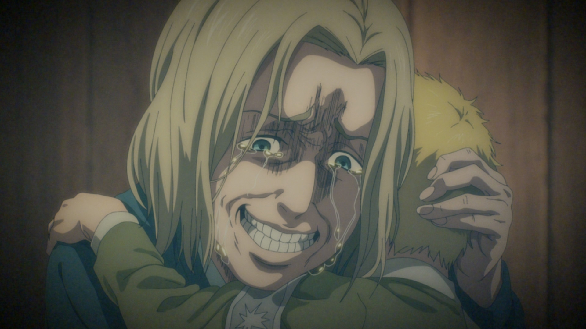
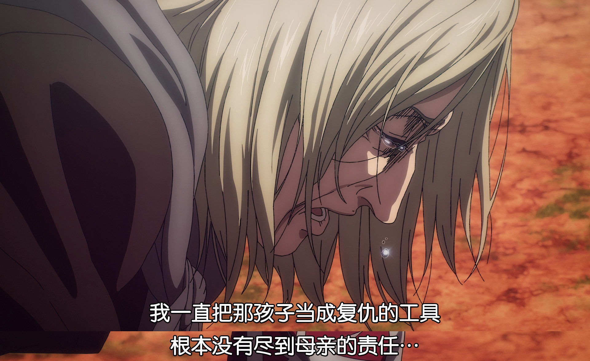

# 想问问张雪，要不要跟我互换母亲？

## 只靠一面之词就开始锐评的自媒体

现在大量的媒体、自媒体都是只靠张雪的母亲何琼的一面之词，来评价何琼。张雪怎么想的，他没说，也没人问。  
包括我关注的 2 位作者，我对此感到失望，所以我要写本文。  

「没被过多管教，又被完全的爱和信任托底。这样的成长环境其实很难得。」《 [张雪成功背后的那些人](https://mp.weixin.qq.com/s/mCRY3mETX8vCECPPwx8HMA) 》陈兴杰  
**爱和信任在哪？**  

「这对母子似乎有一种精神上的默契：妈妈一直鼎力支持他追寻梦想」「张雪那种不服输、能折腾的个性，倒很有可能遗传自妈妈。」《 [妈妈也有自己的人生](https://mp.weixin.qq.com/s/z8-Oc8h8DNpzLa45d7kRkg) 》维舟  
**个性不靠言传身教，靠遗传？**  

还有「武志红」，你要不先跟张雪聊聊，看他是怎么评价自己的「原生家庭」的，再来为你的理论辩护不迟。  

### 下面来分析何琼的原文

《 [张雪，妈妈眼里的鬼灵精](https://mp.weixin.qq.com/s/a4_70fT9juUUKJ1N2d_40A) 》何琼  
公众号「大家文艺」  

首先**编者**的话就有点难绷  

「令人**惊喜**的是，张雪的亲生母亲**竟是**我相交十多年的文友何琼女士——一位善良、优雅、纯粹，且极富才情的女性，也是本刊的老作者。前天，我向她致电祝贺，并约她写一写儿子，她欣然应允，昨晚在前往重庆的火车上含泪撰就。她婉拒多家官媒的稿约，第一个发给了我，这份信任和情谊令人感动。」  

**相交十多年，才知道朋友的儿子是谁**。  
一个爱儿子的母亲，从来不提自己的骄傲，这似乎不太可能。我还是怀疑你们的友情吧。  

「我在海南一家报社任釆编」  
**「釆」biàn 是错别字**，是「辨」的古字，应该为「采」。这个我怀疑是 OCR 识别问题，因为后面另一个「采」字没错，不像是五笔拆字拆错了。  

「苗苗上学前班那年，我请假去探望两个孩子，途经麻阳高村供销社，看见一辆漂亮的儿童自行车，标价180多块。当年算是很贵了，我在自行车旁站了一会，还是买了。他见到车时，所有欢喜都写在脸上。」  
张雪成年后在日记《摩缘》中写道：「我妈妈推着车在马路上往家走，正好被我的老师看见了，然后老师就把我拉出来看。**几年都没看到妈妈了**，但那时我更多关注的竟然是妈妈推着的那台童车。」（陈星伊的抖音账号 @星姐0543 [2025-11-08](https://www.douyin.com/note/7570252294169209747) 发的）  

  

**同一事件的不同视角**，读起来是不是明显不一样了？  

**张雪骑摩托车撞人**  
「学徒不久，他和同伴驾修好的摩托上街，撞了人。无人撑腰，对方索赔，他尽数应下。那一次，我为他付了三万多的“成长费”。」  
「**无人撑腰**」是什么意思？如果家长能到现场处理，还叫「无人撑腰」吗？我也学自媒体同行来想象一下他们的母子关系，我想象的版本是这样的：张雪答应赔钱，他想的是自己挣钱自己赔，但对方要求他现付，他只能求助何琼，也许说的还是「借 3 万，之后还」。「尽数应下」言外之意是觉得张雪被对方讹诈了。  

「张雪做事很有主见，他向来少与我细说。」「所有苦楚，我都是从网上知晓的。心揪着疼。」  
他不说，**你问过没有**？  

「2006年，我陪他去北京参加摩托车山地赛。赛场混乱，我远远看见有人连人带车摔出去老远」  
「我又痛又气，那一刻真真切切动了让他改行的念头。可看着他眼里不肯熄灭的光，那念头转瞬即逝——我舍不得掐灭他的热爱。」  
首先，2006 年「张雪参加摩托车山地赛」这件事好像是**孤证**，除了何琼没人说过。这一年，张雪已经 19 岁了，他求着 [湖南卫视《晚间新闻》采访](https://www.bilibili.com/video/BV1CNXeBaEe8/) 时说的是「我家里没钱。我爸妈在我很小的时候就离婚了。**我十岁的时候，我自己就跟妹妹独立了**」。他求电视曝光就是想进车队比赛，**从他说的话看，像是从未参赛过**。  
其次，未成年的时候何琼不管，现在已经成年了，你来关爱了，**控制欲爆发，要「掐灭他的热爱」**。  

何琼还说「他虽然在社会上（混）几十年了，其实他的内心很干净的。他属于那种两耳不闻旁外事，专心造车」（微信视频号「涟源融媒」2026-04-06 视频连线何琼）（ [BV1maDbBDEgF](https://www.bilibili.com/video/BV1maDbBDEgF/) ）  
什么叫「社会」？什么叫「干净」？明显就是 **难以自食其力的「文人」觉得商业肮脏，书香铜臭**；不说看不起儿子吧，起码对其他人是高高在上的。

何琼的《再见湘女》「勤劳勇敢这极具男性特征的词汇放在湘女身上」是在夸陈星伊。我不知道女权主义者看了之后是什么感想，会不会把何琼开除女籍。  

  

### 母子合照

现在全网的母子合照也没几张，可能是何琼比较在意隐私吧。  

这两张照片明显是摆好姿势之后特意拍的，

  

  

只要看过张雪的一些视频，就会发现他是个直爽的人，不会特别隐藏情绪。  
再看这两张合照，张雪连陪笑都没有。面对妈妈的拥抱，张雪选择两手交叉。

  

这张是在何琼的文章中发的，图题「母子今日于重庆家中（2026.04.04）」。  
张雪笑了，何琼不笑了。给我的感觉就是张雪在看手机，被叫了一声，抬头，拍了一张照片。何琼过来，他没有离开沙发，是因为手机在充电。  

### 钱借了，也还了

2026-04-08 张雪妻子陈星伊回应（ [BV1TVDrBpE1A](https://www.bilibili.com/video/BV1TVDrBpE1A/) ）：

  

「你看到我的那个单子上面，我写的那个妈妈，其实就是这个婆子妈。」  
确实是借钱了。账本上的「妈」并不像一些网友猜的那样，是陈星伊的母亲。在第一行也有个「妈」，是 2014 年的借款。  

也还钱了。账本上有还款记录。  

张雪和妹妹住窝棚的时候，妈妈的钱在哪？  

**借钱，是投资还是母爱，大家自有分辨**。  

## 母亲应该是什么样的？

**父母的钱是父母的**  
父母没有义务帮助成年子女创业。愿意是情分，不帮是本分。  

**放养的父母，好过控制欲强的父母**  
不打压、不控制，在中国的父母中很难得。但是**带着爱、尊重孩子的放养，和根本不想搭理的放弃，可不是一回事**。  

母亲当然应该有自己的人生，**而不是把自己的人生用于控制孩子**。  

**但是缺席三十年之后，再回来表演好妈妈，不觉得虚伪吗？**  

## 张雪会评价他的母亲吗？

现在距离 2026-03-29 张雪机车夺冠已经过了 10 天，再算上之前的 20 多年。张雪好像从未「**感恩**」过他的母亲。  

**在中国，「不孝」是道德上的严重指责**。如果张雪心里对母亲有不满，他大概率也不会公开说。  

## 我的母亲

我写这篇还有一个原因：我 PTSD 了。我的母亲也是（只在地方有名的）作家，省作协会员。她对我是「无微不至的照顾」，我饿不饿是她决定的。  
她在我大学的迎新晚会上，**也写了一篇母亲思念儿子的文章**，被辅导员选中，做成节目，外人看了也很感动。  

​我母亲对我的思念之情，尽管也有表演痕迹，但我并不怀疑她的真诚。  
因为她的「母爱」已经达到了自我感动、自我欺骗、没有自己人生的境界。

她那些泛泛之交的文友，都不止一次地听过她炫耀自己的儿子如何聪明。

​「妈妈的钱，和别人的债不一样，是可以不用还的。」  
​哈哈，别逗笑了。我妈说的是「卖血也要送你去留学！」。  

---------------------------------------------------------------------

  
《进击的巨人》完结篇（前篇）-52：24  

莱纳的母亲起码知道错了，虽然是死到临头的时候。  

  
《进击的巨人》完结篇（前篇）-52：34  

## 参考资料

[如何评价张雪的母亲何琼女士，她自称在离异改嫁后，尽了全力，与湖南台当时的纪录片拍摄到的生活情况不符？](https://www.zhihu.com/question/2024802526944401361)  
《 [机车大佬张雪，湖南怀化人，从修车学徒到中国摩托狂人，仅初中学历，在重庆借1000万自研发动机，37岁裸辞，1年再造年收7亿新传奇](https://news.qq.com/rain/a/20251122A04AYW00) 》互联网大佬说  

**看了但没用上**：  

## 更新日志

2026-04-09 第一版