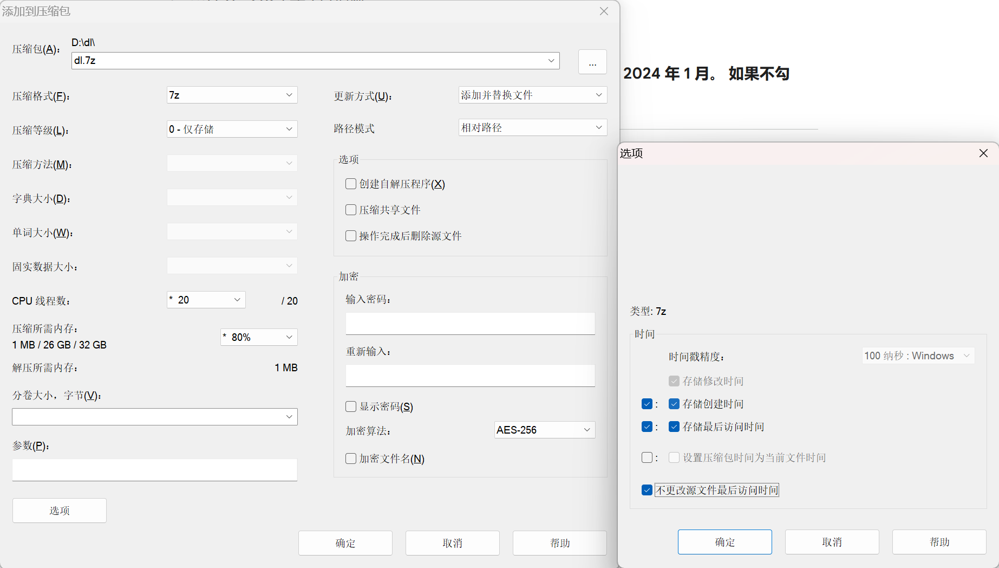
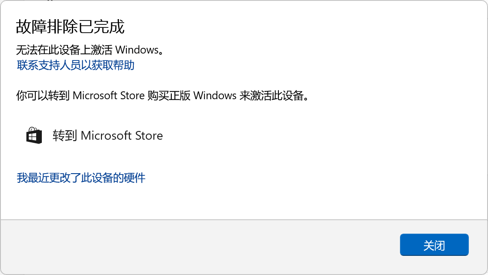
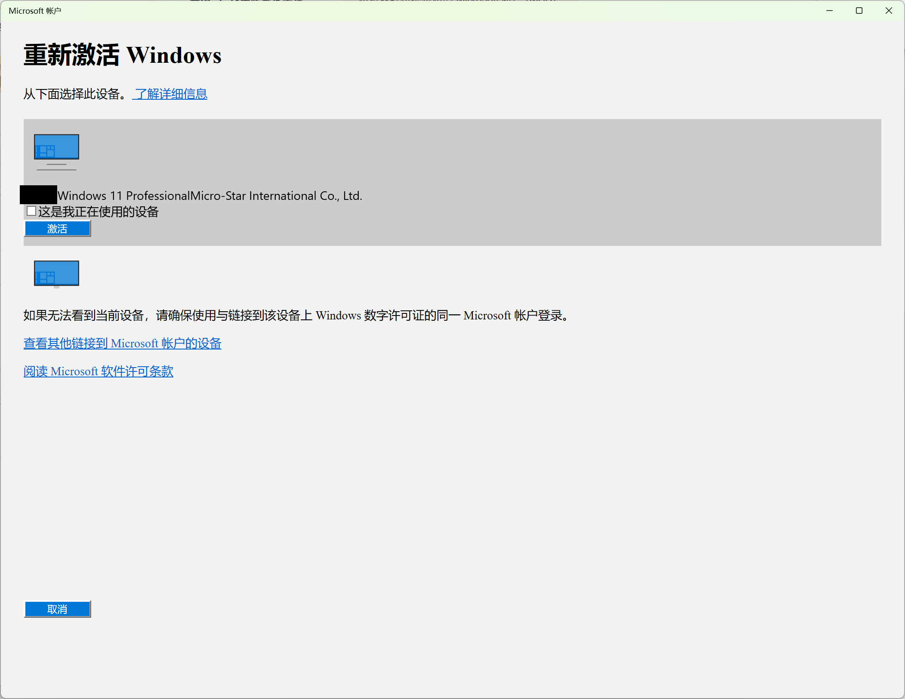
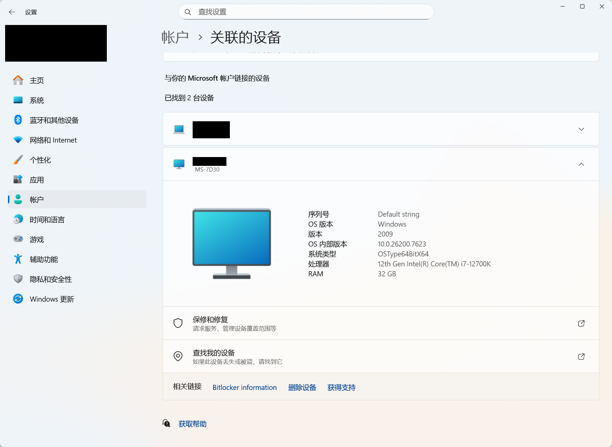
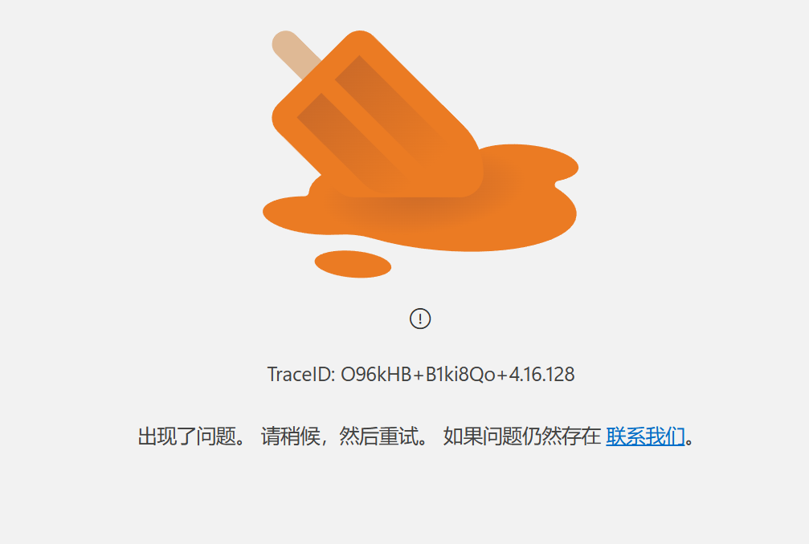
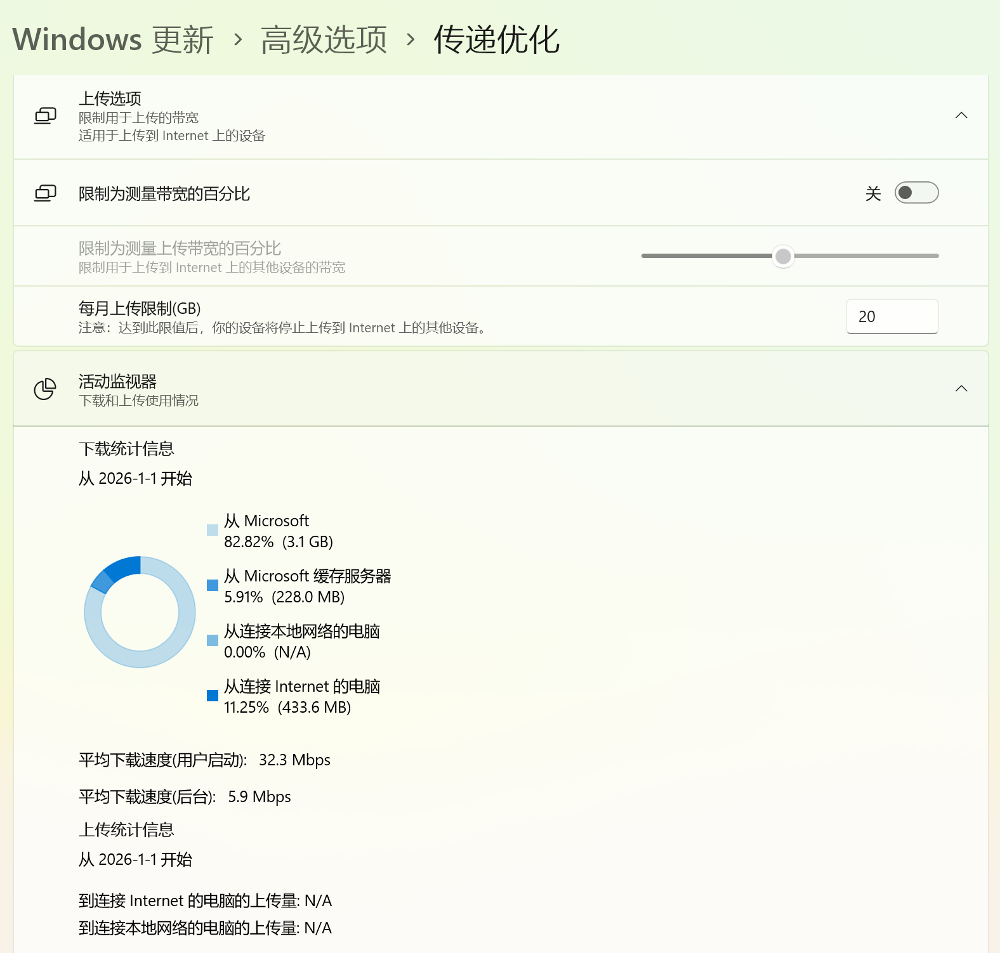
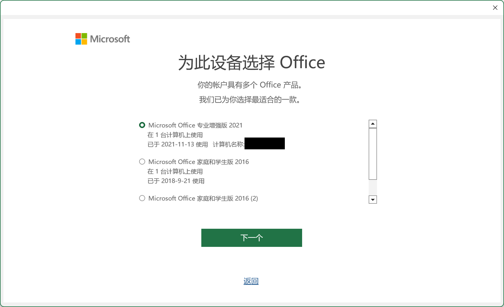
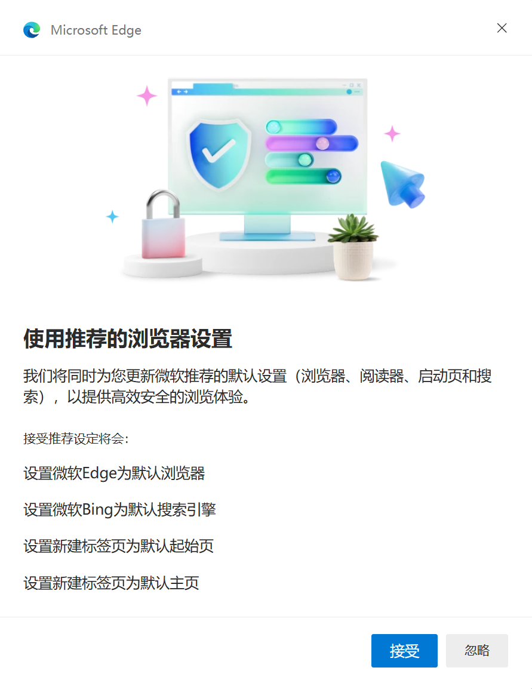

# 我保留了一部分数据，这样才是重装系统【教程】

**本文是重装系统后手动恢复数据的教程，除了解决系统问题之外，其他状态都保持原样，不丢失有用的数据**。  

## 重装前的思考

### 为什么要重装？有必要吗？

导火索是因为我被微软偷袭了，  
【】音频：马保国偷袭  
不能登录微软帐户，详情见上一个 [视频]() 。  
除了被偷袭的问题，还有锁屏图片不更新问题、我之前折腾 Windows 多用户的遗留问题，以及这套系统是从 Win 10 升级而来的，可能全新安装后 bug 会少一些。  
以前就想过要重装，但太麻烦，这次是被迫下定决心了。  

### 重装与保留数据的思路

#### Windows 设置

Windows 官方云同步只支持部分设置，具体看文档：  
【】图：[Windows 备份设置目录](https://support.microsoft.com/zh-cn/windows/windows-%E5%A4%87%E4%BB%BD%E8%AE%BE%E7%BD%AE%E7%9B%AE%E5%BD%95-deebcba2-5bc0-4e63-279a-329926955708#id0ebd=windows_11) （中文是机翻， [英文版](https://support.microsoft.com/en-us/windows/windows-backup-settings-catalog-deebcba2-5bc0-4e63-279a-329926955708#id0ebd=windows_10) ）  
而且由于网络问题，不一定能同步成功。我建议使用截图与文本保存修改过的配置。  

#### 控制面板

在 Win11 系统，已经有一半都被「设置」取代了。

#### 注册表

注册表保存了 Windows 的配置、软件的配置。在我用的软件里，把配置和数据存在注册表的软件只有少数几个。  
全部备份再恢复是不行的，系统问题可能就是因为注册表改乱了导致的。  
对个别软件可以考虑备份相关的注册表。  

#### 组策略

可能设置了比如：关闭 Windows 自动更新、禁用任务管理器、禁用控制面板等策略。  

#### 用户文件夹

**环境变量**  

先介绍几个环境变量，这些变量和路径是等价的，后面的文件路径会使用这些变量。  

| 环境变量       | 对应路径                            |
| -------------- | ----------------------------------- |
| %UserProfile%  | C:\Users\\<用户名>                  |
| %AppData%      | C:\Users\\<用户名>\\AppData\Roaming |
| %LocalAppData% | C:\Users\\<用户名>\\AppData\Local    |

#### 数据盘（非系统盘）的数据

**数据盘的 NTFS 的 ACL 权限问题**  
用户在重装系统后可能会发现非系统盘（如 D 盘）的文件打不开，提示「拒绝访问」；或者在非系统盘安装软件需要管理员权限。这些问题的就是 NTFS 的 ACL（访问控制）权限导致的。ACL 不是存在注册表里，也不是存在系统盘里，而是跟文件系统放一起的。重装系统后，非系统盘的 ACL 设置是没有变化的；即使用户名相同，重装后 SID 也会变化；结果就是**新用户无法访问非系统盘的数据，需要用管理员权限修改 ACL 才可以访问**。  

由于我对 NTFS 只是一知半解，为了减少 bug 以及数据安全，我选择 D 盘也手动迁移数据。文件打包之后再解压，就不会有旧的 ACL 权限问题，而是直接继承解压的目标文件夹的 ACL 权限。  
我是刚好有一块空闲的固态硬盘可以用来中转数据，如果是用机械硬盘中转的话，移动数据的耗时会很长。  

如果觉得这个方案麻烦或者不可行，也可按照下方的参考资料，**直接修改 D 盘的 ACL**，也不是不能用。  
[参考1](https://zhuanlan.zhihu.com/p/34725369) 、[参考2](https://www.v2ex.com/t/905911)  

**数据盘的迁移方案**  

1. 使用 7-Zip 按需对文件夹打包（不压缩）。
2. 压缩包存在中转的硬盘里
3. 重装后解压出来

#### 软件

**准备软件安装包**：  
有些软件是用来帮助安装其他软件的，这些软件的安装包建议提前备好，放在 U 盘或数据盘。比如：网卡驱动、显卡驱动、下载器、解压软件、代理软件、浏览器。  

我一直有存档安装包的习惯，除了会强制要求升级的软件之外都会保存，尤其是个人开发的软件。所以，有安装包的就直接安装原来的版本，没有的就下载最新的。  

**注意付费软件授权「反激活」**  

**软件配置与数据**：  
优先使用软件自带的配置备份、导出功能。  

软件的数据一般存储在这些位置：

- 如果是便捷版，就存在软件程序所在目录
- %AppData%、%LocalAppData%
- %UserProfile%、%UserProfile%\Documents、%UserProfile%\Saved Games
- 注册表：HKEY_CURRENT_USER\Software

软件在 `%UserProfile%` 路径下的数据，有这几类情况：  

- 直接在这个路径以软件的名字新建文件夹
- 在「我的文档」里新建文件夹
- . 开头的隐藏文件、隐藏文件夹

对于**重要的软件**要参考他人迁移的例子，或者进行实测，避免出现数据丢失。

**还原软件数据**  
先安装软件，然后有两种方式：  

- 手动创建文件夹，恢复数据。
- 先运行一次软件，让软件创建相关文件夹。退出软件，再还原备份的数据。

#### Office

因为我的 OneNote 笔记是我的外置大脑，现有 9GB 数据，所以 Office 要单列一个标题重点关注。

**是否要换成 Office 2024 专业增强版？**  
不换。  
2021 的零售版本功能还在更新，与 2024 版本并没有区别。  
而且激活已经绑定到的微软帐户，可以在官网下载并激活。  

2024 年 OneNote 2024 LTSC 对比 OneNote 2021 LTSC 增加的新功能  
2024-10-08  
https://cn.onenotegem.com/a/documents/win-office-onenote/2024/1008/onenote-2024-vs-2021-LTSC.html  

OneNote 各版本间的兼容性的比较，功能的异同  
2024-10-10  
https://cn.onenotegem.com/a/documents/onenote/2019/1112/114.html  

#### 电子游戏

游戏的数据不只是程序、美术资产，还有存档、补丁、mod、设置。比如补丁（尤其是那些游戏的补丁）、mod，不管是 Steam 还是 Xbox 的云存档都是不会备份的，需要手动备份。  

### 新系统选什么？

#### Win10 还是 Win11 ？

这套系统我是准备长期用的，我计划在换新电脑时直接把硬盘移过去。所以，已经（2025-10-14）停止更新的 **Win10 可能不支持新的硬件**：  

- Win10 22H2 支持了大小核调度，但需要自己手动调整：12、13、14代酷睿处理器在Win11、Win10中大小核调度 https://www.bilibili.com/opus/916230297947734035
- Ryzen AI 系列处理器不支持 Win10

所以，我用 Win11。  
虽然，在我电脑的虚拟机上跑 Win10，动画都比 Win11 流畅。  

#### 要不要 LTSC 版本？

- 我要拿来玩游戏。
- 我会使用：微软商店、Xbox、Game Bar，这些都被精简了，还得自己装。
- 我并不特别反感定期更新系统。因为我还没有被偷袭式的系统更新伤害过。

所以，我不要 LTSC。

-----------------------------------------------------------------

## 备份数据

### Windows

#### 设置（ Win + I 打开的那个）

**系统**  
屏幕
    缩放：175%
    分辨率：4K
通知
    之后再手动调吧
电源
高级
    结束任务：开启
    启用长路径：开启
剪贴板
    剪贴板历史记录：关闭

**蓝牙和其他设备**  

**网络和 Internet**  

**个性化**  
**主题**  
主题文件：`%LocalAppData%\Microsoft\Windows\Themes` ，这个文件在简中系统用的是 GBK 编码。注册表 `HKEY_CURRENT_USER\Software\Microsoft\Windows\CurrentVersion\Themes` 的 `CurrentTheme` 记录当前正在运行的 `.theme` 文件路径。  
声音：程序事件：感叹号、星号、系统通知、默认响声，这个 Windows Background.wav 比较烦人。  
开始  
任务栏  

**应用**  
高级应用
    存档应用：关闭。
默认应用
    安装各软件后再设置
启动
    装完软件后统一调

**时间和语言**  
日期和时间
    格式化：短日期格式

**游戏**  
摄像位置：要修改位置，就移动当前的那个文件夹。文件夹可以重命名。子文件夹里的图片也会被 Game Bar 读取。  

**辅助功能**  
鼠标指针与触控  
自定义方案位置在注册表：`HKEY_CURRENT_USER\Control Panel\Cursors\Schemes` 。  

#### Windows 杂项

**开始菜单固定的程序**  
截图保存  

**（右下角）系统托盘图标排序**  
截图保存  

**文件资源理管器**  
手动记录设置。  
文件夹选项
常规
查看
    显示隐藏文件
    显示扩展名

**Windows 安全中心（Defender）**  
手动记录设置。  
比如添加了白名单、关闭了 VBS（虚拟化安全）、关闭了「内存完整性」。  

**Hosts 文件**  
`C:\Windows\System32\drivers\etc\hosts`  

**环境变量**  
用户变量：Path：D:\software  
编程语言的二进制程序。  

**PowerShell 的历史记录**  
`%AppData%\Microsoft\Windows\PowerShell\PSReadLine\ConsoleHost_history.txt`

**手动添加的开机启动项**  
`%AppData%\Microsoft\Windows\Start Menu\Programs\Startup`

**计划任务**  
`taskschd.msc`

**防火墙策略**  
`wf.msc`

**SSH 密钥、 GPG 密钥**  
`%UserProfile%\.ssh`  

**数字证书**  
有些业务系统（网上银行、税务软件或公司内部系统）需要特定的 .pfx 或 .p12 证书才能访问。  

**自定义安装的字体**  
系统字体：`C:\Windows\Fonts`  
用户字体：`%LocalAppData%\Microsoft\Windows\Fonts`  

#### 注册表

我改了右键菜单相关的注册表项。

#### 组策略

我没有记录对组策略的修改。

### Office

**准备安装包**  
我用的是 Office 2021 专业增强版 零售版。脱机安装程序的 iso 有 4.86 GiB 。在不用代理的情部下，下载需要大概 40 分钟。这也是使用在线安装程序，同时不经过代理要等待的时间。所以建议**先下载好「脱机安装程序」**。  
在 [订阅](https://account.microsoft.com/services) 可以找到「已购买的产品」，点「安装」就可以下载了。先下载「脱机安装程序」。再下载在线安装程序「Office 专业增强版 2021-64位」（用于更新）。  

**OneDrive**  
停止备份。  

**OneNote**  
常规
    字号：11
    用户名、缩写：
    不管是否登录到 Office 都始终使用这些值

Onestatic 不需要安装了。  
Gem for OneNote：备份自定义样式。  

其他 Office 没改过什么设置。  

**Outlook**  
多帐户  
好像设置是有云同步的，比如「背景」（常规 → 外观 → 图像）。  

### 在微软商店安装的应用 UWP / MSIX

只要旧电脑的微软商店登录了微软账号，这些应用在新设备打开微软商店后，**会自动安装**：  
来自设备制造商的HEVC视频扩展  
AV1 视频扩展  
AVC 编码器视频扩展  
HEIF 图像扩展  
MPEG-2 视频扩展  
VP9 视频扩展  
Web 媒体扩展  
WebP 映像扩展  

记事本
    自动换行
    记事本启动时：继续上一个会话

**Terminal / 终端**  
配置文件：`%LocalAppData%\Packages\Microsoft.WindowsTerminal_8wekyb3d8bbwe\LocalState\`  

**Xbox**  
**Xbox Game Bar**  
快捷方式
    快捷键

**Snipaste**  
设置：  

- 微软商店版本： `%LocalAppData%\Packages\45479liulios.17062D84F7C46_p7pnf6hceqser\LocalState` config.ini
- 桌面版：程序安装目录的 config.ini

### exe 安装的应用

**注意软件授权「反激活」**  

**7-Zip**  

**Calibre**  
我没有深入使用（没建书库），而且用的是便携版，所以移动 `Calibre Settings` 文件夹就行了。  

**EA**  

**Everything**  
备份 `%AppData%\Everything` 文件夹，或者安装目录即可。  
书签：可以导出。  

**Firefox**  
详细操作看我之前写的过《迁移浏览器数据的方法》。  
备份两个文件夹：  
配置：`%AppData%\Mozilla\Firefox\Profiles\`  
缓存：`%LocalAppData%\Mozilla\Firefox\Profiles\`  

**FlydigiSpaceStation**  
好像没什么要备份的。  

**G.SKILL Trident Z Lighting Control**  
应该是不用装了，还得是 MSI Center 管理。  

**Git**  
`%UserProfile%\.gitconfig`  

**GOG GALAXY**  
安装，更新：游戏安装文件夹  

**Google Chrome**  
详细操作看我之前写的过《迁移浏览器数据的方法》。  
备份：  
`%LocalAppData%\Google\Chrome\User Data`  

**花儿五笔**  
可以导出配置。但找不到配置是存在哪个文件的。  
码表
    右键可以导出为 txt
    修改过「快符」
高级
    高级设置模式：备份。并不包括全部的设置，还有几项要手动还原。  

**IDM Internet Download Manager**  
TODO:如果买了正版，重装前记得先卸载；不卸载也行，也能激活。  
官方给了个 [迁移说明](https://www.internetdownloadmanager.com/register/new_faq/functions17.html) ，但是不太详细。  
注册表：`HKEY_CURRENT_USER\Software\DownloadManager`，存了软件设置，还存了下载任务的信息。想了下还是准备手动还原设置了。  
`%AppData%\IDM` 文件夹下：  

| 文件名             | 作用                                    |
| ------------------ | --------------------------------------- |
| defextmap.dat      | 以下地址不要自动开始下载                |
| urlexclist.dat     | 比 defextmap.dat 大一些，内容大部分一样 |
| foldresHistory.txt | 历史下载路径                            |
| sts_list.dat       | 不知道作用，跟浏览器下载视频有关        |

**坚果云**  
如果把同步文件夹放在「我的文档」，容易与 OneDrive 有冲突，建议修改同步文件夹位置，在 `%UserProfile%` 多建一层文件夹。  

**剪映专业版**  
注意草稿位置、素材下载位置、代理缓存位置，都要备份。  
设置是保存在这的 `%LocalAppData%\JianyingPro` 。  

**KeePass**  
我用的是便捷版。备份安装目录就行。`%AppData%\KeePass` 、`%LocalAppData%\KeePass` 不需要备份。`PluginCache` 文件夹建议**不要保留**，让 KeePass 重新编译插件；如果有旧的插件编译版本，会降低启动速度。  

**Listary**  
有 [官方文档](https://help.listary.com/zh-Hans/faq#-%E5%AF%BC%E5%87%BA%E5%AF%BC%E5%85%A5%E8%AE%BE%E7%BD%AE%E9%A1%B9)  
在 `%AppData%\Listary\UserProfile\Settings\` 文件夹：

- PathHistory.json 应该是监控文件变化的
- Preferences.json 是设置
- SearchHistory.json 应该跟搜文件时的排序有关。比如同样的关键字，被选择次数最多项目的排第一。

**Logitech G HUB**  
`%LocalAppData%\LGHUB`  

**雷神加速器**  

**Microsoft Edge**  
启动、主页和新建选项卡页  
启动时：打开上一个会话中的标签页

**MSI Center**  
居然放在根目录 `C:\MSI` 

**NVIDIA App**  

**NVIDIA Control Panel**  
颜色设置：10 bpc、RGB、完全

**OBS Studio**  
`%AppData%\obs-studio`  

**Obsidian**  
每个仓库都是一套设置，迁移仓库即可。  
`%AppData%\obsidian` 文件夹内：`obsidian.json` 保存了最近打开的仓库，`Preferences` 可能也有用。  

**OneNoteGem**  

**欧路词典**  
配置：`%AppData%\Francochinois\eudic`  
词库也记得迁移。  

**PotPlayer**  
可以在设置中「导出当前配置」，会导出注册表项；这个文件实际还包含了播放的历史记录。  
或者勾选「将设置保存到初始化文件 (.ini)」，就会在 `%AppData%\PotPlayerMini64` 生成一个 `PotPlayerMini64.ini`  
实在是不想再配一遍 `MadVR-LAVFilters` 了，这次准备换播放器。  

**Python**  
第三方包（安装目录）： `Python\Python312\Lib\site-packages`  
pip设置（镜像）： `%APPDATA%\pip\pip.ini`  

**Rockstar Games Launcher**  

**Samsung Magician**  
 `C:\ProgramData\Samsung\Samsung Magician`

**Steam**  
我没有完全明白 Steam 的机制。比如设置是否会云同步  
Steam 是把程序和数据都放在 `C:\Program Files (x86)\Steam\` 文件夹里。  
仅迁移这两个文件夹，**账号还需要重新登录**： `config` 是 Steam 全局配置，`userdata` 是账号相关数据。我没找到 `ssfn` 文件。这个 `%LocalAppData%\Steam` 可能也是要备份的。  
Steam 云存档不会保存 mod，甚至游戏设置都不一定能保存。  

**SumatraPDF**  
设置和历史记录都在这一个文件里： `%LocalAppData%\SumatraPDF\SumatraPDF-settings.txt`  

**Telegram**  
备份 `%AppData%\Telegram Desktop\tdata` 。  
恢复数据后，打开就是登录状态，不需要重新登录，也不会有重复的登录设备。其他数据感觉也都是在的。  

**Typora**  
`%AppData%\Typora` 包括设置、主题。  
TODO: [反激活](https://support.typora.io/activation/#deactivate-typora)  

**Ubisoft Connect**  

**Visual Studio Code**  
官方支持云同步： [文档](https://code.visualstudio.com/docs/configure/settings-sync) 。「历史记录」「打开的文件」「未保存的草稿」不知道能否同步。  
开启系统代理时：由于 Windows 优先使用 IPv6 协议，如果你的代理没有 IPv6 地址，结果就是**无法登录微软帐户**。解决办法（二选一）：1. 关闭代理。2. 设置 hosts：`20.190.190.195 login.microsoftonline.com`。  

`%AppData%\Code\User` 整个文件夹都备份。文件夹下：`settings.json` 既包含 VS Code 的设置，也包括扩展的设置。  
**部分扩展在 `settings.json` 之外还有数据**。比如 [Markdown Preview Enhanced](https://marketplace.visualstudio.com/items?itemName=shd101wyy.markdown-preview-enhanced) 在 `%UserProfile%\.crossnote` 里还有几个文件，`style.less` 定义了预览 markdown 的样式。  
**全局状态与缓存**：`%AppData%\Code\Local Storage` 和 `%AppData%\Code\Backups` 存储了关闭软件时没保存的临时文件（热退出数据）以及窗口的排列状态。Gemini 说官方云同步不会同步这些内容。  
**扩展安装目录**：`%UserProfile%\.vscode\extensions` ，可以不备份。  

**VMware**  
软件设置：`%AppData%\VMware`  
虚拟机文件：记得先关闭虚拟机。  

**Wireshark**  
备份：`%AppData%\Wireshark`  

**网易云音乐**  
看不出来配置是存在哪个文件夹了。  
注意保存音乐文件。  

### 游戏

**3DMark**  
`%LocalAppData%UL\3DMark` 设置方面，好像没什么要备份的。  
`%UserProfile%\Documents\3DMark` 保存了测试结果。  

**Battlefield 6**  
游戏设置 `%UserProfile%\Documents\Battlefield 6\settings\steam`  

**Rockstar Games，包括 GTA5 RDR2**  
`%UserProfile%\Documents\Rockstar Games`  

### 用户文件夹

`%UserProfile%` 包括「我的文档」，`%AppData%` 和 `%LocalAppData%` 就不整体备份了。  

#### 7-Zip 设置

使用 7-Zip 添加各文件夹，

- 只打包不压缩：压缩格式选 7z，压缩等级选存储 (Store)。
- 在「选项」里，勾选「存储创建时间」「存储最后访问时间」。两个 checkbox 都要勾才能把时间存到压缩包里。
- 设置压缩包时间为当前文件时间：作用是在包里的所有文件中，找到最近修改的那个文件，以该文件的修改时间作为整个压缩包的修改时间。不需要勾选。
- 不更改源文件最后访问时间：压缩时 7-Zip 要访问文件，所以默认情况下会改变访问时间，勾选这一项之后，访问时间不会被 7-Zip 改变。

如果遇到「文件正在使用」无法打包，就进 PE 系统打包。  
压缩完成后，检查错误：在 7-Zip 中选中压缩包，点「测试」。

### 备份 D 盘

- 关机。拆掉独显（为了放中转硬盘），视频线接主板。
- 开机。打包方法同上。

**SpaceSniffer** 可以保存可视化的目录结构，保存后方便恢复。  

### C 盘全盘备份

强烈建议做备份，不要嫌麻烦。  
进入 PE，使用 DiskGenius 对全分区或全硬盘备份，如果遇到意外，或者重装之后那些问题还存在，之后可以恢复。  
还有一个重要作用是，如果某些文件忘了备份，重装后还能从镜像中提取出来。  

-------------------------------------------------------------------

## 安装 Windows 及初始化

### 下载镜像、驱动

**下载系统镜像**  
[下载 Windows 11](https://www.microsoft.com/zh-cn/software-download/windows11)  

在 [Windows 官网](https://www.microsoft.com/zh-cn/software-download/windows10ISO) 下载 Win10 镜像，2026-01 月和 2024-04 月下载的是一样的 22H2 版本（MD5 值相同）`Win10_22H2_Chinese_Simplified_x64v1.iso` 。  

**准备网卡驱动**  
去主板（网卡、笔记本制造商）的官网下载网卡驱动，**解压后**，放在 U 盘里。  
**这一步不建议跳过**，因为不装驱动可能上不了网，不能上网就不能下驱动。我的主板是「微星 MPG-Z690-CARBON-WIFI」，重装后在 OOBE 界面联网时，只能连 WiFi，有线网卡是不工作的。如果 WiFi 的信号不稳定，那网络就不稳定，在 OOBE 界面对 Windows 设置时就容易出错然后重复设置，甚至有可能跳过某些设置。  

**准备 VMD/IRST 驱动：解决「找不到驱动器（无法识别硬盘）问题」**  
一般是笔记本电脑会遇到这个问题，因为近几年生产的笔记本会默认开启 VMD/IRST 功能，重装系统后由于没驱动就会无法识别硬盘。自己装的台式机主板一般是不会开这个功能的。  
**不组 RAID 的话建议直接关闭**，就不用装驱动了。因为这个功能在功能方面没有明显的好处，反而会导致部分硬盘软件无法识别硬盘，有兼容性问题，比如甚至 Win11 安装程序都不带这个驱动。关闭方法就是在主板里，找到名字是：VMD、IRST、Intel 快速存储技术、RAID 的选项，把它关闭。  
[指南](https://www.msi.cn/support/technical_details/MB_OS_Inst_HDDSSD_Unrecog)  

如果要使用 VMD，就去主板（网卡、笔记本制造商）的官网，或者 [Intel 的官网](https://www.intel.cn/content/www/cn/zh/search.html#cf-tabfilter=Downloads&cf-downloadsppth=%E5%86%85%E5%AD%98%E5%92%8C%E5%AD%98%E5%82%A8) 下载网卡驱动，解压后，放在 U 盘里。  
[指南](https://www.msi.cn/faq/notebook-1995)  

### 安装 Windows

**拆下数据盘**  
为了数据安全，**最保险的操作是把除了系统盘之外的其他所有硬盘从主板上取下**；这样可以避免后续安装系统、禁用 BitLocker 等操作的风险。  

**安装驱动**  
【】图：[BV1UP4y1L7io-17：51](https://www.bilibili.com/video/BV1UP4y1L7io/?t=1070)  
在安装 Windows 选择硬盘分区的界面，安装 VMD/IRST 驱动。  

### OOBE 设置

OOBE Out-of-Box Experience  

**安装网卡驱动**  
进入 OOBE 界面后，先按 Shift + F10，再输入 `explorer.exe` 回车，调出「文件资源管理器」。（据说 Win + E 能调出「文件资源管理器」，我用 Win10 测试是不行的。）  
然后安装网卡驱动。  

**禁用 BitLocker / 设备加密**  
Win11 家庭版和专业版是自动开启 BitLocker 功能的，非高端商务人士建议还是关闭，别给自己找麻烦。  
（视频演示： [BV1Ss42137Wn](https://www.bilibili.com/video/BV1Ss42137Wn/) ）在安装界面的 OOBE 阶段（即选择国家/语言界面），按下 Shift + F10 打开命令行，输入 `regedit`，在 `HKEY_LOCAL_MACHINE\SYSTEM\CurrentControlSet\Control\BitLocker` 下新建一个名为 `PreventDeviceEncryption` 的 `DWORD (32位) 值`，并将其值设置为 1。  

**地区**  
选新加坡。  

**用户名保持一致**  
不管用本地帐户还是微软帐户，最好都保持用户名不变。  

**登录微软帐户**  

**完成安装**  

### 确认新系统没问题

进入桌面。暂停系统更新。  

TODO: **记录 C 盘已用空间**  
安装 H2 版本安装后的 C 盘空间：44 GiB。  

**安装显卡驱动**  
如果没有提前下载安装包的话，系统也会自动下载驱动的，但是看不到进度条。  

**安装芯片组驱动（可选）**  

**使用系统文件检查器 sfc**  
我想确认一下是不是全新安装的系统也能被找出问题。  
[使用系统文件检查器工具修复丢失或损坏的系统文件](https://support.microsoft.com/zh-cn/topic/%E4%BD%BF%E7%94%A8%E7%B3%BB%E7%BB%9F%E6%96%87%E4%BB%B6%E6%A3%80%E6%9F%A5%E5%99%A8%E5%B7%A5%E5%85%B7%E4%BF%AE%E5%A4%8D%E4%B8%A2%E5%A4%B1%E6%88%96%E6%8D%9F%E5%9D%8F%E7%9A%84%E7%B3%BB%E7%BB%9F%E6%96%87%E4%BB%B6-79aa86cb-ca52-166a-92a3-966e85d4094e)  
[sfc命令](https://learn.microsoft.com/zh-cn/windows-server/administration/windows-commands/sfc)  

1. 运行 DISM：`DISM /Online /Cleanup-Image /Scanhealth` 检查映像是否有问题
2. 运行 sfc： `sfc /scannow`

未发现问题的话：`Windows 资源保护未找到任何完整性冲突。` 。

**检查项**：

- 检查设置中的微软帐户登录状态
- 看能否切换到本地帐户：设置 - 帐户 - 帐户信息 - 帐户设置。
- 设置 PIN、指纹，测试是否能正常解锁
- 登录系统自带（非 Office 版本）的 OneDrive 或 Outlook，检查是否能正常同步

检查没问题后，重启电脑，再检查一遍。

**如果有问题**：  
看能否解决。如果解决不了：进 PE，还原 C 盘的备份。  

**（确认）配置数据盘 NTFS 权限**  

### Windows 设置（初始化、优化）

**关闭：为了提高安全性 …… Windows Hello**  
帐户 → 登录选项  
为了提高安全性，仅允许对此设备上的 Microsoft 帐户使用 Windows Hello 登录(推荐)  
不要再被 PIN 卡脖子了。  

**设置 PIN、Windows Hello**  

#### 激活系统

**在疑难解答中激活系统**  
**[Windows 支持在更换硬件后重新激活](https://support.microsoft.com/zh-cn/windows/%E5%9C%A8%E6%9B%B4%E6%8D%A2%E7%A1%AC%E4%BB%B6%E5%90%8E%E9%87%8D%E6%96%B0%E6%BF%80%E6%B4%BB-windows-2c0e962a-f04c-145b-6ead-fb3fc72b6665)** 。不只是重装系统，哪怕是更换了硬件，也一样能重新激活。  
除了 KMS 以外，使用密钥激活 Windows 后，一般都把密钥转换成「与 Microsoft 帐户关联的数字许可证」。所以，在登录微软帐户后，进入设置 → 系统 → 激活 → 疑难解答，如图，选择「我最近更改了此设备的硬件」。  

  

如果有多个密钥的话，还要再选择其中一个进行激活。  

#### 设置

**系统**：  

**语言和区域**  
区域：新加坡。避开：微软电脑管家、微软应用商店的腾讯应用宝专区。  
把「非Unicode程序的语言」也就是 `system locale` 设为「简体中文（新加坡）」。避开：OfficePlus。  

**帐户**：  

**关联的设备**  

**这里显示的设备与微软帐户网页端显示的设备是不一致的**。重装后，同一台电脑，在我这里有 4 个重复的（可能是由于更换硬件、从 Win10 升级到 Win11 导致的），但在 [微软帐户网页端](https://account.microsoft.com/devices) 只显示 2 个设备。点击「删除设备」就会跳转到网页，URL 是这样的：  
`https://account.microsoft.com/devices/device?fref=Win11_Settings_AC_MyDevices_remove&deviceId=global%<16位字母数字>%5D`  
可以注意到有个 `deviceId` 参数，每个登录微软帐户的设备有一个设备 id，格式是这样的：  
`global[<16位字母数字>]`  
同一台电脑被识别为多台设备，就是因为这个 id 不同。对于我这 4 个重复的项，点击「删除设备」后，打开的网页都能显示设备信息，所以是**微软帐户网页端设备显示不完整**。  
删除设备之后，也就是 deviceId 不存在的情况，网页端显示是这样的：

删除重复项时，可以通过「OS 内部版本」「查找我的设备」进行区分。还有就是删除设备后，不会立即生效，需要重启才行。  

**打开传递优化**  
由于微软的境内服务器带宽不稳定，下载速度慢，开启传递优化后可以提高下载速度。如图，还是有用的。  

Windows 更新 > 高级选项 > 传递优化，允许从其他设备下载，允许从以下来源下载：Internet 和我的本地网络上的设备。  
注意还要设置 **上传选项 → 每月上传限制**，因为现在运营商卡上传。  

**更新系统**  

TODO: **记录 C 盘已用空间**  
安装更新后， H2 版本的 C 盘已用空间：50 GiB，包括 `hiberfil.sys` 12.7 GiB、`pagefile.sys` 5 GiB 。  

关于**安全中心的语言是英文**的问题，安装 KB2267602 更新就正常了。~~但还是有部分功能是英文的~~。  

#### Windows 杂项

**修改 PowerShell 执行策略**  
管理员权限打开终端，运行 `Set-ExecutionPolicy RemoteSigned` 。  

**自定义安装的字体**  
Shift + 右键，「为所有用户安装」。因为有些旧软件只读取 `C:\Windows\Fonts` 这个路径的字体。  
JetBrainsMono、SarasaMonoSC  

**文件资源理管器**  
恢复设置。  

## 安装软件、还原数据

### Office

**安装 Office**  
安装语言：选简中，没有已知问题。  
在微软官网下载的「Office 2021 专业增强版」 iso，它的版本是 `2304` ，需要更新。所以在脱机安装完成后，再运行在线安装程序，等待更新完成。更新包就比较小，等待 10 分钟就可以了。  
更新完成后，打开 Excel（不要开 OneNote），会自动登录帐户，完成激活。  

  

设置 `system locale` 之后，应该是不需要卸载「微软OfficePlus」了。  
**设置 Office 的用户名、缩写**  

**OneDrive**  
设置：  
同步并备份：取消所有备份，尤其是「我的文档」。  

**OneNote**  
有多个笔记本的话，**建议逐个进行同步，不要一次全都打开**。  
打开「选项」，手动恢复 OneNote 设置。  
同步完成后就是漫长的「折叠子页面」。  
我的笔记本同步完成后，还有很多页需要**手动点击后才加载出来**，否则是搜索不到的，不知道是不是因为数据太多了。  

### 在微软商店安装的应用 UWP / MSIX

打开微软商店，检查更新，会自动安装一部分应用。  

**卸载小组件 / Widgets**  
就在微软商店找到 `Windows Web Experience Pack` 卸了就行了。  

**禁用开始菜单的在线搜索**  
我是在卸载「小组件」之后，就不显示在线搜索结果了。改注册表倒是好像没有用。  
如果卸载小组件不行的话，进入注册表，`HKEY_CURRENT_USER\Software\Microsoft\Windows\CurrentVersion\Search` 设置 `BingSearchEnabled` `DWORD (32位) 值` 为 0。  

**卸载「Edge游戏助手」**  
在我这里是没有直接安装这个小组件的。如果要卸载的话，按 `Win + G` 打开 Game Bar，点「小组件菜单」按钮（图标是九宫格），最下面「小组件商店」 → 已安装，卸载。  

**MSI Center**  
即使是在官网下载 exe，最后安装完成也是变成微软商店应用。  
可以在这里更新驱动。  

**终端**  

### exe 安装的应用

**按照安装顺序排序**

**7-Zip**  
设置文件关联，需要在 Windows 里面设置。即使用管理员权限运行 7-Zip 也不能设置成功。  

**IDM Internet Download Manager**  
支持 B 站的视频：选项 - 常规 - 自定义浏览器中的 IDM 下载浮动条 - 添加文件类型 `M4S` 。  

**Firefox**  
修改默认浏览器之后，再打开 Edge 浏览器时，**记得不要手快点错了**。  

**Visual Studio Code**  

**Git**  
Git 的安装选项是真多啊。  

**Listary**  
**坚果云**  
**KeePass**  
**Chrome**  
**Telegram**  
**Everything**  

**Steam**  
Steam 的游戏库：迁移数据后数据盘的库是不能用的，会提示「磁盘写入错误」；需要在设置里「移除库」再新建，默认文件夹名字是：`SteamLibrary`。  
还原游戏程序：只需要把文件夹放在正确的位置，在 Steam 里点「安装」，Steam 就会开始验证文件，验证完成就可以了。  

**SumatraPDF**  
**雷神加速器**  
**GOG GALAXY**  
**剪映专业版**  
**PotPlayer**  
**Obsidian**  
**OBS Studio**  
**Typora**  
**Ubisoft Connect**  

**VMware**  

1. 安装 17.5.2 版本
2. 覆盖数据
3. 导入虚拟机，选择移动不要选复制

**Wireshark**  
**网易云音乐**  
**Rockstar Games，包括 GTA5 RDR2**  

### 安装软件完成后的设置

**精简右键菜单**  

**开始菜单固定的程序**  

**（右下角）系统托盘图标排序**  

**优化开机启动**  
任务管理器 → 启动。  

**优化服务项**  
Win + R，`msconfig`  

## 参考资料

Gemini  
ChatGPT  
《 [【官方双语】Windows，这么装才干净 - 2025版Windows11安装教程](https://www.bilibili.com/video/BV1dxT6zGESE/) 》LTT  

**看了但没用上**：  

《 [Windows系统超基础必学调教指南](https://www.bilibili.com/video/BV1oUw9zKEDb/) 》赵德柱。对新手很有帮助  

## 更新日志

2026-01-22 第一版  
2025-12-24 开始写、规划